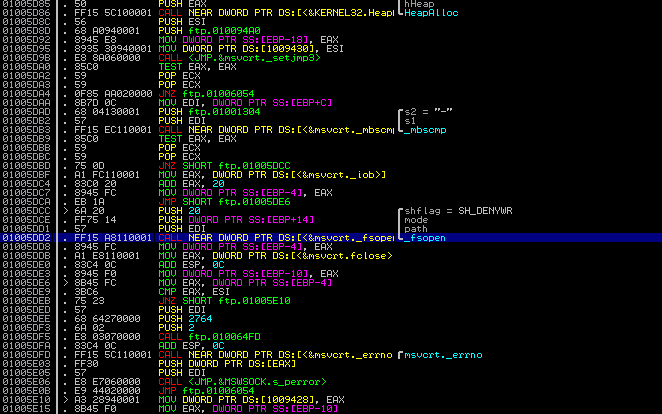
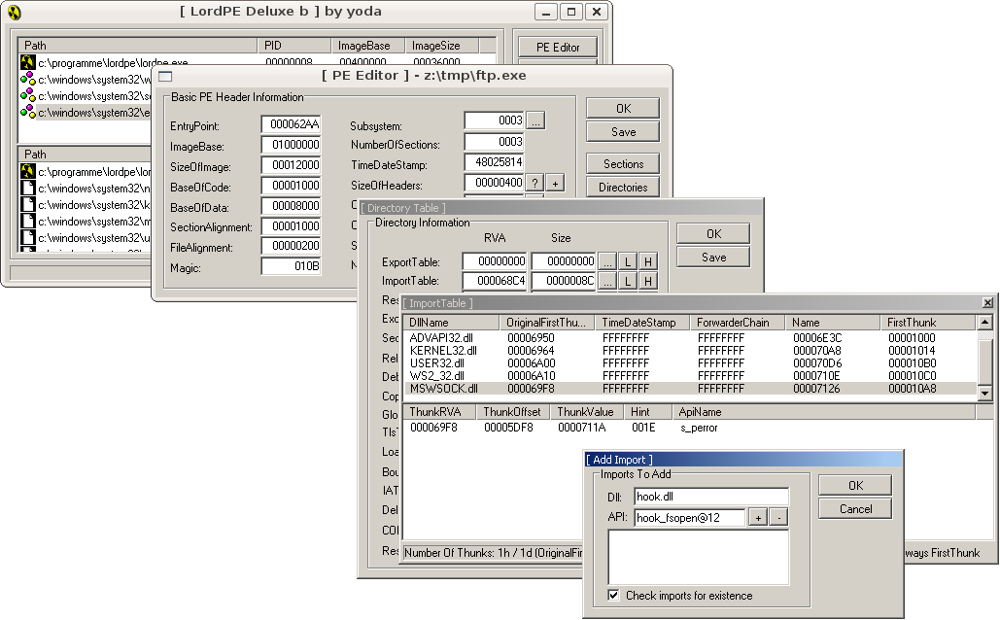
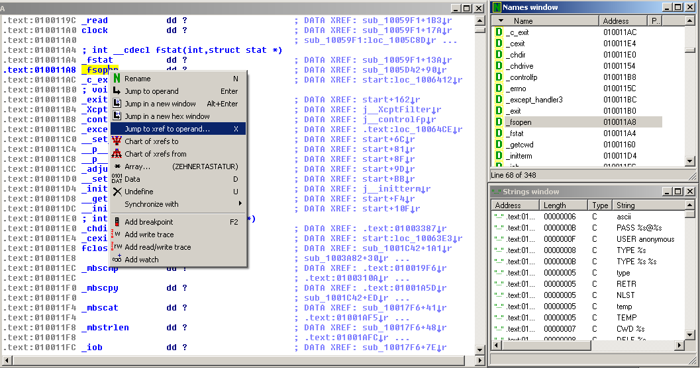
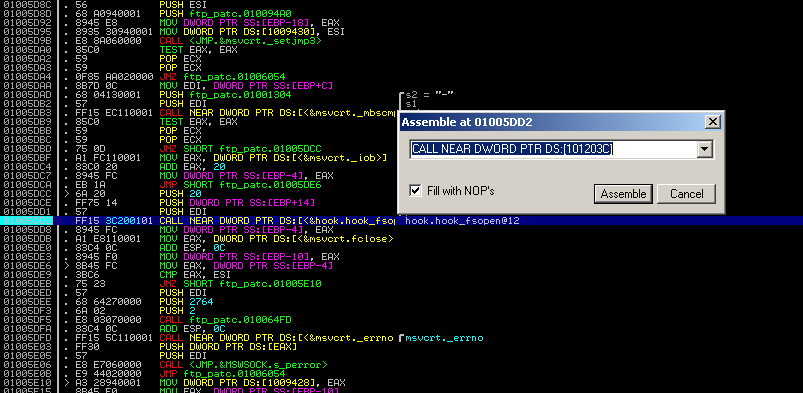

Emulation is an important technology in honeypots and honeynets. It's not always what we want, though, and here's why. As you might know, most bots perform attacks in multiple stages, i.e., they

- send some exploit code to the victim that opens a shell,
- connect to that shell or let the shell connect back,
- invoke commands to download the actual malware binary,
- execute the malware.

Catching the exploit and providing a fake shell isn't too hard, as shown in [this post](http://honeytrap.mwcollect.org/whatfor). But we certainly don't want a malware to get executed on our honeypot, not even in an emulated environment. Instead, we want to do different things with it, e.g., submit it to a central service for automated analysis.

Most bots use Windows' `ftp.exe` or `tftp.exe` to download a copy of themselves, so we could emulate their behavior and call our own handler whenever a file would normally get written to disk. But that means we'd have to completely reverse the way ftp. exe (and others) work – which probably takes several hours. Too much as we are only interested in overriding the part that stores a file on disk. Can't we use what's already there? Can't we just use `ftp.exe`? In a normal Windows environment we would probably simply hook the relevant API calls, e.g., by creating hooks with [`SetWindowsHookEx()`](http://msdn.microsoft.com/en-us/library/ms644990.aspx) or by injecting threads into a running process. But under [wine](http://www.winehq.org/), there is no persistent Windows environment and our `ftp.exe` gets only called when needed. A solution is to replace relevant functions in `ftp.exe` (or any other program) with our own ones. The rest of this post describes how to load own arbitrary code into `ftp.exe` and how to make it get used.



First, we need to identify the functions we're interested in, so the ones we want to replace. This can easily be done by loading `ftp.exe` in a debugger (I use [Immunity Debugger](http://www.immunitysec.com/products-immdbg.shtml) which is much like [OllyDBG](http://www.ollydbg.de/) but with python support) and stepping through its machine code until an appropriate call instruction is found. `ftp.exe` uses [`_fsopen()`](http://msdn.microsoft.com/en-us/library/8f30b0db.aspx) to create a stream handle for a downloaded file. Its first argument is the path. If we can change it, we control the location where the downloaded file gets stored. So how can we replace [`_fsopen()`](http://msdn.microsoft.com/en-us/library/8f30b0db.aspx) with our own function that modifies the path argument?

The next step is to write a DLL that contains our replacement function and that will later be loaded into `ftp.exe`. The code could look like this:

```
#include

FILE __stdcall __declspec(dllexport) *hook_fsopen(const char *path, const char *mode, int shflag) { FILE *stream = NULL;

printf("hooked _fsopen("%s", "%s", %d)", path, mode, shflag); stream = _fsopen(path, mode, shflag); printf("return value: (FILE *) %p", stream);

return stream; }
```

Now we need to make a DLL of it. Under Linux we can use [mingw](http://www.mingw.org/) to cross-compile and link the code: `shell$ i586-mingw32msvc-gcc -Wall -Werror -shared hook.c -o hook.dll shell$ i586-mingw32msvc-strip hook.dll` The first command compiles the code and builds the DLL. Stripping symbols with the second command is optional but greatly reduces the DLL's size. So, now that we have a dynamic library with our replacement function, how do we enforce `ftp.exe` to load it? We need to edit the program's import table, located in the PE header, and add our DLL to it. I used LordPE for this as shown below. Click at the marked buttons to open `ftp.exe` and edit its header information:


A right-click in the _\[ Import Table \]_ window brings up a popup menu where we have to choose the item _add import..._. In the next window we need to fill in the DLL's name (**hook.dll**) and our function's name as listed in the DLL's export table. As the export table entry can differ from the original funtion name, we better look it up in the library itself using winedump:

`shell$ winedump dump -j export hook.dll Contents of hook.dll: 4608 bytes`

Exports table:

Name: hook.dll Characteristics: 00000000 TimeDateStamp: 48B57622 Wed Aug 27 17:43:30 2008 Version: 0.00 Ordinal base: 1 # of functions: 1 # of Names: 1 Addresses of functions: 00005028 Addresses of name ordinals: 00005030 Addresses of names: 0000502C

Entry Pt Ordn Name 00001260 1 hook\_fsopen@12

`Done dumping hook.dll`

OK, now that we now the export symbol name (**hook\_fsopen@12**), we can fill in the values as shown below and click the "+" button to actually add it. If LordPE complains about a non-existing API, copy the DLL to `C:\Windows\system32\`. The error should go away once the library is found.



Now we close LordPE to save our changes to `ftp.exe`. The last step is to change the original call instruction to [`_fsopen()`](http://msdn.microsoft.com/en-us/library/8f30b0db.aspx) such that our hook function gets called. To do so, we open the modified binary in Immunity Debugger, jump to the according location and change the instruction code accordingly. IDA Pro can help with finding all calls to [`_fsopen()`](http://msdn.microsoft.com/en-us/library/8f30b0db.aspx). Just load the binary, wait for the code analysis to finish and go to the _Names window_. We find and double-click [`_fsopen()`](http://msdn.microsoft.com/en-us/library/8f30b0db.aspx) to jump to its address. A right-click at the function name brings up a menu which lets us see all cross references, namely the call instructions we are interested in.



`ftp.exe` contains only one call to [`_fsopen()`](http://msdn.microsoft.com/en-us/library/8f30b0db.aspx), so this one is easy. We take the address of the call instruction, switch to Immunity Debugger and jump to the according location. Double-clicking the call instruction lets us modify the target location - we just enter the address of `hook_fsopen@12` which can also be determined quite easy with IDA's help.



Immunity Debugger has no dump feature, but we can patch our ftp program manually by opening it in a hex editor, searching for the hex code of the original call instruction and replacing the address with the address of our hooking function. Now we copy our DLL to `C:\Windows\system32\` (if we haven't already done so) and replace the original `ftp.exe` with our patched one. And that's finally it, we are done.

We can verify if everything works by downloading some file using our patched ftp tool. We should get notified about the [`_fsopen()`](http://msdn.microsoft.com/en-us/library/8f30b0db.aspx) call by our hooking function as shown below in line 3 and 4.

`... ftp> get gzip hooked _fsopen("gzip", "wb", 32) return value: (FILE *) 00128380 200 PORT command successful. Consider using PASV. 150 Opening BINARY mode data connection for gzip (45420 bytes). 226 File send OK. ...`

So much for this little writeup. Modifying the hooking function to ones needs is left as an excercise for the willing reader.
