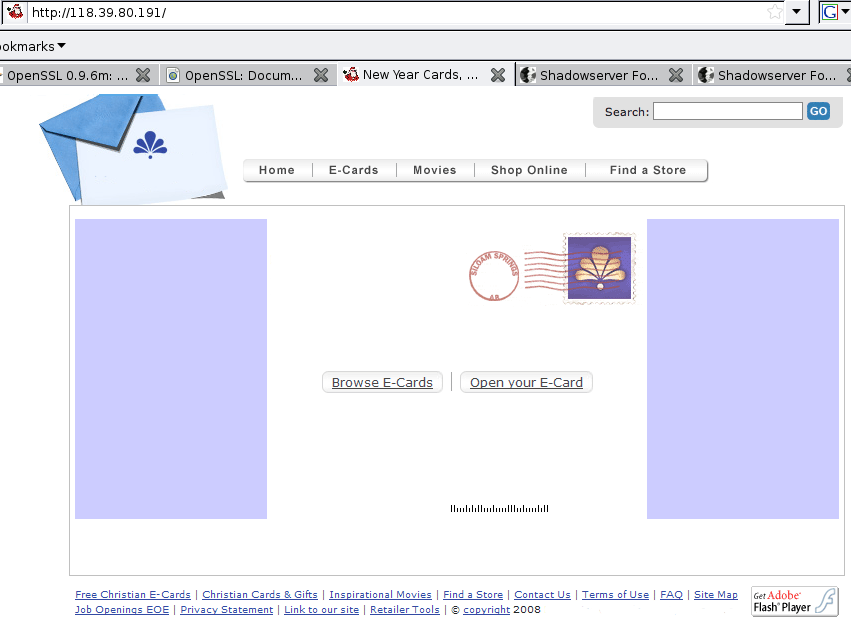

**Waledac is wishing merry christmas**

There is a new bot in town. It's called Waledac. The way it is spreading reminds a lot of people of the good old storm botnet: An email is sent containing a "christmas card" in form of the executable "postcard.exe".

A preliminary view on the binary has been given by the [Shadowserver guys (Steve Adair)](http://www.shadowserver.org/wiki/pmwiki.php?n=Calendar.20081231).

I had the chance to have a first look at the binary (MD5 ccddda141a19d693ad9cb206f2ae0de9) and want to note down some of my few findings to let the hunt begin.

**Some first details**

Clicking on the executable installs it in HKEY\_LOCAL\_MACHINE\\SOFTWARE\\Microsoft\\Windows\\CurrentVersion\\Run with key "PromoReg" (similar to Storm). Unlike storm, the binary is not using GetWindowsDirectory() and CopyFileA() to copy itself to the Windows Directory.

The binary contains a statically linked-in version of openssl 0.9.8e.

As described by Steven, there is a 1024 bit RSA certificate inside the binary. Upon execution, another certificate appears:

`Certificate: Data: Version: 3 (0x2) Serial Number: 0 (0x0) Signature Algorithm: md5WithRSAEncryption Issuer: C=UK, CN=OpenSSL Group Validity Not Before: Jan 2 04:24:10 2009 GMT Not After : Jan 2 04:24:10 2010 GMT Subject: C=UK, CN=OpenSSL Group Subject Public Key Info: Public Key Algorithm: rsaEncryption RSA Public Key: (1024 bit) Modulus (1024 bit): 00:d4:5a:7d:1f:bc:20:99:f4:77:6a:0a:04:25:ca: 71:29:59:3d:8d:61:c8:0e:9f:a2:c1:74:d8:6b:5f: e7:7b:47:13:d2:c1:9e:b0:c6:44:6d:21:9d:31:67: 7e:86:43:c2:b4:fe:42:fb:27:fd:04:95:03:bb:d3: 43:82:ca:6a:47:b7:fd:de:bf:a9:ea:71:ed:5e:69: 3c:0b:53:fa:a4:d4:50:87:ed:5d:02:73:4e:47:a4: a8:5e:ab:0c:fd:01:3c:5e:15:05:22:c4:63:f6:a6: 24:76:99:27:2a:e7:93:27:ad:b7:fd:1c:0f:e3:85: f0:d8:c8:39:32:11:c8:41:19 Exponent: 65537 (0x10001) Signature Algorithm: md5WithRSAEncryption 2e:e3:f8:b4:0d:ee:58:6e:25:51:12:9a:3e:4d:62:6b:c8:e6: d8:aa:83:19:f7:64:7e:02:45:ff:00:b0:82:3d:42:1a:61:78: 67:0c:44:f9:bb:02:da:bd:6e:e4:45:dd:af:02:4e:70:62:41: ef:81:67:17:a8:6c:41:92:a5:20:41:ee:e6:5b:38:22:b4:41: 26:de:f0:ec:2d:2c:e5:56:d4:05:22:40:bb:64:3d:ce:a4:c8: dd:76:b6:23:b8:2b:69:14:af:70:10:d8:7b:03:f6:b8:c2:90: 02:94:14:18:99:4d:cb:6e:8a:7a:71:49:05:b1:b9:2f:dc:0e: b1:c7 -----BEGIN CERTIFICATE----- MIIBvjCCASegAwIBAgIBADANBgkqhkiG9w0BAQQFADAlMQswCQYDVQQGEwJVSzEW MBQGA1UEAxMNT3BlblNTTCBHcm91cDAeFw0wOTAxMDIwNDI0MTBaFw0xMDAxMDIw NDI0MTBaMCUxCzAJBgNVBAYTAlVLMRYwFAYDVQQDEw1PcGVuU1NMIEdyb3VwMIGf MA0GCSqGSIb3DQEBAQUAA4GNADCBiQKBgQDUWn0fvCCZ9HdqCgQlynEpWT2NYcgO n6LBdNhrX+d7RxPSwZ6wxkRtIZ0xZ36GQ8K0/kL7J/0ElQO700OCympHt/3ev6nq ce1eaTwLU/qk1FCH7V0Cc05HpKheqwz9ATxeFQUixGP2piR2mScq55Mnrbf9HA/j hfDYyDkyEchBGQIDAQABMA0GCSqGSIb3DQEBBAUAA4GBAC7j+LQN7lhuJVESmj5N YmvI5tiqgxn3ZH4CRf8AsII9QhpheGcMRPm7Atq9buRF3a8CTnBiQe+BZxeobEGS pSBB7uZbOCK0QSbe8OwtLOVW1AUiQLtkPc6kyN12tiO4K2kUr3AQ2HsD9rjCkAKU FBiZTctuinpxSQWxuS/cDrHH -----END CERTIFICATE-----`

In addition, an XML list of peers is created from information inside the binary. Those servers are tried to connect to in order to receive commands. Whether those are fast-flux entry points or a fixed set of masters has to be investigated:

`1230860545

3667c04b3e3220425709494c1d02534b

462ec931ec096f2b4f13e4573a31e51c

07585758b27f2a0fd61488598274cf69

ff2ce82f9c506544cf30f1775a12e274

813bc91cd914e21a4b38f02215665d70

2a77b861733a813848710e0ba21aa119

1f24203ed1254c35233cf72ce11aa55e

ef56943d6972c9367b29a01872216940

47323d5b186f8211c7311d169946dd55

9b35c94714342118db7cf638fd2e5552

07700c2c35117f15032f406a5c700309

9237133ff5574f4bb012ef05fe069a0e

4c5db625782a0efd18727c1e32014802

89618316680f6c32b160a40e7a1e1a16

6a122f712536e65d67738b7a5804b766

b7388c214536e0386e23952ede063942

71706d65de370d61f12522706578c856

7a41632dcd4cca01163398504c3d355b

fc6fdd5cad125363ce2408698559fb0a

433d3a1d9b38971d754ed64c704d5f0c

bb1785774d0dee12c939f03788570c14

2a569b39ad3774479d3053488c710027

166f3053823558076379cc366325d500

5a6f004ee808945d9771e8589a6c8679

8b5ef420d072a76acc508f331e119b56

1449bf3286594c715b1ffd27d83c777c

611230634d7b4b6a8132be281e6ea727

a74397669e25371fd1438741c9660239

be24a90777384e7b364da57993790967

9752103e7c7b634d1a5ce279357de76d

f1190b34d92b0f62c1561b226c354d06

f662d8381d73802bf23b3e50242b0759

33a4c14ed5b99a93d9051e861950c95b

14202543682ca91f7505596f09125532

0f71405a4f7e324483290e2da43e2f51

1c318474a138ba30cd6c6b363e5f2d16

004f4961746991194d5e11444f1da33e

8b47ea6b1c1407047241a24ded57e877

603a9815a3265a5be355b06bbe6b2472

8a7a45793173c822e17c2c31f614494e

5b1c606365760c04214a3121c47cb571

052565171d731c7ba136b95ae836a623

a94cd3032818e00f0124726991780d3e

fd311017074bc00e2b49db5be625a029

7f57cb67286efd59ab6b4b01df417817

042b4f5958617245b145be1be83f6c20

06215f44631b1d7ecf5d8f297b3e212d

eb659619f276350512797a4c78644d48

bb3f8f764e7ace1fc560687e1b659d0e

2854d3306139781b9d3be41a1645d918

`

**Infos from the inside**

Unpacking is fairly easy. The code is encrypted/encoded inside the code section (this was a lot different in storm). After reaching the following address, everything can be dumped.

The request to the server is created at address 0x408b41 and send out at 0x408d25 using regular Windows HTTP API calls, like InternetOpenA, InternetConnectA, HTTPOpenRequest, InternetReadFile, ....

The Bot scans all files on the harddrive. Don't know for what, yet. The files are opened at 0x404c80

At 0x4A5575 and 0x4A5594 Windows Console input and output are opened (CreateFile() to CONIN$ and CONOUT$). A closer look on what this is for is still to be done...

More details and code sequences will follow.

**Storm v2?**

The inside does not look like storm at all. Nearly no common API calls (e.g. different heap allocation) and structure seems to be different. Installation is different (e.g. no copy to windows directory).

There is one similarity I found: Both storm and Waledac are using a=...&b=... as HTTP Post parameters. (But this is straight forward, isn't it?)
