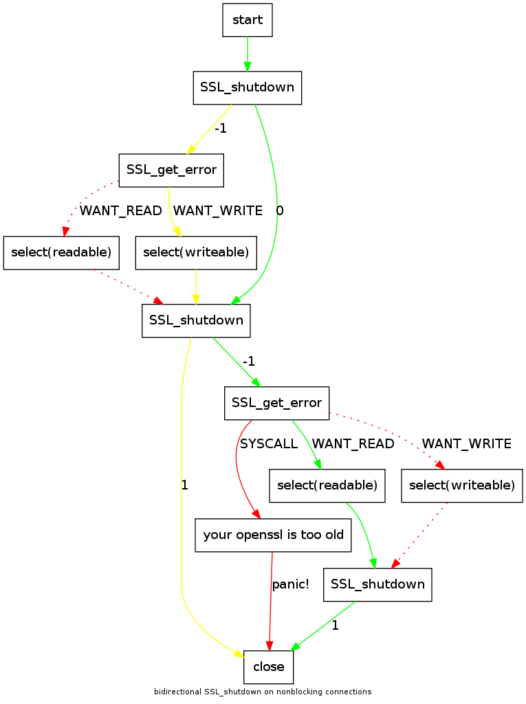

Hello,

due to the length of the whole term _Improving the effectiveness of low interaction honeypots_**,** I decided to use **Iteolih** as uniq abbrevitation. Things are rolling for the project, writing [code](http://svn.carnivore.it/browser/dionaea/trunk "dionaea homepage") started, a basic [homepage](http://dionaea.carnivore.it/) with instructions how to compile/use it was created.

I even had the plan to write about it once or twice, finish something in the code, write about it. When I was done with the code, I got the idea, writing about it was not worth your time.

So this is my first blog post for the project, as I feel guilty after seeing other people blogging frequently about their progress.

Nevertheless, now I got something which might be of intrest to at least .01% of the audience:

After [long discussions](http://marc.info/?l=openssl-dev&m=119109053023605&w=2 "make SSL_shutdown work with non-blocking BIOs"), OpenSSL [applied](http://cvs.openssl.org/chngview?cn=17995 "openssl cvs diff") a [three years old patch](http://marc.info/?l=openssl-dev&m=115154030723033&w=2 "Re: [PATCH2] Fix for SSL_shutdown() with non-blocking not returning") to make SSL\_shutdown working with non blocking sockets.

For better understanding, here is a quality reduced picture.

