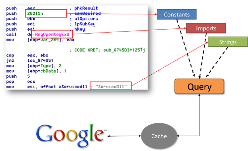

Some people say "Reverse Engineering is an art". Well, this might be true if you consider stuff like mathematics as art. It is more an application of standard methods that evolve constantly. Actually, everybody can learn these methods and start to RE executables. With the [RE-Google](http://regoogle.carnivore.it) plugin for IDA Pro, even your granny can start reversing :)

Reverse engineering is like solving a jigsaw puzzle. In order to see the whole picture you need to find the corner pieces, then the frame, and then work your way forward from there. The corner pieces for reversing are strings, constants and function names. The function names that people normally start with are the one's imported from shared libraries (e.g. Dlls). Strings contain human readable hints about the functionality. Specific constants add more clues to solve the puzzle or can sometimes even be used to identify certain (types of) algorithms. The imported functions tell about the actions performed by it.

The major problem is that a lot of experience is needed to identify strings, constants or to know what the combination of imported functions may result in. But why don't we use the combined knowledge of many people in order to get this expertise. Google allows to search for this.

Google code search is very valuable when trying to find algorithms or code excerpts that contain this information. Often the few results you see on one page can already tell you what the function might be doing.

This plugin enumerates all functions and extracts strings, constants (also called immediate values), and the names of imported functions. If there is sufficient data, a Google Code search is performed and the result is added to the IDA database as function comment. Reviewing these comments sometimes turns the analysis of the considered function unnecessary and saves time.

**Example A:**

`; trunk/src/lib/third-party/jsSHA/src/sha.js ; FileZilla3/tags/3.0.9/src/putty/sshsh512.c ; trunk/v1/puzzle/vista/js/encriptar.js ; StepMania-3.9-src/src/crypto/CryptSH512.cpp ; coreutils-6.4/lib/sha512.c`

It seems to be very likely that the considered function is SHA-512 based on the results shown above. And it is :)

**Example B:**

`UPX0:0040D7A5 sub_40D7A5 ; src/iexplorer/greta/regexpr2.cpp UPX0:0040EA6D sub_40EA6D ; src/iexplorer/greta/regexpr2.cpp UPX0:004102B7 sub_4102B7 ; src/iexplorer/greta/regexpr2.cpp ... UPX0:0041E163 sub_41E163 ; src/iexplorer/greta/regexpr2.cpp UPX0:0042183F sub_42183F ; src/iexplorer/greta/regexpr2.cpp UPX0:0040EE2F sub_40EE2F ; trunk/shareaza/RegExp/regexpr2.cpp UPX0:0041E945 sub_41E945 ; trunk/shareaza/RegExp/regexpr2.cpp`

These functions seem to be part of a library related to regular expression parsing. Saves some time because those don't have to be investigated by hand, now.

**Example C**:

Some functions like the following only get a single result: `; openssl-0.9.8e/crypto/x509v3/v3_alt.c

`

Wow, perfect hit. And the result is pointing right to the source code. This will help when investigating related functions.

**Example D**: Enough examples... [Try it out yourself :)](http://regoogle.carnivore.it)
