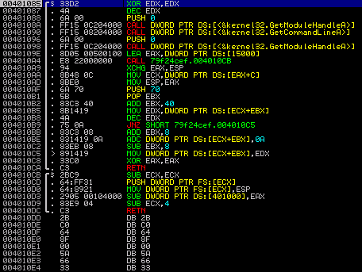
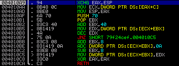
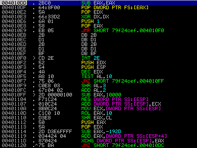



The last spreading malware version of [Waledac](https://honeynet.org/node/348), a notorious spamming botnet that has been taken down in a [collaborative effort lead by Microsoft](http://blogs.technet.com/microsoft_blog/archive/2010/02/25/cracking-down-on-botnets.aspx) earlier this year, contained some neat anti-debugging tricks in order to make reverse-engineering more difficult. Felix Leder and I [have been presenting about the approach](http://events.ccc.de/sigint/2010/wiki/Fahrplan/events/3895.de.html) at SIGINT 2010 in Cologne yesterday, and as the method seems to be not publicly known yet, I will quickly describe it here as well.

\[caption id="attachment\_6875" align="alignnone" width="456"\] _At the entry point of Waledac's code_\[/caption\]

The md5 hash of the sample I was playing with is `79f24cefd98c162565da71b4aa01e87b`. When you load it into a debugger, you see two functions, one calling the other. Apparently, somewhere in there must be a branch into the real code. So let's look more closely. The instructions of the second function starting at offset `0x004010CB` are pretty standard. What they do is to put an additional exception handler in the SEH chain that would be called on, e.g., memory access violations:

004010CB 2BC9 SUB ECX,ECX ; clear ECX 004010CD 64:FF31 PUSH DWORD PTR FS:\[ECX\] ; push pointer to end of SEH chain on stack 004010D0 64:8921 MOV DWORD PTR FS:\[ECX\],ESP ; set SEH chain pointer to the new handler

The address `0x004010A9` has been pushed on the stack as return address by the previous call, so the code starting at this offset would be called upon exceptions. This is what the stack looks like now:

\[caption id="attachment\_6876" align="alignnone" width="313"\] _The stack after setting a custom SE handler_\[/caption\]

After the new exception handler is in place, an access violation is triggered by subtracting the value in `EAX` from `[0x00401000]`, which is in a non-writeable memory section. This is the code line triggering the exception:

004010D3 2905 00104000 SUB DWORD PTR DS:\[401000\],EAX ; trigger an access violation exception

Let's have a look at what the exception hander does. The first three instructions basically load `[ESP+C]` in the `ECX` register, which then points to the so-called `ContextRecord` that also contains the faulting instruction's offset. (The dereferencing could have been done in a single instruction relative to `ESP`, and I don't quite understand why this code uses `EAX` for it - but hey, who's perfect.) Have a look at [crash course on Win32 exception handling](http://www.microsoft.com/msj/0197/Exception/Exception.aspx) if you want to learn how to get the faulting address out of the context information.

\[caption id="attachment\_6877" align="alignnone" width="369"\] _The custom SE handler's code_\[/caption\]

Next, the handler decrements a stack variable that was initialized with `0x15000` at offset `0x0040109E`. We will see shortly that this variable does in fact serve as some kind of loop counter. The decremented value is written back into the variable at offset `0x004010C5`. What happens now is that the exception handler will continue execution at the faulting instruction, because this is where `_CONTEXT.Eip` points to. Of course, the memory location is still not writeable, so we will end up in our exception handler again. Things are getting interesting when the counter variable is decremented to 0. Have a look at the following line:

004010BE 831419 0A ADC DWORD PTR DS:\[ECX+EBX\],0A ; add 10 to the faulting address

By adding `0x0A` to the saved faulting address, the offset where execution is continued after the exception handler returns is changed to `0x004010DD`. So let's interpret the bytes at this address as instructions.

### The Second-Stage Anti-Debugging Code

The picture below displays the disassembly of the code that is executed after the stack variable reaches 0. The first two instructions restore the SEH chain by resetting the pointer at `FS:[0]`. Then the image base is calculated from the return address of the call mentioned above by zeroing `DX`. Finally, `EAX` is set to 1 - we will see in a bit what that is good for.

\[caption id="attachment\_6878" align="alignnone" width="386"\] _2nd stage code with `INT 2E` trick_\[/caption\]

As you can see, the jump instruction takes execution to an `INT 2E` at offset `0x004010F0`. This instruction calls a ring-0 subroutine and takes the system service's index in `EAX` and a pointer to a parameter block in `EDX`. In this case, the `AccessCheck()` routine (i.e. routine `0x1`) is being called. The purpose here is to trigger an access violation, so that is why `EDX` has been loaded with `0x00400000`. When this service routine throws an error, the error code is returned in `EAX` and `EDX` contains the address of the instruction following the failing one. So that should be `0x004010F2` in this case. However, if the program is being executed either inside [VirtualBox](http://www.virtualbox.org/) or with [OllyDbg](http://www.ollydbg.de/) or also [ImmunityDebugger](http://www.immunityinc.com/products-immdbg.shtml) attached, the `EDX` register would contain `0xFFFFFFFF` instead. So this fact may be used to detect if the process is being debugged or running inside a virtual machine.

### Working Around It

What Waledac does with the instructions starting at `0x004010F3` is to derive an offset from `EAX` and `EDX` and to push this value on the stack. It would then jump back to the `RETN` instruction at `0x004010DC` which, in turn, takes the computed value on the stack as return address and jumps there.

\[caption id="attachment\_6879" align="alignnone" width="368"\] _Re-attaching to Waledac, looping in a "breakpoint"_\[/caption\]

The problem is, how can we easily get the correct offset here? I decided to use a little trick I tried with success previously when analyzing SEH-based anti-debugging code: You can put a SoftICE-style breakpoint at offset `0x00401020`, i.e. just before we jump back to the return instruction, by patching in a `JMP -2`. This results in an endless loop. Now you can dump the patched version, execute it, wait a bit in order for the SEH loop to finish, and then attach a debugger. The picture above shows the situation when I re-attached - the highlighted instruction implements the "breakpoint". By inspecting the top-most stack entry, we see that the target offset is `0x0040561E`. The final step is to restore the original jump instruction and continue execution inside the debugger. By the way, I did this in [qemu](http://wiki.qemu.org/Main_Page) which worked quite nicely.

### The Final Stage

The next stage functions independent from the previous parts. All it requires is an address to calculate the image base address from again. As there is still one on the stack (it is the one taken from `EDX` after the `INT 2E`, see above), we are fine. Here is the code of this part. Again, this could have been done more efficiently.

0040561E 5A POP EDX ; load address from INT 2E 0040561F 60 PUSHAD ; save registers 00405620 52 PUSH EDX ; save EDX 00405621 B9 AE080000 MOV ECX,8AE ; useless crap 00405626 8B3C24 MOV EDI,DWORD PTR SS:\[ESP\] ; load saved address in EDI 00405629 66:33FF XOR DI,DI ; zero out lower word to get image base 0040562C 8BD7 MOV EDX,EDI ; write result back in EDX 0040562E 037F 3C ADD EDI,DWORD PTR DS:\[EDI+3C\] ; spot start of PE header 00405631 81C7 48010000 ADD EDI,148 ; spot .data entry in section table 00405637 8B7F 0C MOV EDI,DWORD PTR DS:\[EDI+C\] ; get PointerToRawData 0040563A 03FA ADD EDI,EDX ; add it to the image base 0040563C 8BC7 MOV EAX,EDI ; store it in EAX 0040563E E8 00000000 CALL looping-.00405643 ; push return address on the stack 00405643 5E POP ESI ; EIP -> ESI 00405644 83C6 08 ADD ESI,8 ; correct the offset 00405647 F3:A4 REP MOVS BYTE PTR ES:\[EDI\],BYTE PTR DS:\[ESI\] ; copy stuff into the .data section 00405649 FFE0 JMP EAX ; jump to the copied code

The jump instruction will take us to some self-modifying code at `0x00403000` that makes extensive use of floating point instructions, most likely to confuse analysts (I haven't looked into them too much). The decoded part starts at `0x004031E5` if you want to have a look yourself. In a nutshell, what it does is:

- - spot `GetProcAddress` and `LoadLibraryA` in `kernel32.dll`

- - use these to find a couple of other API calls (VirtualAlloc, VirtualProtect

- - set the image section's attributes to `PAGE_EXECUTE_READWRITE`

- - decrypt bytes at `0x00405EF9` to restore a valid PE file

- - map the decoded PE file into memory at `0x00400000` by overwriting the current image

- - build an import address table (IAT) for it

- - set the section attributes to `PAGE_EXECUTE_READ` and `PAGE_READONLY` for the import and data section respectively

- - return to the new image's entry point

This part does contain some trivial anti-debugging checks like embedded `INT3` instructions which are easy to handle. We can now dump the process or assemble the original binary from the new sections. If we take a look at the unpacked code in a disassembler, we observe two IP addresses this Waledac version is apparently trying to connect to. However, this is now standard reverse-engineering stuff and beyond this blog post. So I will leave it with that.

\[caption id="attachment\_6881" align="alignnone" width="545"\] _The restored PE file in a disassembler_\[/caption\]

What we have seen is how this Waledac version tries protect itself from being debugged. It implements multiple code stages with the goal to confuse debuggers, but eventually restores its original code. By using debugging tools in a smart fashion we can still track and control the individual steps.

Tillmann
