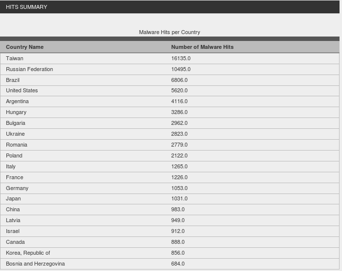
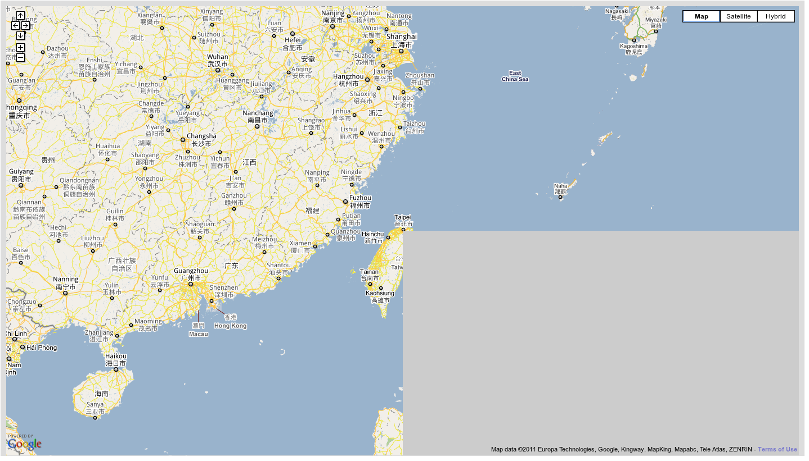



The review period is coming and i decided to write an entry to inform about the Webviz project. Till now the first output of the project is a proof of concept work\[1\] (requires WebGL supported browser, tested on Firefox 5 and Firefox 4, on other browsers i don't guarantee it works fine).

The figure displays the visualized data. The elevations corresponds to the geograpical malware numbers. The more malware detected the higher peeks are represented with changing color.

It is a WebGL Globe visualization that is using hpfeeds\[2\] data. hpfeeds has a python script that connects to a central Dionaea server and returns the malware information to the screen. The returned information includes source and destionation IP numbers, URL of the malware, SHA1 and MD5 sum of the malware. Timestamp is currently missing. I used the same script with a small modification that will save the output to the postgis\[4\] database. Postgis database is a postgresql database which is specialized to keep geoprahic data. To use the hpfeeds output as a geographic information, the IP numbers should be converted to the latitude and longitude values. That is where Python GeoIP binding comes. GeoIP needs offline source path to query the IP numbers and get the geographic information (lat., long., country information, etc. ). MaxMind\[5\] data sources are used.

At the web page a summary on the country based malware numbers are also displayed.

What you see on the \[1\] address is a GeoDjango\[6\] application. At the backend, Python, Django, spatial database and Geospatial Libraries are working\[6\]. The data is collected by using the modified version of the hpfeeds. When the url is called, related view at the Django application is gathering data from database and responsing with a JSON data to the browser. The reason of the JSON response is that WebGL Globe\[7\] requires JSON response. WebGL Globe is the front end of the current visualization. It supports multiple display of the array data which includes the same JSON response, ony if the arrays include same ordered coordinates but different magnitudes. I didn't used this property yet.

What i need was to feed the globe with live data. Unfortunatelly the WebGL Globe does not support working with Orbited+ like technologies, yet. They said they may add this feature, though.

The idea behing Orbited is, pushing (indeed it is long pulling) data at the script side over a TCP channel to the browser. A message queue is created and when the browser sends a request to the Orbited server, data is sent. The data should be handled at the javascript side, then.

The next stop at my project study was to create a 2D map with a grid sketched on it. I was planning to use Google Map API for creating map and Processing.js for the grid side. The was simple. Lets check this processing.js example first:http://www.openprocessing.org/visuals/?visualID=9151 Lets forget about the planets spinning. My aim was to create the 2D map on the base part with the grids on it. Instead of collapses on the screens, i was planning to create elevations which will demostrate the malware magnitude at this region. After struggling for a while, trying Elabel\[8\] to create a canvas over the map i was nt succesfull enough. Check out the url\[9\] (It takes time to get response from the server and see the map and the grid at the web site, because of the grid processing. I tested via Firefox 4 and 5 and i suggest you to open it with it).

The lower is the grid creation. It is created with the lines between 3D vertices. Currently the vertices' Z values are all 0. The above is the map, the gray rentangle part should be where the grid displays. I just made the starting position from a location i know the lat. and long. values. Because of the conversion of the canvas to svg, i just see the background color of the div area. I am not sure what is the reason of not displaying the grids. Although the same example works with a simple Hello World! sketch on the map, but still with the gray background, with the dynamic grid creation it was not succesfull. Even it was working, i was still have an unanswered question that is, how will i change the view(camera view) for the google map so that i will be displaying the elevations on the map. After a while i learned that even OpenLayers\[10\] is not used for this type of issues.

Currently i am working on whether i can use WebGL Earth\[11\] custom javascript API with a combination of tile server. Maybe i can handle the grid creation issue over the map part at the TMS (tile map server) side on a 2D map and then the custom API will let me used it as 3D. Although i am not sure about this solution, i will be working on it next weeks.

Here is my email address for the ones to get connected. I am open to any comments, suggestions or criticism: oguzyarimtepe at gmail dot com

For the ones want to watch the visualization at my browser with a short [video](http://www.youtube.com/watch?v=b-L_1tDj8oQ).

\[1\] http://webviz.comu.edu.tr/globe/show/ \[2\] https://github.com/buffer/hpfeeds/comments \[3\] http://postgis.refractions.net/ \[4\] http://geolite.maxmind.com/download/geoip/database/ \[5\] http://geolite.maxmind.com/download/geoip/database/ \[6\] https://docs.djangoproject.com/en/dev/ref/contrib/gis/install/ \[7\] http://www.chromeexperiments.com/globe \[8\] http://econym.org.uk/gmap/elabel.htm \[9\] http://webviz.comu.edu.tr/map/show/ \[10\] http://openlayers.org/ \[11\] http://www.webglearth.org/
