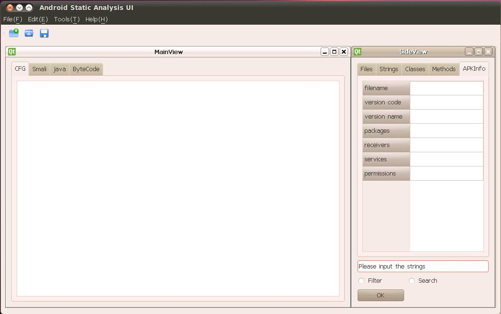
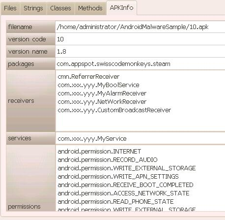
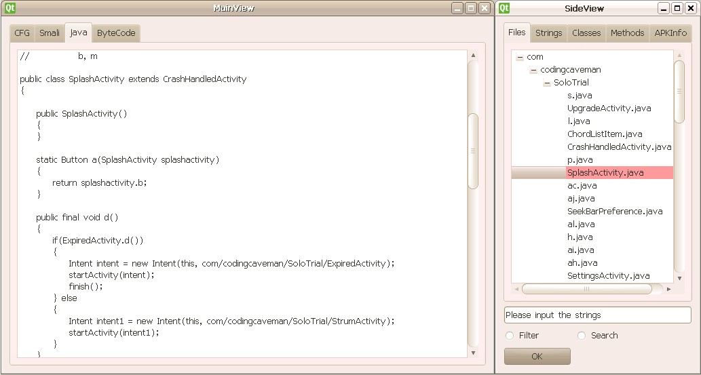
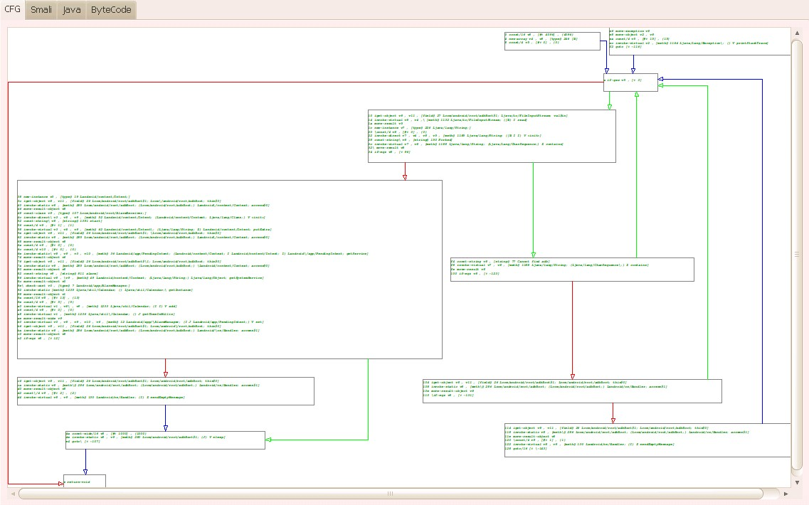
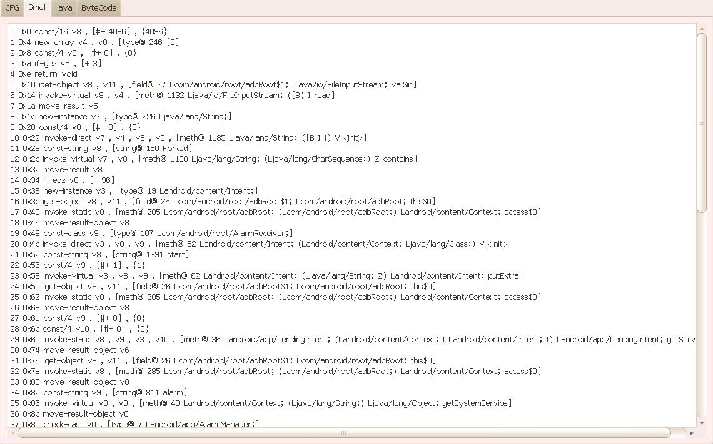

For the forthcoming midterm evaluation of Gsoc2011, I made a lot of progress with the code and now I’m about to publish the alpha release. Before the alpha release is released, I have decided to post a blog to inform everyone about the progress of project 6 (Static Analysis of Android Malware).

Our tool is written by PyQt, which is a great interface to Qt for Python. It is very easy to design the UI by Qt Designer. Qt contains lots of libraries to support pretty UI framework. What’s more, Qt supports cross platform applications.

\[caption id="attachment\_6891" align="alignnone" width="1055"\] Figure 1: The main Android Static Analysis UI window\[/caption\]

The above Figure 1 is the main window of the tool. The four main parts of UI are the menu bar, the toolbar, the main view window and the slide view window. In the menu bar and the toolbar, I only finished the “New” function and other functions, such as save, open, configure, etc need to be added later. The main view window contains four tabs to show CFG (control flow graph), Smali code, java codes and byte codes. Besides java codes, the other three use the Androguard for support. Java codes are produced using the dex2jar tool and the JAD api. In the side view window, we can see the files, strings, classes, methods and the APK’s information. In addition, there is search box below, although this search function hasn’t been implemented.

After we create a new analysis session and open an APK, the APK’s information is showed as seen in the following Figure 2. The filename, version code, version name, packages, receivers, services and permissions are all in this tab.

\[caption id="attachment\_6892" align="alignnone" width="458"\] Figure 2: This figure shows the basic package information window\[/caption\]

In the strings and classes tab, we will see all strings and classes accordingly. The following Figure 3 is an example.

\[caption id="attachment\_6893" align="alignnone" width="526"\] Figure 3: Example of the strings and classes tab\[/caption\]

In the files tab, there are .java files,which are decompiled by the dex2jar tool and JAD api. As is know to us, the JAD cannot fully decompile the .jar file and usually cannot resolve all exception handlers, but it’s still a great java decompiler and its generated java codes are helpful to analyzers when they understand these limitations. When we double click the item in the files tab, the correspond java codes will be showed in the java tab of the main view window, just as the following Figure 4.

\[caption id="attachment\_6894" align="alignnone" width="1033"\] Figure 4: An example of contextual views and selections\[/caption\]

In the methods tab, the corresponding CFG, smali codes and bytecodes will be showed after we double click the method item as follows:

\[caption id="attachment\_6895" align="alignnone" width="1137"\] Figure 5: An example CFG of a selected method\[/caption\]

\[caption id="attachment\_6896" align="alignnone" width="1140"\] Figure 6: Example Smali code of a selected method\[/caption\]

\[caption id="attachment\_6897" align="alignnone" width="1148"\] Figure 7: Example Dalvik bytecode for a selected method\[/caption\]

The CFG graph is drawn by this method: it gets the .xdot file by the Androguard’s CFG pretty show module firstly, then it gets all coordinate positions from the .xdot file and we can draw the CFG using QGraphicsView to display it at last. Each link between nodes has three colors. Red means the jump when the jump condition is satisfied. Green means the jump when the jump condition is not satisfied. Blue means the direct jump or no jump. The node’s content is editable if we double click the node. So, analyzers can modify the node arbitrarily. Moreover, when analyzers scan the CFG, they can drag it or zoom in/out.

In the next phase, I will add more users’ interaction functions and make this tool more convenient to use. Other modules also need to be added, such as syntax highlighting, flow in/out from a given point, finding the path of suspicious APIs and so on.

I welcome feedback for this project’s current functions or other desired functions.
