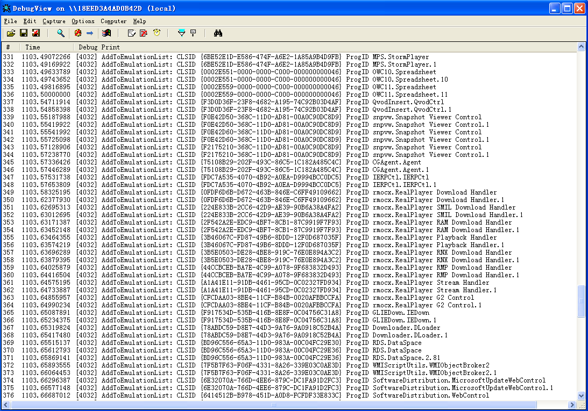

By now, what I have done for Capture-HPC is:

1. 1. **Write a Mock Capture Server.**

This is to help dubugging and coding the Capture client. According to the message format defined in ealier Capture, the mock server will send an command to client firstly and then keep listening to client's log.

 After the server's working, we can start the Capture Client. The command is same as the earlier beta, although I updated the client code, which changes the way that invoke an IE process.

1. 1. **Finish sniffer, the hooking module.**

Why I change the IE's invocation? Because I need to add my sniffer into the starting process. The sniffer is a dll file, written in C++ language. This will be more convenient to code, debug. Moreover, user can take the COM emulator as an optional choice. Along with the sniffer is emulator and emulation list. I would like to introduce the policy of emulation. The COM controls can be defined into four strategies:

1. 1. - Installed

Calling the CoGetClassObject method, if it not FAILED, this component has been restistered correctlly into the operating system. In our sniffer, all the creation of controls can be recorded as an event.

1. 1. - To be emulate

Here I have a file to list all the controls and responding methods that to be emulated. This list will be loaded into memory as the initialzation for sniffer.

The list is based on some known vulnerabilities, and we can obtain them by CVE etc.

1. 1. - Existed

These are controls existing but no attacking reported by now. We only emulate the creating function.

1. 1. - Unexisted

This strategy is for the detection of those cunning attack. Some of the malicious script will create a non-existed control to judge if the target is an actual program or not.

1. 1. **Finish a very simple emulator, which is a COM control as well.**

The emulator is a COM component written in python. Before using it, one need be registered into windows. all the method in this component is progid+methodname, to ensure the unique calling. The sniffer is charging of mechanism while the emulation list and emulator is charging of policy. This can be easy to maintain since the seperation of policy and mechanism.

In the next weeks, I will begin to fix some bugs in sniffer. Here are the problems:

1. 1. **Interface same address.** I hooked the IDispatch and IDispatchEx interfaces for storing it in a map of . However, I found out that IDispatch and IDispatchEx share the same interface address, which means that I need add another key to indicate the type of interface(0 for IDispatch while 1 for IDispatchEx, for instance).

1. 1. **Class factory hooking problem.** When I try to create an emulator class fatory by CoGetObjectClass, the IClassFactory will be hooked to another component's IClassFactory's interface. This will cause an error that the IE will be crushed unexpectedly.
