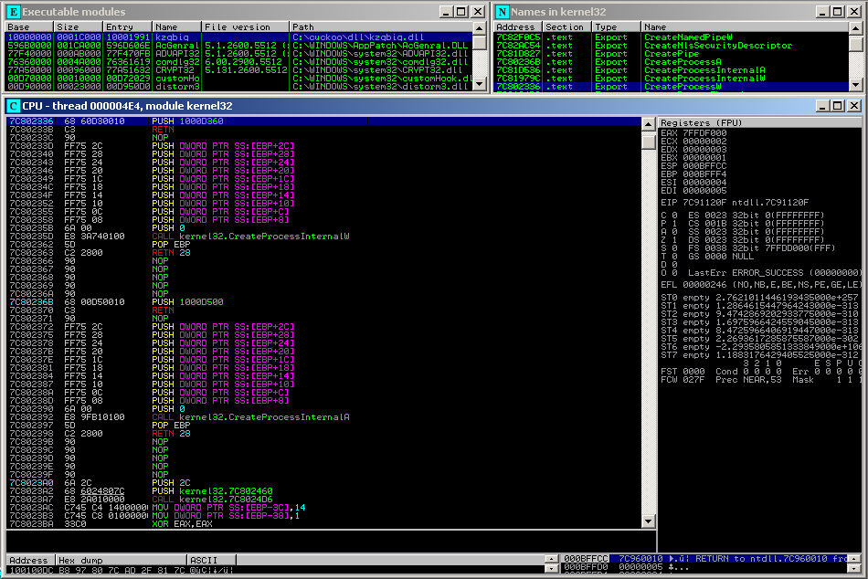

Cuckoo Sandbox is a malware analysis system capable to outline the behavior of a malware during its execution. In order to generate such results, Cuckoo performs hooking of a number of selected Windows functions, intercept their calls and after storing the relevant informations and eventually performing additional actions, returns the exection to the original code.

Until now it made use of latest Microsoft Detours Express. Part of the work of this Google Summer of Code was to implement a custom hooking engine to completely replace the old one. The motivations for such change are essentially the following: - Detours implements a single and very simple inline hook, consisting of replacing the first bytes of the functions with a JMP to the new "detouring" function. Consequently it can be very easily detected by just checking for the E9 opcode as following:

FARPROC addr; addr = GetProcAddress(LoadLibraryA("kernel32.dll"), "CreateFileW"); if(\*(BYTE \*)addr == 0xE9) // Hook detected

\- For some mysterious reasons, the non-commercial "Express" version of Microsoft Detours requires the load of "detoured.dll", which is an empty library providing nothing but an additional detection vector. - We wanted more freedom of action, and Detours' license is limiting and vague in certain aspects.

Here comes cHook, a new and dedicated hooking engine built to face these issues. CHook behaves just like Microsoft Detours, it provides usermode inline hooking functionalities for Win32 in a very easy fashion, but brings something more: it allows the developer to implement any kind of trampoline code he wants, making every build unique.

At current stage, by default, cHook implements the following:

PUSH

RET

MOV EAX,

JMP EAX

At load time, for each function cHook randomly selects a trampoline across the ones compiled.

\[caption id="attachment\_6906" align="alignnone" width="949"\] Figure 1: cHook using the MOV EAX,JMP EAX code in the CreateFileW  
function.\[/caption\]

\[caption id="attachment\_6907" align="alignnone" width="950"\] Figure 2: cHook using the PUSH, RET code in the CreateProcessW Function.\[/caption\]

CHook provides a more transparent, open source, customizable solution for inline hooking needs. It has already been implemented in Cuckoo Sandbox workflow and proved to fit perfectly.

The remaining time for this Google Summer of Code 2011 will be spent to implement self-protection technologies in order to decrease even more current detection vectors.
