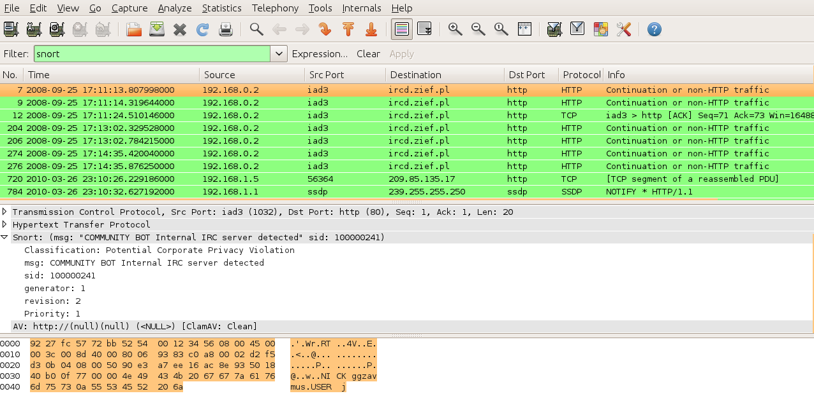
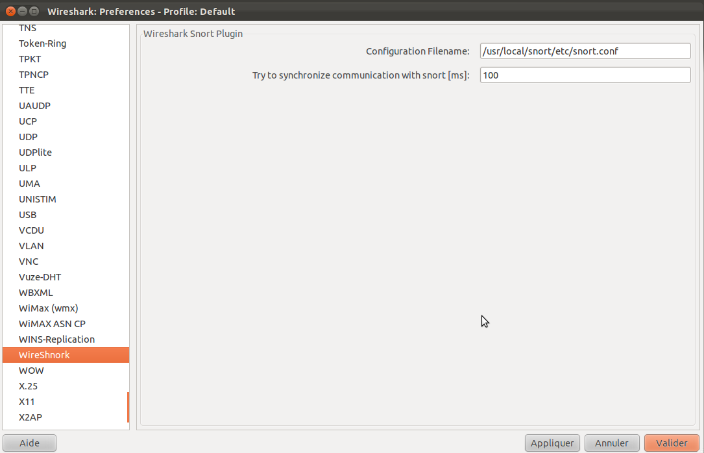

GSoC 2011 #8 project's goal was to add forensics features to the popular Wireshark network analyzer.

### Overview

Wireshark is an open source network analyzer widely used for network debugging as well as security analysis. Wireshark provides network analyzer with graphical interface as well as command line tools. Wireshark also provides network protocol decoders and support filters that allow to search through packets with keywords.

GSoC plugins extend Wireshark capabilities when Wireshark is used to analyze network traffic with security and forensic in mind.

Five plugins were developped by Jakub Zawadzki during GSoC 2011: - WireShnork : this plugin allows applying Snort rules on dumped network tracks. - WireAV : this plugin allows to scan files contained in a dumped network tracks. - WireBrowse : this plugin allows to access to a Wireshark instance running on another machine with a web browser. - WireSocks : "proxy" plugin that would allow browsing web pages (with css, images, javascript, and other files) saved in a pcap file - WireViz : this plugin generates connections graphics with GraphViz.

### WireShnork

In this post we will take a closer look at WireShnork plugin.

Snort is an open source network intrusion prevention and detection system (IDS/IPS) developed by Martin Roesch and Sourcefire. Snort is a libpcap-based packet sniffer and logger that can categorize network traffic as suspicious (either malicious or hostile) based on rules and signatures, just like the way antivirus software categorize files as infected by scanning its and looking for tracks of infection.

Suppose you have to deal with huge PCAP file containing hundreds if not thousands of packets. Lot of these packets may be legitimate, some abnormal or erroneous and only few suspicious. Digging through the PCAP for those last ones can be like looking for a needle in a haystack.

A useful way to speed up this search process is to run Snort rules on the PCAP file as very often suspicious packets are tracks of known hostile actions (like malware). Packets matching a Snort rule can be logged in a text file or in a dedicated pcap file. Looking for these packets in Wireshark then requires: - to open Snort alert file; - translate a log line into a Wireshark filter; - apply this filter in Wireshark session.

That can be a painful task when there are hundreds of packets matching tens of different Snort rules as the above steps have to be repeated many times...

That is why WireShnork was created for: applying Snort rules on all packets of a PCAP file and adding a new kind of filter to Wireshark. Listing all packets that match a Snort rules can be done by just using the filter keyword "snort" in the Filter textbox as shown on below pictures:

WireShnork adds a new Filters family that can be used to filter output on Snort rule's message (snort.msg), Snort SID (Unique Signature ID) like this:

Like any other Wireshark filter, snort keywords can be mixed with other keywords to build more precise filter, like "snort && udp". This will output only UDP packets that match Snort signature.

### Installation

Currently WireShnork plugin is provided as a patch to Wireshark's development version.

Before trying to compile GSoC plugins, you need to have all libraries required to compile wireshark 1.7 (development release) on your computer. That means that if you can compile wireshark, you should be able to compile it after having applied GSoC patches. If you don't manage to compile a working 1.7 version by itself, then it's useless to go further.

You also have to have a working Snort installed. GSoC plugins were tested after having compiled a Snort 2.9.1.2 from sources and it works. Should work with packaged version as well.

If all is okay, just grab the plugins code via GIT: `$ git clone git://git.honeynet.org/wireshark.git`

You should after that have a new wireshark directory that contains GSoC patches and the get-wireshark.sh script.

Change version branch with : `$ git checkout origin/master-1.7.0`

Then you should be able to run get-wireshark.sh script with `all` argument like this: `$ ./get-wireshark.sh all`

After that and if compilation worked, you will have wireshark under current directory (you will be informed at the end of compilation process).

For WireShnork to work you may have to fix your PATH if Snort binaries are not in the current PATH. Snort (2.8 or 2.9) must also be configured in such a way that the user running Wireshark has access to Snort files.

Note that for WireViz to work you also have to have GraphViz and GraphViz libraries installed.

#### WireShnork configuration

At first launch, you may be prompted that some Snort configuration files were not found:

 You must fix the path to snort.conf in Edit -> Preferences -> Protocol panel:

 Once done you have to Apply this change and you should be ready to use this plugins.

Let's give a try at this plugin, we're waiting for your feedback.

https://www.honeynet.org/gsoc/slot8 https://www.honeynet.org/node/716 http://www.wireshark.org http://www.snort.org

A huge thank to Jakub who did a really good job, to HN/P members for their support (esp. Jeff) and to Google GSoC's team for sponsoring.
