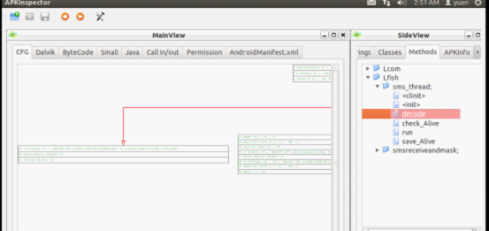
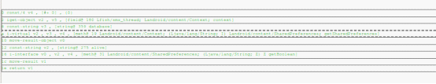
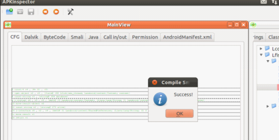

The updated version of APKInspector is a powerful static analysis tool for Android Malicious applications. It provide convenient and various features for smartphone security engineers. With the sensitive permission analysis, static instrumentation and easy-to-use graph-code interaction .etc, they can get a thorough and deep understanding of the malicious applications on Android. The improvement mainly focus on two categories: User Interface and Security Analysis. The goal is to build an easy-to-use tool with strong security analysis features. For the UI part, we made the following progress: 1) Automatically installation In last version, user need to install many packages APKInspector depended on in order to run this tool which might be an obstacle for the widely distribution of APKInspector. With the updated version, user only have to run a script to install the tool. 2）Fine-grained Graph View to Source View The new version of APKInspector have fine-grained graph-code interaction. In the past, we only provide the interaction at the block level, now we can identify each phase of the code. It supports instruction level interaction between graph view and code view now.

3）Call Graph Provide users with direct display of the call in and call out structure.

4）Navigation Back and forward button are added to help the user to check the application throughly and flexibly.

5）Better display of Control Flow Graph Cut down the content in each node to provide better view, the users can read the hint-full content of the node if they want.

When it comes to the Security Analysis features, the following components are added to assist the users: 1）Static Instrumentation User can modify the smali code for the purpose of observing the sensitive APIs. As the platform is always updating, it’s a better option to add static instrumentation in applications.

2）Reverse the Code with Ded for Java Analysis Dex2jar don’t support high version of java classes, so when turn into ded wich is more complete and loss less context information.

3）Combine Permission Analysis We run permission analysis on the application first and use it as a basic filter for malware on Android. We apply the sensitive permission combinations from Professor Willam Enck’s Kirin paper On Lightweight Mobile Phone Application Certification. If the application require such sets of permissions, users will be notified that these sensitive permissions might leak the privacy of the victims.

4）Add Support for odex Support analysis of the optimize dex file.

5) Bug fix: Fix the bugs reported on the homepage.

