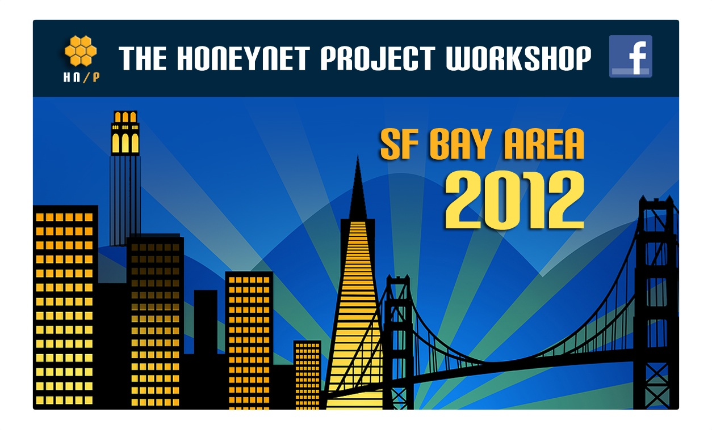



  
The Honeynet Project will hold its 2nd public security workshop at Facebook, Inc. in the San Francisco Bay Area. The workshop is going to be a two day event filled with technical presentations and hands-on tutorial training. On day 1 of the workshop, Honeynet Project members and Facebook will present on a wide range of information security topics: from honeypots and social networks to cybercrime and mobile malware. Day 2 will be a day of hands-on tutorial training. Our members will teach a total of 8 courses in forensics, honeypots, and visualization. For those who want to further hone their skills in a competitive setting, we will also host a capture-the-flag event on day 2. 

Event details and registration information can be found at [https://honeynet.org/SecurityWorkshops/2012\_SF\_Bay\_Area](https://honeynet.org/SecurityWorkshops/2012_SF_Bay_Area). We hope to see you there!  
