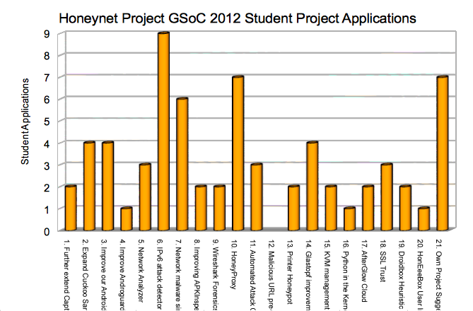
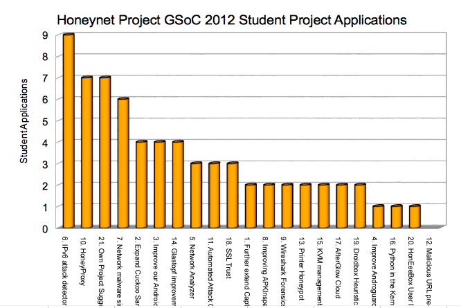



After a slower than usual start, this years [Google Summer of Code (GSoC) student applications period](https://www.google-melange.com/gsoc/events/google/gsoc2012) closed at 19:00 UTC on Friday April 6th, with a major application rush in the last couple of days which kept us busy right up to the deadline! Many thanks to all the interested students who applied, and our mentors and org admins for taking the time to respond to students on IRC, email and through Melange. Even if you don't get accepted as student for [GSoC 2012 with the Honeynet Project](https://www.google-melange.com/gsoc/org/google/gsoc2012/honeynet), please do consider trying to work on your chosen project and becoming part of our community anyway, as we are all volunteers and would be happy to welcome and support you too.  

Having spent the Easter weekend performing our initial round of weeding out spam and obviously poor quality or off-topic proposals, we thought we'd release some high level information and preempt the usual requests for extra information from students.  

This year's application pattern was different to previous years, with a very slow start and consequently some worries about the likelihood of getting a strong enough student showing this year. However, there was a sudden rush in the last two days, resulting in a record number of student applications (82) - with 5 submitted in the last 2 minutes alone, including 1 with only 13 seconds to go! Rather unsurprisingly, a number of these last minute student applications were unfortunately pretty spammy, but overall the quality initially seems good enough to hopefully result in plenty of healthy competition for whatever number of student slots we eventually receive from Google this year.  

Comparing recent years:  

In 2010, 367 mentoring orgs applied and 151 were accepted. 5539 proposals were submitted by 3464 students and 1026 were accepted, with the Honeynet Project receiving 56 student applications and being offered 16 funded student project slots by Google.  

In 2011, 417 mentoring orgs applied and 175 were accepted. 5474 proposals were submitted by 3731 students and 1115 were accept, with the Honeynet Project receiving 61 student applications and being offered 12 funded student project slots by Google.  

In 2012, 406 mentoring orgs applied and 180 were accepted. This year had a record 6,685 student proposals submitted by 4,258 students, with 1212 eventually being funded by Google. Our 82 student applications were 1.23% of the total student applications submitted, up from 1.0% and 1.1% in previous years. I doubt anyone beat last years global record for latest successful student application submission of 2011-04-08 18:59:56 (although 13 seconds to go was pretty crazy for us!).  
  
The graphs below show our daily and hourly rate of GSoC 2012 student applications:  
  
  
  
  
  
From our initial 82 student applications, our first cut spam reduction reduced it to 75. Additional review today and initial feedback from mentors (such as students simply repeating what the mentor had told them about the project before had, without showing any understanding or initiative, nor a project plan/timeline/deliverables or not using our requested student application format) reduced that number to 67. 
  
Of those, student applications were spread over most project ideas from our [public project ideas page](https://www.honeynet.org/gsoc/ideas):  
  
  
  
With the most popular projects being:  
  
  
  
including a larger than usual number of students proposing their own project ideas this year, which we are busy seeking additional mentors for internally now.  
  
Next steps are for our hard working org admins and mentors to complete their initial reviews of each student proposal, then ask follow up questions or set additional assessment tasks and work with students to refine their proposals to contain realistic goals, timelines and deliverables. We hope to find out our initial student slot allocations next week and then work to ensure we get the most slots we can for any excellent projects we really want to mentor.  
  
Mentoring organisations need to have all student scoring complete and top rated students paired up with mentors and assigned to the org's allocated student slots by initial inter-org de-duplication on Aprll 19th and final de-duplication at 19:00 UTC on Friday April 20th. Google will publicly announce the list of students successfully accepted for GSoC 2012 on Monday April 23rd, so please don't ask for any additional information before then, because we simply won't be able to provide any.  
  
We hope people find this information useful and look forward to hopefully another great line up of successful student projects again this summer.  
  
For anyone using [Olly Betts of Xapian](http://survex.com/~olly/blog/xapian/xapian-gsoc-applications-for-2012.html)'s spreadsheet summarizing student application rates, here are our figures in that format for comparison too:  
  
  
  
(Kudos to Olly for sharing his GSoC spreadsheet)
