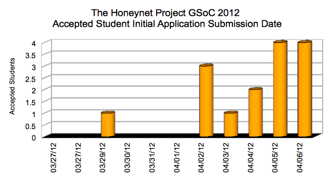

Since my [last post](https://www.honeynet.org/node/840) about the Google Summer Of Code 2012 Student Applications deadline closing and sharing some [initial student applications statistics](https://www.honeynet.org/node/840), all the GSoC 2012 mentoring organisations have been hard at work reviewing and scoring their student applications.  
  
After what seems like a very long few weeks for students, mentors and org-admins alike, the waiting is finally over! If you haven't already seen it, the GSoC 2012 student selection results were formally announced by Google on Monday April 23rd:  
  
[http://google-opensource.blogspot.com/2012/04/students-announced-for-google-summer-of.html](http://google-opensource.blogspot.com/2012/04/students-announced-for-google-summer-of.html )  
  
The names of our officially accepted GSoC 2012 students can now be found on the official Melange site (filter the results by Organization = "The Honeynet Project"):  
  
[http://www.google-melange.com/gsoc/projects/list/google/gsoc2012](http://www.google-melange.com/gsoc/projects/list/google/gsoc2012)  
  
Behind the scenes our org admins and mentors had been hard at work reviewing over 80 student proposals and trying to decide which lucky students would eventually be accepted for the 15 student slots Google have generously given to the Honeynet Project for GSoC 2012 (3 more than last year, so a really good result for the org this year - thanks Google!). With multiple reviews per mentor/project/student, plenty of internal debate and more than a few late nights this definitely hasn't been a quiet period for us!  
  
Congratulations to the 15 students who were selected, and commiserations to those of you who unfortunately we couldn't accept this year. The competition for limited numbers of student slots was particularly tough this year, with many difficult decisions unfortunately having to be made. We hope we have selected some strong students with interesting ideas and hope they can do great project work for us once again this summer.  
  
Although we know that many students who applied but unfortunately weren't accepted, please don't take this as a personal failing. With more than 5 students applying per available student slot available and less slots than project ideas or mentors, even before students suggested their own project topics, we had to make a number of very difficult decisions and couldn't  
support every good student application or project topic.  
  
You can find more information about our 15 GSoC 2012 projects and track their ongoing progress each week here:  
  
[https://www.honeynet.org/gsoc/slots](https://www.honeynet.org/gsoc/slots)  
  
For those interested in more student application statistics, with 15 of 1212 accepted GSoC 2012 students slots allocated to us, the Honeynet Project received 1.24% of the total Google student allocations - up slightly again on previous years If you remember the previous post about the unexpected "[hockey stick](https://www.honeynet.org/node/840)" growth pattern in student applications towards the end of the GSoC student application window this, we were interested to find that contrary to expectations, this year, many of the students we accepted actually made their initial student application submission surprisingly late:  
  
  
  
In the past we tended to find that students who started their application early tended to be more likely to be accepted than late starters, but not so this year, with many more well formed complete student applications being received right up to the final GSoC deadline. It will be interesting to see how the move to "just in time" student applications play out in terms of project success! ;-)  
  
Once again this year, as in previous years, we have a hugely international mix of students and mentors coming together from many different countries:  
  
  
  
Please remember that all of our mentors, org admins and members are volunteers, so just because you didn't get selected for GSoC 2012, it doesn't mean that you can't still contribute to open source software and work on open source software projects this summer (ideally with Honeynet Project of course!). FOSS isn't about the money, so if you are still interested in working on your proposed project (or contributing in other areas), please do keep in touch here or on IRC (**#gsoc2012-honeynet** on **irc.freenode.net**) and we'll try and do as much as we can to support you too.  
  
There are sometimes a number of organizations who may announce smaller, post-GSoC student acceptance date funded coding efforts too, such as [this page](http://blog.lydiapintscher.de/2011/04/25/not-accepted-into-gsoc-heres-what-to-do/) last year. If you do need to work over the summer to pay your student bills - keep an eye on the main GSoC mailing lists, #gsoc, etc for more details (although we'd obviously recommend you consider working as a volunteer with us anyway!)  
  
For our accepted GSoC 2012 students, many congratulations, we are looking forwards to an exciting summer of code with you all. During the next few days you'll receive an invite to a student/mentor mailing list for GSoC 2012 and we'll be sending out further information on what will be happening during the [community bonding period](https://www.google-melange.com/gsoc/events/google/gsoc2012) that runs between now and May 21st, when GSoC 2012 coding officially begins.  
  
We'll be aiming to establish preferred communication channels, set up source code control systems and wikis for each project, get everyone in regular communication with their mentors, work on reviewing project plans, confirm expectations about making regular (ideally daily) svn/git commits, prepare for blogging you progress publicly each week, etc so plenty to keep you busy in the coming month.  
  
Students - please remember - only code written between the official GSoC coding period of May 21st to August 20th counts for project assessments. However, you can do preparation, planning, prototyping, testing, research, etc before then, so please try and make as constructive use as possible of the community bonding period as you can.  
  
Thanks to everyone involved for all their hard work and enthusiasm, and your interest in The Honeynet Project and Google Summer of Code 2012. We really appreciate your motivation and energy, and hopefully the last few weeks will prove to be the starting steps to some great new projects and some future Honeynet Project members (whether officially accepted for GSoC 2012 or not). Fingers crossed we'll get the chance to meet at least some of you face to face next spring at our next annual workshop, when you'll hopefully be demoing your new tools.  
  
In the mean time, you can keep an eye on our [accepted GSoC 2012 projects page](https://www.honeynet.org/gsoc/slots) and track progress on each of our new summer projects there. Happy coding!
