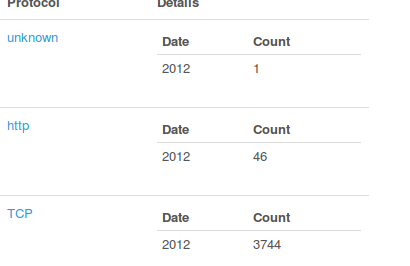
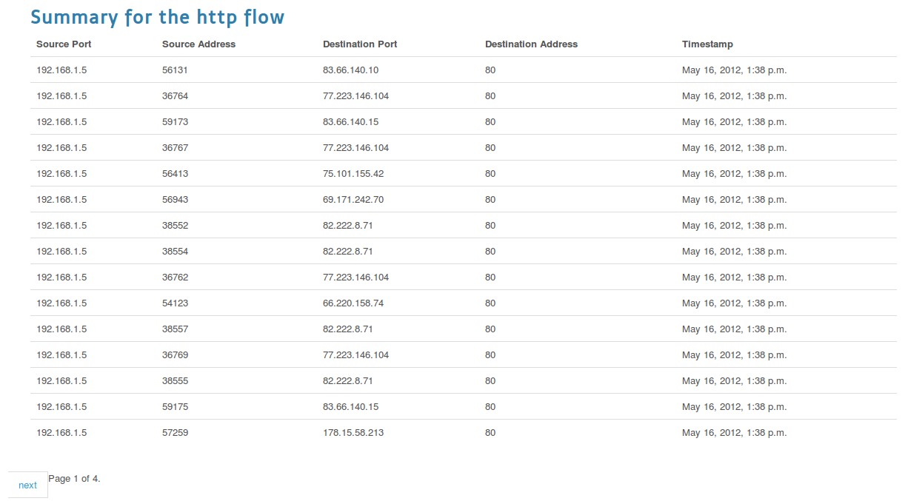
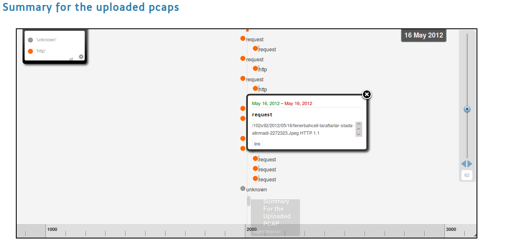



Hi everyone, I am announcing an initial release of the [Ovizart, Network Analyzer Project](https://www.honeynet.org/gsoc/slot13). Ovizart (OV - Open VİZual Analsis foR network Traffic ) is a web based application that will let users upload captured traffic in a PCAP format, analyze the traffic, and present the traffic in an intuitive manner. The current development branch is located on Github: [https://github.com/oguzy/ovizart](https://github.com/oguzy/ovizart).

In this initial release, I am rolling out the basic GUI that people can start using, and then within the next week, I will enable the upload of PCAPs for analysis and visualization.

A basic demo is available here: [http://ow.comu.edu.tr/](http://ow.comu.edu.tr/)

Currently, OV has handlers for DNS, SMTP and HTTP application traffic. The structure of OV is designed for custom handler implementations, so anyone can easily develop and deploy handlers to analyze the target traffic. Data for this demo is composed of DNS, HTTP, and SMTP traffic, and for the purposes of testing the DNS and SMTP samples were downloaded from [pcapr](http://www.pcapr.net). The HTTP traffic was generated using my browser and viewing some websites.

As a side note, the initial import phase of the PCAP processing uses Bro IDS to separate the PCAP traffic into traffic flows, and these flows are parsed using the OV protocol handlers. After the data is processed, it is then added to MongoDB. Now, when the flows are analyzed by a human analyst, the data it is taken from Mongodb.

When you visit the site, what you see is the brief explanations about the uploaded raw traffic files. They are ordered in a descending order according to their upload time. Clicking on MD5 hashes open a page for each pcap file, giving more details about traffic.

OV has several views, the first is a scatter plot built on top of [NVD3 (a D3.js fork)](http://nvd3.com/). The scatter plot displays total number of packets for a given protocol. The protocols are grouped by year and clicking them opens either flow or packet level information. Moving your mouse over the graph will focus the numbers.

At the bottom, the table gives the count numbers as well. According to the table, there are 46 packets that has a timestamp date 2012, belonging to the HTTP flow.

[Clicking](http://ow.comu.edu.tr/pcap/af37dbf71ab365833ebcef724b830f2e/http/2012) on protocol names will let you see the packet or flow details per each. If you click HTTP, what you will see is the flow details, though clickin on TCP will let you open the packet details.

There is also one packet, marked as _unknown_. The ones that the handlers couldn't handle are marked as unknown. For the cases where Bro fails like the missing handshakes, [Tshark](http://www.wireshark.org/docs/man-pages/tshark.html) is used to detect the application level protocol information. Although Bro handles TCP reassembly, i experienced that [tcpflow](https://github.com/simsong/tcpflow/wiki/tcpflow-%E2%80%94-A-tcp-ip-session-reassembler) is working much better for SMTP traffic so TCPFlow is also used.

OV also has a **timeline** view also. You may see it by clicking on [Summary](http://ow.comu.edu.tr/pcap/summary/af37dbf71ab365833ebcef724b830f2e/) tab. This is where the flow reassembly results display in a human readable manner. The timeline circles displays the flows. The sizes are calculated by looking at their timestamps. The more close timestamp information they have to the current date, the bigger circles they will have. The timeline displays the application level flows in a zoom-able layout. Zooming can be performed by moving the slider up and down. If you zoom out to 38, all application level protocols observed by OV will be visible. Clicking on squares will open a popup displaying a summary of the flow and a link to the reassembled data.

Try the big [SMTP's](http://ow.comu.edu.tr/pcap/summary/565c93dc541cd15a5f529786c68a2bda/) link.

You will see that this is an email with an attachment, which also includes meta-information informing you about the attachment type and the scanned results. OV supports adding third party application handlers. In the case of the scan results, VirusTotal's API was used to scan the attachment, and libmagic by way of the python-magic package in Ubuntu is used to help detect the file's type.

At the bottom of the timeline view, you may see _count_ and _size_ labels which will let you see treemaps either created taking into consideration the size of the packets or the count of the packets per each flow. Clicking on http size will let you see the packet sized belonging to the flow session.

Try the [http size](http://ow.comu.edu.tr/pcap/visualize/http/size/"") one. This page will display the Treemap, and below this plot information like the packet IDs and packet size are displayed.

You will recognize that some packets has larger in size. [Clicking](http://ow.comu.edu.tr/pcap/info/4762/) on them will display their payload information as well (choose one with a larger size).

The last stop is the parallel coordinates view, that is seen when you click the Visualize tab. Port communications are listed.

Ovizart has an REST API that is used for creating the visualizations. It is mainly designed to abstract database handling and getting JSON data from database. I used Mongo DB as database server. The aim was to let a real-time process at the further steps. The front end is using Django web framework and all the code works on Python.

I plan to write a CLI that uses the current API so that one may send its pcap and get the results from command line.

OV is still being actively developed, and this is a preview of whats to come in the future. If you have any feedback or suggestions please feel free to send it to me: http://about.me/oguzy or oguzyarimtepe at gmail.com
