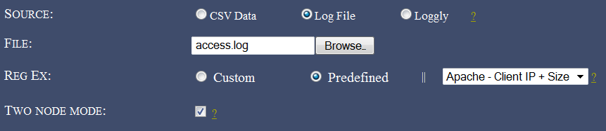
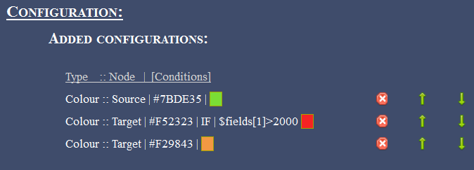

AfterGlow cloud has evolved further into another release; with many improvements added to the [initial version](https://honeynet.org/node/890). With GSoC 2012 approaching an end, we've covered all the additional features we planned for in the second phase of development, post mid-term. Building up on the initial version, this post will run you through the general features and additional improvements covered.

A live demo of this release can be found here: [http://andromeda.ayrus.net:8080/](http://andromeda.ayrus.net:8080/)

**Data sources**: In addition to the initial method of uploading AfterGlow compatible CSV file, the application now supports two new methods of visualizing your data. You can now upload your logs straight from the source and have it parsed (to a CSV file) and then, rendered on the fly. Additionally, AfterGlow Cloud is now integrated with [Loggly.com](http://www.loggly.com)'s API. Loggly is a service which is used collect log data for monitoring and analyzing the data. With an account at Loggly, you can now search and import your logs straight from Loggly and have it visualized. Your authorization to the application to access your account at Loggly remains on our end for about a hundred days, beyond which you'll have to re-authenticate the application again. You can however revoke access to the application anytime. Both of these new additions, require you to specify a parsing scheme which is covered below.

**Log parsing**: Logs you upload directly or from your Loggly account have to be parsed initially for them to be visualized later. For this to happen, a regular expression has to be provided which groups two or three columns of data (if you're using two columns you'll have to check "Two Node Mode") from each line in your log. You can either specify a custom expression or select one the 'predefined' expressions. While provided a a custom regular expression to parse your log, you're given an opt-in choice to save your expression as 'Predefined' for other users to use.

**Settings tab**: These define general settings over the way you want your final graph to be rendered. For example, "Print Node Count" prints the frequency at which each node occurs in the data uploaded beside the node's label while, "Text Label Colour" lets you choose the colour of text on each node. Each field on the application throughout is appended with a "?" help link. Hovering over this link, will provide you a small tip as to what they're supposed to do.

**Advanced settings tab**: These settings go a little beyond the general settings. As examples, "Soruce fan out threshold" will give a lower limit on the number of edges originating from each source node. If one or more source nodes don't have the required (threshold) number of edges originating from them, they're omitted on the graph. Same idea applies to "Omit threshold for each node" but with the threshold presiding over the frequency at which each node occurs throughout the data.

**Configurations tab**: These settings fine-tune your graph and often bring about interesting patterns, useful for visualization. Each fieldset in this tab provide a way to identify properties across the nodes in the graph. Examples: Option 'port' in clustering provides a way to cluster all the nodes with a specific bound for the port they represent. Giving a value of "2000" would mark and cluster (group) all the nodes representing a port higher than 2000 together. 'Number of occurrences' in Size fieldset, will have the size of each node proportionate to the frequency at which they appear throughout the log. A node with a heavy frequency would appear thick and vice-versa. This helps you to notice interesting patterns. If you're very familiar with the way configurations work with AfterGlow you also have the option of specifying these manually using the "Manual" option. You can simply cut/paste from a configuration file or write your configuration file by hand in a textbox. AfterGlow Cloud also saves your configuration every time you render a graph. When you choose to render a graph again, you can simply use your 'last used configuration' and it'd import the same configuration file you used last time. Alternatively, you can 'import' the last used configuration into the manual mode and further fine-tune it manually.

**Rendering Engines**: The application now supports using dot/sfdp in addition to using neato using GraphViz. More information about these, if you're unsure can be found [here](http://www.graphviz.org/Documentation.php).

**Gallery**: You can submit the graphs you render using the application to a public gallery (with some details of it) for other users to view.

As an example (a very rudimentary example actually), here's how you might parse a typical Apache log. For this example we'll be using a very small portion of the log (attached), parse the client IP and the size of the request from it and try to render it.

We first point to the demo access log file from Apache and since we're uploading a log directory from our source, we'll have to select the "Log" option to have it parsed to a CSV (compatible with AfterGlow) and then render it. We've also checked the "Two node mode" box since, we'll be only extracting two columns (IP/Size) from our data. For the parser, we use a predefined regular expression which extracts the client IP and request size from an Apache log using the Common Log Format:

On the settings end, for some eye-candyness we define an edge length of 1.5 (length of an edge between two nodes) and define the text label colour as white:

Finally, on the configurations end, we add three colour configuration settings. All source node (Client IP) will be coloured with a shade of green. Target nodes (size nodes with a value of more than 2000 -- in this context it converts to more than 2000 bytes) will be coloured red. All the other target nodes will be coloured with a shade of orange. It's important to note here that configurations are read line-by-line hence, the line ordering matters. This type of configuration will show a really simple relation between how many bytes each client has requested in each request, but it will specifically mark the request with more than 2000 bytes in red (say you wanted to visualize the 'heavy' requests):

The resulting graph from these settings looks like:

You can see from the (really simple) example above some of the 'heavy' (we're classifying 'heavy' as >2000 bytes for the sake of an example here) requests from different clients.

From the development perspective, AfterGlow Cloud can now be deployed to a production like environment. The application (and the demo above) [README](https://github.com/ayrus/afterglow-cloud) cater to deploying the application on Apache using mod\_wsgi. If you wish to run your own instance of the application, you can clone the [source from the repository](https://github.com/ayrus/afterglow-cloud). A detailed [README](https://github.com/ayrus/afterglow-cloud) (pertaining to a machine running Ubuntu) is also available to help you setup. The README walks through the complete steps required from scratch to set the environment and the application (to the point that you can get it running on a fresh Ubuntu install without a hassle). The codebase has also been documented in detail, should you wish to fork and play with it.

This release marks the next version of AfterGlow Cloud. Please report any bugs or comments you have using the [contact form](http://andromeda.ayrus.net:8080/contact) on the demo :)
