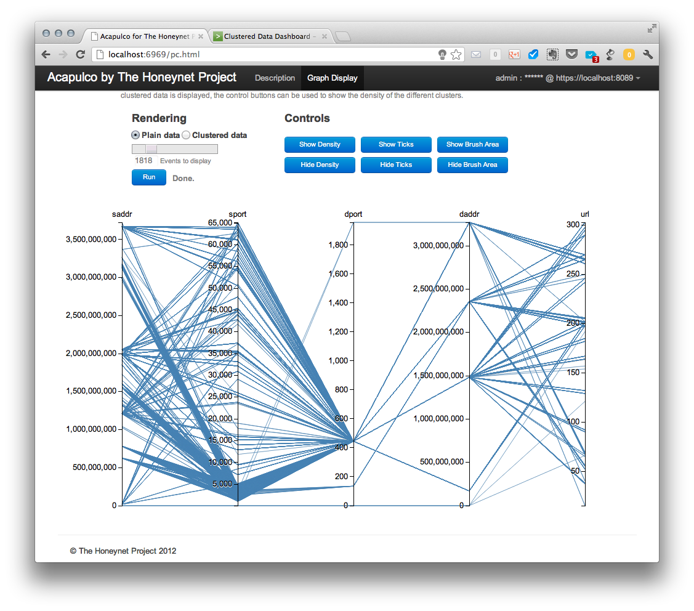

…and the summer is over. During the last three months I have tried to make sense of the highly unstructured data set that comes from merging the data streams of several hpfeeds channels. I have had to learn the inner workings of Splunk, their SDKs, the D3.js graphic library and explore different machine learning frameworks and clustering algorithms.

Today I am presenting the first release of Acapulco, a tool to find and display clusters of meta-events built from different types of hpfeeds events within a parallel graph, one of the best ways to represent multidimensional security data in a single visualization.

Acapulco consists of three different parts that are displayed in the following diagram: the Splunk application, the cluster runner and the visualization web client.

The Splunk server and the installed Acapulco application should be managed by an administrator who has one master key to the HPfeeds system. This key should have access to as many channels as possible and, although in this first release not every data feed is included for analysis, new ways of creating meta-events from different feeds will be included in next releases.

Once the Splunk app is configured, all available data feeds are logged in a specified local directory in the server and the _cluster runner_ can be run with the logging directory as a parameter to indicate where it can find all the available hpfeeds log files. A new pair of files will be created. The first of them will include a series of **meta-events**. These are new events build from the intersection of different feeds into a single one for some of their parameters. For instance, the most common parameters found across all feeds are _source IP address, source port, dest IP address_ and _dest port_, but Dionaea feeds provide the URL from where a sample has been downloaded and also does Glastopf provide the URL of the malicious server file. These parameters can be combined and clustered to search for similarities across different hpfeeds channels.

In order to preserve similarities when plotted along a linear axis, some of the parameters needed to be encoded. For example, IP addresses are converted into integers in a way that subnets distances are preserved. Port numbers, which are already integers, are easily encoded. URLs present a special case because there are many different manners of encoding strings in a way that some similarity measure is preserve. In this case, every URL string is character-vector encoded. This means that every string is embedded in a vector where every element represent the integer version of each character. To be able to apply clustering algorithms on these set of vectors, all of them need to have the same size, so smaller vectors are zero-padded up to the size of the largest one (i.e. the longest URL).

After clustering every feature, the original values are changed by the cluster label that has been assigned by the algorithm and saved in the second file in the logging directory. The unclustered and the clustered files are also indexed by Splunk so the remote visualization client is able to retrieve them using the JavaScript Splunk SDK and a standard Splunk search query.

When the user is accessing the visualization client, it is necessary to provide a user and login to the Splunk server. This account can be configured by the administrator in the server so the user can access the visualization without admin rights.

The following is the intro to the viz client:

And this is the main graph page before requesting any data:

After a successful login, a new "Run" button appears and it can be used to retrieve the **plain data** from the server after the type and amount of data has been selected using the slider bar. Retrieved data are displayed in parallel coordinates graph as shown below.

The displayed data can be then shown in a clustered view (selecting "clustered data" radio button and leaving other options unchanged).

This configuration is good to see how the different clusters in different coordinates or features relate to each other, but as all the lines are over imposed on one another it is difficult to see the relative size of each cluster respect to the other ones. Then, we come to a nice way of visualizing the density of the clusters in a parallel coordinate graph. If we hit the **show density** button, which is only active in the clustered data view, we see the following:

The size of the cluster _bubbles_ represents the number of elements in that cluster and is relative to the number of total events requested. This means that, if all events retrieved belong to just one cluster, the _bubble_ will reach a maximum size. This maximum size will be the same, independently of the amount of events retrieved, if all the events belong to a single cluster.

This might result in a situation when some clusters have no displayed density bubbles in spite of having events. This is only visual effect. Since a size of bubbles is proportional to the number of events in a cluster, clusters with small number of events (e.g., 4) have a significantly smaller bubble size compared to large clusters (e.g., 4000 events).

The cluster density _bubbles_ can be understood as a histogram of the sizes of the clusters in each coordinate and while the relation between them is currently linear, another function, like a logarithm, can be applied to them to stress the difference between very populated and less populated groups.

As described in the project page, the code is available at: [https://github.com/hgascon/Acapulco4HNP](https://github.com/hgascon/Acapulco4HNP)

I have made available here some slides with more details on the project and a very simple and rough [demo video](https://vimeo.com/48014065) with the first version of the visualization client.
