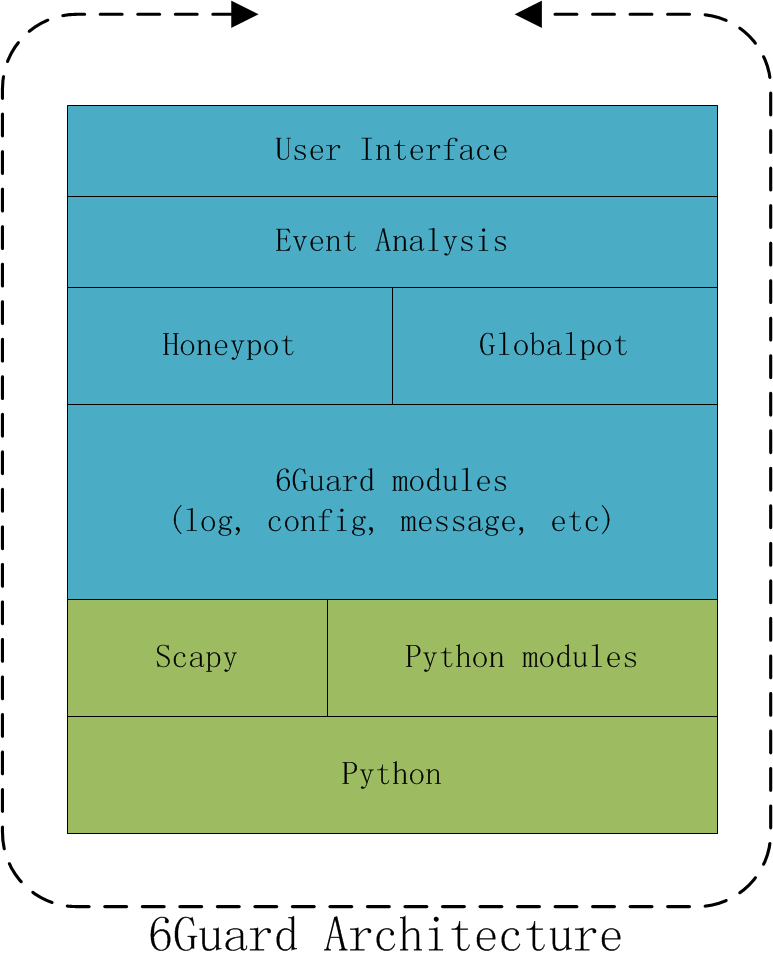

6Guard is a honeypot-based IPv6 attack detector aiming at detecting the link-local level attacks, especially when the port-mirror feature of switch is unavailable.

### **Intallation**

1. 1. Download and install [Scapy](http://www.secdev.org/projects/scapy/) in your machine. (`apt-get install python-scapy`)

1. 1. Download the [v1.0 tarball](https://github.com/mzweilin/ipv6-attack-detector/tarball/v1.0) directly or the latest code from [Github Repository](https://github.com/mzweilin/ipv6-attack-detector/), then extract it into a directory.

### **Usage**

1. 1. Enter the directory of 6Guard.

1. 1. Run `$ sudo ./conf_generator.py` to generate the configuration files.

1. 1. Run `$ sudo ./6guard.py`.

_Note_: The `./conf` directory stores the configuration files of the honeypots and the globalpot. The `./log` directory stores the operation logs and the attacking records. The `./pcap` directory stores the message-related packets that can be reviewed in Wireshark.

### **Detection Capability**

6Guard is able to detect most attacks initiated by [THC-IPv6](http://thc.org/thc-ipv6/) and the advanced IPv6 host discovery methods utilized by [Nmap](http://nmap.org/). In practical terms, this beta version could detect the attacks as below:

**Group I of THC-IPv6. Fake Router Advertisement or Redirect ICMPv6**

- - fake\_router6

- - flood\_router6

- - kill\_router6

- - redir6

**Group II of THC-IPv6. Fake Neighbour Solicitation/Advertisement**

- - dos-new-ip6

- - parasite6

- - fake-advertise6

- - flood\_advertise6

- - flood\_solicitate6

**Group III of THC-IPv6. Fake DHCPv6/DNS Server or Client**

- - flood\_dhcpc6

**Group IV of THC-IPv6. Evil Consumer For Network resource or CPU resource**

- - rsmurf6

- - smurf6

- - sendpees6

- - sendpeesmp6

**Advanced IPv6 host discovery utilized by Nmap**

- - targets-ipv6-multicast-echo.nse

- - targets-ipv6-multicast-invalid-dst.nse

- - targets-ipv6-multicast-slaac.nse

### **Architecture**

6Guard is based on Python and Scapy. Basically, it contains the three modules: honeypot, globalpot and event analysis.

The _honeypot_ is a virtual low-interaction IPv6 host with the capability of NDP and StateLess Address Auto-Configuration. Consequently, it is responsible for detecting the unicast attacks.

The _globalpot_ is a module focusing on detecting the multicast attacks. Since each honeypot would be able to capture the multicast attacks at the same time, then implementing the feature as a globalpot would simplify the detection significantly.

The _event analysis_ module is responsible for analyzing the Event messages and generating an Attack message if detected. Such mechanism is useful for detecting attacks like dos-new-ip6: when one honeypot reported an _Event_ message that the address was in use, it might be true, but if more honeypots reported the address-in-use message, we could know that the network was suffering dos-new-ip6 attack.

Consequently, the _Attack_ messages comes from the _honeypots_, the _globalpot_ and the _event analysis_ module.

### **Detecting Examples**

#### 1\. THC-IPv6: fake\_router6 detected by globalpot

Attacking information:

- - Principle: Run a fake router on the Ethernet link.

- - Source: attacker

- - Destination: ff02::1

- - Attacker: source

- - Victim: ff02::1

- - Detected by: Globalpot

- - Example: sudo ./fake\_router6 eth5 2002::1/64

Detected Attack message:

- - \[ATTACK\]

- - Timestamp: 2012-08-19 15:13:59

- - Reported by: Globalpot

- - Type: DoS

- - Name: Fake Router Advertisement

- - Attacker: \[fe80::a00:27ff:feab:a569\] 08:00:27:ab:a5:69 (CADMUS COMPUTER SYSTEMS)

- - Victim : \[The whole network\]

- - Utility: THC-IPv6: fake\_router6

- - Packets: 30bc907683566e0f7a704a1e820aaeba.pcap

#### 2\. THC-IPv6: smurf6 detected by honeypot.

Attacking information:

- - Principle: fake an echo request destinating to ff02::1 (or other address)

- - Source: Victim

- - Destination: ff02::1 (or other addr)

- - Attacker: unknown

- - Victim: ip6.source

- - Detected by: Honeypot

Detected Attack message:

- - \[ATTACK\]

- - Timestamp: 2012-08-19 15:13:35

- - Reported by: Honeypot-apple-2A:C4:2D

- - Type: DoS

- - Name: Fake Echo Request

- - Attacker: \[Unknown\] 00:00:de:ad:be:ef (CETIA)

- - Victim : \[Honeypot-apple-2A:C4:2D\] 40:3C:FC:2A:C4:2D (Apple, Inc.)

- - Utility: THC-IPv6: smurf6

- - Packets: b12fe3415c1d61c1da085cb8811974a2.pcap

#### 3\. THC-IPv6: dos-new-ip6 detected by event analysis with the support of honeypots.

Attacking information:

- - Principle: (tons of DAD: address-in-use messages)

- - Source: Victim

- - Destination: ff02::1

- - Attacker: unknown

- - Victim: all machines

- - Detected by: Event Analysis with the support of honeypots

Detected Event messsage 1:

- - \[EVENT\]

- - Timestamp: 2012-08-19 21:06:22

- - Reported by: Honeypot-apple-2E:A4:E9

- - Type: DAD

- - Name: Address in use

- - Utility: Unknown

- - Packets: fd439f6174bfbc0de210bebe4add691e.pcap

Detected Event messsage 2:

- - \[EVENT\]

- - Timestamp: 2012-08-19 21:06:22

- - Reported by: Honeypot-Dell-0A:73:C9

- - Type: DAD

- - Name: Address in use

- - Utility: Unknown

- - Packets: 226555a1d6cfd7967e93e9b3efe6b91e.pcap

Detected Attack message:

- - \[ATTACK\]

- - Timestamp: 2012-08-19 21:06:23

- - Reported by: Event Analysis Center

- - Type: DoS

- - Name: dos-new-ip6

- - Attacker: \[Unknown\] 08:00:7a:7c:05:74 (INDATA)

- - Victim : \[Honeypot-apple-2E:A4:E9\] 00:26:4A:2E:A4:E9 (Apple, Inc)

- - Utility: THC-IPv6: dos-new-ip6

- - Packets: 2f93cf4f4c889887ed1fe70e7d0a4230.pcap
