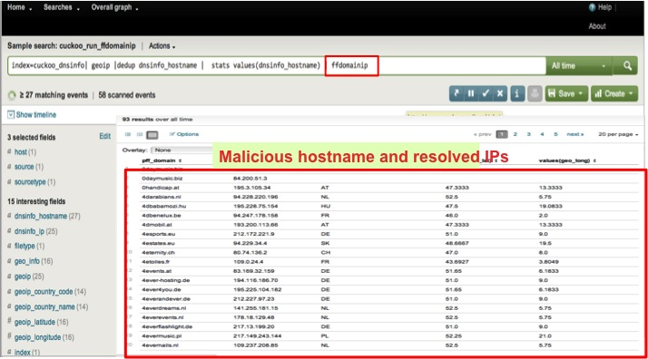
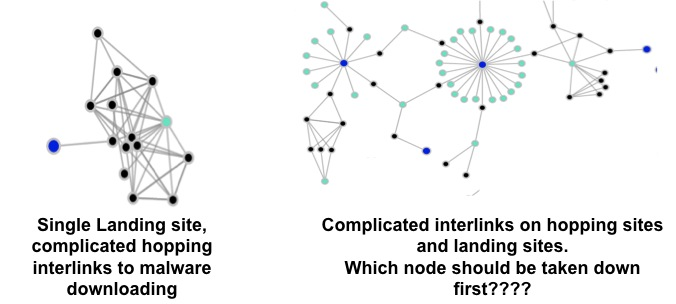
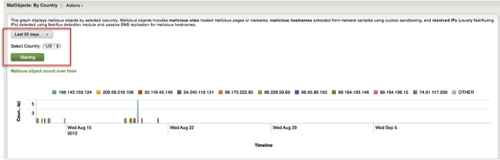
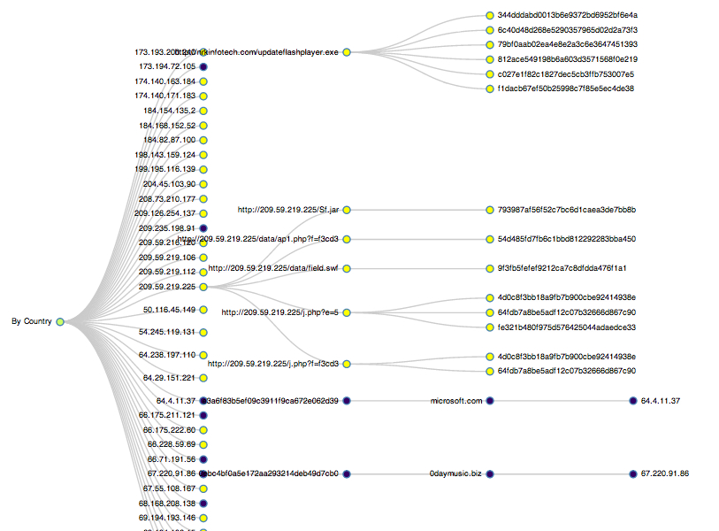

Finally it is good enough to announce my GSoC project - HpfeedsHoneyGraph which is a Splunk APP to display attack graph for hpfeeds logs. It is not a easy project for me to complete in short time. During the last three months, I have to learn several skills for implementation including HPfeeds logs correlation of several hpfeeds channels, Splunk frameworks, Splunk REST API , D3.v2.js graph library and fast-fluxing modules. The most difficult challenge for me is to write javascript code. I SUPER hate javascript.  
  
I cannot tell enough how fortunate I am to have **Chris Horsley** from Australia chapter on guiding me to achieve project goal. Without him, I definitely cannot finish my project.  
  
**Code is available at : https://github.com/yuchincheng/HpfeedsHoneyGraph**  
  
**Project Introduction:**  
A large amount of honeypot logs from Hpfeeds result in difficulties in data analysis and interpretation. In order to solve this problem and make logs easy to explain, this project is to implement a Splunk APP, named as HpfeedsHoneyGraph, for constructing attack graph from multi-sources to provide a comprehensive attack scenario.  
  
**Project Design**  
HpfeedsHoneyGraph collects honeypot logs from hpfeeds and indexes the logs. Pre-processing extracts useful fields, run automatically _GeoIP_ for IP addresses and _DNSLookup_ for hostname to get country information. When given a hostname, Fast-Flux module resolves IP addresses and continue to run passive DNS replication. Furthermore, we use force-based and node-line tree of D3.v2.js graph drawings to present three attack graphs.  
  
  
  
**Data Processing Flow**  
As described on last figure, we apply GeoIP, DNSLookup, fast-flux module and passive DNS replication to further process hpfeeds logs. Then, we can get multi-sources data to construct graph.  
  
  
  
**Fast-Flux Module: ffdomainip**  
ffdomainip includes _pffdetect_ and _BFK edv-consulting_ sub-modules. pffdetect is to resolve fast-fluxing IPs with domains, and BFK edv-consulting is to do passive DNS replication for fast-fluxing IPs extracted from pffdetect.  
  
While malicious hostname extracted from Cuckoo Report, the first we want to know is "does malicious hostname belong to fast-flux domain? ". If the answer is YES, we hope we can explore all fast-fluxing IP addresses. For this purpose, we integrate _[pffdetect](http://code.google.com/p/pffdetect/)_ module into SPLUNK HpfeedsHoneyGraph App as an external command. [Pffdetect](http://code.google.com/p/pffdetect/) is a python fast-flux domain detector. Given a domain, pffdetect can check if fast-flux domain and find all resolved IPs.  
  
Following the pffdetect, we continue to do passive DNS replication of fast-flux IPs by _[BFK edv-consulting](http://www.bfk.de/bfk_dnslogger_en.html)_. Given a fast-flux IP address, query BFK database to display known A RRs for this IP address and CNAME RRs.  
  
The following figure runs _ffdomainip_ external command to explore fast-fluxing IPs and passive DNS replication.  
  
  
  
**Attack Graph 1 : Domains and IP addresses connected to malware**  
This forced-based attack graph shows the comprehensive malicious hostname and resolved IPs relationships connected to malware MD5. 
- Central red dot: the circle means cuckoo reports.
  
- Green dot: Malware samples MD5
  
- Black dot: Malcious hostname extracting from cuckoo reports
  
- Dark red dot: Resolved IPs or fast-flux IPs by ffdomain external module
  
The most important we did in this graph is to make nodes unique. It helps us easily find the highly-connected node called it "weak point". The weak point is the domains or IP addresses are connected to lots of malwares.  
  
  
  
It is quite interesting when observing this graph. We found that different shapes of subgraph could present different stories.  
  
  
  
**Attack Graph 2 :Thug\_hopping: Malicious websites interlinks**  
This graph is to display the interlinks from landing site, hopping site to malware downloading.  
- Green dot: landing site detected by thug
  
- Black dot: hopping site (referer URL from thug.events)
  
- Dark blue dot: malware MD5
  
  
  
From observing the graph, some thoughts come in my mind. This graph could help study the complexity of malicious websites through interlink analysis.  
  
  
  
**Attack Graph 3 : By Country: Malicious Activities on selected country**  
This graph displays malicious activities related to selected country on specific time duration.  
Malicious activities include (1)
malicious IPs (sites): The IP address on selected country are used to host malicious pages or malwares. (2) malicious hostnames: Analyzed from malware samples using Cuckoo sandboxing. We also use node-link tree to show malicious activities for each IP address.  
  
  
  

