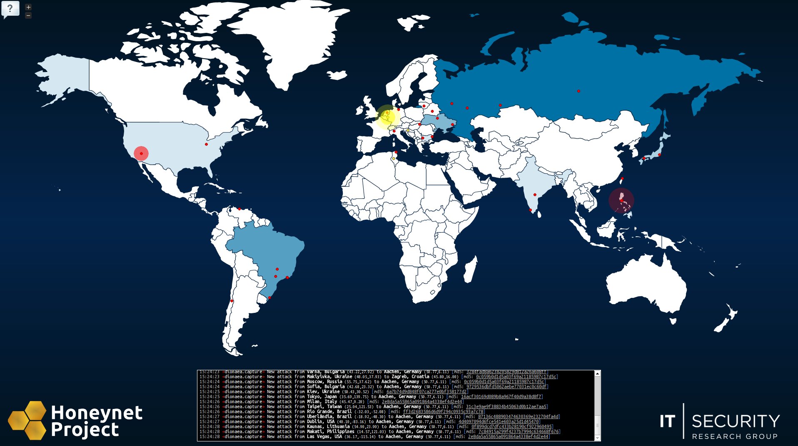

The HoneyMap shows a real-time visualization of attacks against the Honeynet Project's sensors deployed around the world. It leverages the internal data sharing protocol [hpfeeds](https://github.com/rep/hpfeeds) as its data source. Read this post to learn about the technical details and frequently asked questions. Before going into explanations, take a look at the map itself: [map.honeynet.org](http://map.honeynet.org/)!

We have seen attack visualizations for quite some time in various forms and availabilities. So far, we only had a GTK canvas based solution and [a project](https://honeynet.org/gsoc2011/slot4) around Google Earth and WebGL that would show attacks against our honeypot systems. The most awesome related projects are coming from our Australian folks (thanks Ben) - make sure to take a look at [their site](https://honeynet.org.au/).

Despite earlier nice approaches, a pure web based one that could easily be shared was not existing. With better abstractions, more libraries and cool HTML5/CSS3 stuff becoming available for web browsers, Florian decided to try a similar visualization that could be made available as a service without any setup requirements. After the first initial proof-of-concept code, we decided to throw some real data onto the map.

Internally, the Honeynet Project uses hpfeeds for collecting data from honeypots and sharing it across different analysis components and data storage setups. Thus, we added hpfeeds support to our map back-end and translated all IP addresses of our events to geographic locations through the [MaxMind](https://www.maxmind.com/) IP geolocation. After a short while we had a real-time event visualization that used our already existing honeypot data - and it looked awesome!

We are very happy with the outcome of our small pet-project as the map so far has been very popular and seems to be well-received by other researchers and the community. As the word was spread across [Twitter](https://twitter.com/ProjectHoneynet), [Facebook](http://www.facebook.com/TheHoneynetProject), and some news sites, we started to get a decent amount of mails by people having questions about the HoneyMap and the data used for it. Here are a few more insights that should clarify most of the questions we got.

- - **Where does the data come from?** The Honeynet Project is, among other things, focused on creating software and frameworks for learning about attacks and analyzing threats that appear in the wild. Several of these tools are run by the members of the HP in various locations around the world. Basically, the data comes from the systems running at our members' infrastructure in a lot of different countries. The tools are actually passive and just sit on a network and wait for something to happen. The most events are created by the [dionaea](http://dionaea.carnivore.it/) and [Glastopf](http://glastopf.org/) honeypots.
    - **What kind of attacks are these? Are they "targeted"?** The data that is currently shown on the HoneyMap is mostly not "targeted" in the sense that a human attacker with a specific goal is monitored. Mostly, we see automated scans and attacks with the current set of sensors and they originate from infected end-user computers or hijacked server systems. This also means that an "attack" on the HoneyMap is not necessarily conducted by a single malicious person but rather by a computer worm or other forms of malicious programs.
    - **Is the data representative?** Kind of. Historically, this kind of visualization would be skewed by the sensor location but with newer attack code (e.g., Conficker) this is not true anymore as the attack target selection is randomized. This means that a country's chance of getting attacked by those randomized spread techniques only depends on the number of potential target IP addresses in that country. Consequently, red dots roughly depict reality when it comes to attacker location (regarding the type of attack which we capture). Also, our hpfeeds back-end is still young and not all sensors are connected to it. We have more sensors around the world than currently visible on the map.
    - **Countries with many red dots are evil, right?** No. Many red dots means there are many machines which are attacking our honeypots. This does **not** imply that those countries are "very active in the cyberwar" (which we actually read in some news articles about our map). For all we know, this just means that those countries run many old unpatched Windows XP boxes which are infected with worms. No harm intended (probably).
    - **Why are there so many attacks and yet so few different attackers (red dots)?** This is just an issue of precision in geo location lookups. We identify the red dots by their GPS location and many IP addresses map to the same GPS location, even if the corresponding machines are actually not really close to each other. So one single red dot can represent many different attackers.As a sidenote, IP geolocation is not 100% accurate, either. In the past we had US systems being mapped to asian countries and similar problems.
    - **Why does the whole world seem to attack Aachen?** From time to time, you might notice that many attacks are targeted against Aachen, Germany. This is because we run a very active dionaea honeypot at the [IT-Security Research Group of the RWTH Aachen University](http://itsec.rwth-aachen.de/). This honeypot is assigned a very large "honeynet", which means that it accepts connections for hundreds of target IP addresses at once. So from the point of view of an attacker, this honeypot is not a single system but rather a whole network of potential targets.
    - **What's going on under the hood?** It depends on the type of sensor that is attacked. The most events right now originate from [dionaea](http://dionaea.carnivore.it/) sensors. This software sits in the network and passively waits for someone or something to connect to it. Once connected, it emulates a variety of network protocols and the respective vulnerabilities that were found in the past. Actually, because of the way its detection works, it might also find some attacks that were unknown before and thus give us insights about new exploits and spreading techniques.
    - **How can I contribute?** If you are a member of the Honeynet Project, the easiest way to contribute is to just run a honeypot system in your own network. Set it up to push results to the hpfeed system and all your captures will automatically show up on the HoneyMap. Make sure that you publish your own public IP adresses (rather than local addresses) if you want your honeypot to appear on the map, otherwise only the attackers will show on the map. If you are not a member of the Honeynet Project, you could contact us to discuss how to become involved and how to get connected to our hpfeeds system. Also you could run your own map on your own server and basically do whatever you want with it :-) Documentation on how to interconnect all the necessary parts is a bit sparse at the moment (we are working on it). If you are serious about running your own map, feel free to contact us if you need help. If you know some web-design and JavaScript, you can help us by improving browser compatibility. Right now, only Chrome and Firefox are tested. We would like to make the map run on all major browsers, including mobile ones. Contact us! Since one of the main goals of the Honeynet project is to raise awareness, you can help us with that by just showing the map around :-)Hosting sensors is very easy with our HonEeeBox distribution - which is actually what a lot of our sensors are running. You can read more about this effort in this [slide set](https://www3.honeynet.org/wp-content/uploads/attachments/David_Watson_HonEeeBox.pdf).
        
        Apart from that the Honeynet Project has many tools and activities that you can participate in. And of course we are always grateful for [sponsors / donations](/funding)!
    - **Who created this map? And why?**  There was no real "goal" or "project", we just wanted to create something which looks nice and which uses "new" technologies (HTML5 websockets, CSS3 animations, asynchronous network I/O). The HoneyMap was hacked together as a just-for-fun project in essentially 2-3 days by [Florian Weingarten](http://itsec.rwth-aachen.de/people/florian-weingarten) ([flo@hackvalue.de](mailto:flo@hackvalue.de)) and [Mark Schloesser](http://itsec.rwth-aachen.de/people/mark-schloesser) ([ms@mwcollect.org](mailto:ms@mwcollect.org)) from the [Research Group IT-Security](http://itsec.rwth-aachen.de/) of RWTH Aachen University. Mark has been active in the Honeynet Project for quite some time and is the author of hpfeeds and one of the developers of the dionaea honeypot. For the HoneyMap, he wrote the hpfeeds geolocation lookup tool as well as the [node.js](http://nodejs.org/) module which connects the HoneyMap back-end to hpfeeds. Florian wrote the front-end code of the HoneyMap as well as parts of the node.js server back-end.

Now if you still want to find out more, you might want to take a look around this website and at the material available from our last workshop hosted by Facebook [here](/SecurityWorkshops/2012_SF_Bay_Area/Mar_19/Workshop_Program_Agenda).
