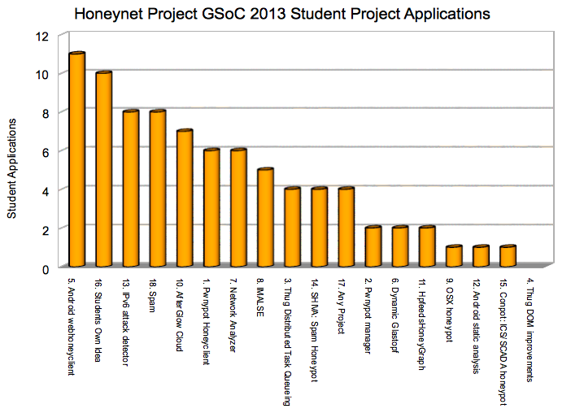
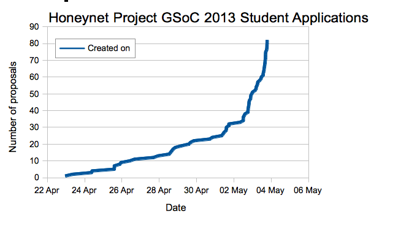

Having being very pleased to be [accepted once again](https://www.honeynet.org/node/1043) by Google as one of the lucky mentoring organization for [GSoC 2013](http://www.google-melange.com/gsoc/homepage/google/gsoc2013), we had eagerly awaited the [student application period](https://www.honeynet.org/node/1045) starting and the excitement (and occasional drama) that always brings. Once again we were not disappointed, with a steady stream of students getting in touch with us via our [public mailing list](https://public.honeynet.org/mailman/listinfo/gsoc) or IRC channel (#gsoc-honeynet on irc.freenode.net) and exploring project ideas with us.  
  
Google had made a number of changes to the usual process for [GSoC 2013](http://www.google-melange.com/gsoc/homepage/google/gsoc2013), including moving the [program start date](https://www.google-melange.com/gsoc/events/google/gsoc2013) (and therefore also the student application period) backwards by about a month, and reducing the number of individual student applications to a maximum of five per student. These changes were likely to make the program more attractive to European students (who generally have later summer holidays), and also hopefully reduce the amount of last minute spam applications by encouraging more detailed proposal writing.  
  
[Last year](https://www.honeynet.org/node/840) we had a pretty slow start followed by a last minute rush, and this year seemed to move even further in that direction! Initial discussions on the GSoC mentors mailing lists suggested many participating Orgs were seeing lower than normal levels of early student applications, and we definitely shared those early fears. However, student application rates really picked up in the final few days. Encouragingly, first impressions were that the last minute timing did not necessarily mean only spammy student applications either.  
  
The [official deadline](https://www.honeynet.org/node/1045) for student applications was [19:00 UTC on Friday May 3rd](https://www.google-melange.com/gsoc/events/google/gsoc2013). Many thanks to all the interested students who applied, and our mentors and org admins for taking the time to respond to students on IRC, email and through Melange. Even if you don't get accepted as student for GSoC 2013 with the Honeynet Project, please do consider trying to work on your chosen project and becoming part of our community anyway, as we are all volunteers and would be happy to welcome and support you too.  
  
After spending a few busy days on initial reviews and scoring, we would like to provide some initial statistics for comparison with [previous years](https://www.honeynet.org/node/840):  
  
In 2010, 367 mentoring orgs applied and 151 were accepted. 5539 proposals were submitted by 3464 students and 1026 were accepted, with the Honeynet Project receiving 56 student applications, which was 1.0% of the total student applications submitted, and being offered 16 funded student project slots by Google.  
  
In 2011, 417 mentoring orgs applied and 175 were accepted. 5474 proposals were submitted by 3731 students and 1115 were accept, with the Honeynet Project receiving 61 student applications, which was 1.1% of the total student applications submitted, and being offered 12 funded student project slots by Google.  
  
[In 2012](https://www.honeynet.org/node/840), 180 of 406 mentoring orgs were accepted. 4258 students submitted 6685 proposals, of which 1212 were accepted. The Honeynet Project received 82 student applications, which was 1.23% of the total student applications submitted, and being offered 16 funded student project slots by Google.  
  
In 2013, 177 of 417 mentoring orgs were accepted. Google have not yet announced the total number of students applying and the total number of student applications received. However, once again The Honeynet Project received 82 student applications, which is likely to represent a similar percentage of the overall student applications submitted. Given our initial fears about the lack of early student applications, this was a very pleasant surprise (and relief)!  
  
Despite spending a lot of time trying to encourage all of our potential students to apply early, our latest student application was received a relatively sedate 27 seconds before the deadline, at 18:59:33. Not quite as ridiculously last minute as previous years, but still pretty crazy given the risks involved and what is potentially at stake!  
  
The graphs below show our daily and hourly rate of GSoC 2012 student applications:  
  
  
  
  
  
From our initial 82 student applications, our first cut spam reduction reduced it to 73 (down from 75 [last year](https://www.honeynet.org/node/840)). Additional review and initial feedback from mentors (such as students simply repeating what the mentor had told them about the project before hand, without showing any real understanding or initiative, nor a project plan/timeline/deliverables or not using our requested student application format) is likely to reduced that number to 69 (down from 71 [last year](https://www.honeynet.org/node/840)). So overall our ratio of spam student proposals has not really been significantly impacted by this years program changes.  
  
Of those student applications that we will spend time reviewing between now and [May 22nd](https://www.google-melange.com/gsoc/events/google/gsoc2013), topics were spread quite widely over most project ideas from our [public project ideas page](https://www.honeynet.org/gsoc/ideas) plus quite a high number of student's own proposed project topics too:  
  
  
  
The most popular proposed project ideas were:  
  
  
  
We are actively seeking appropriate mentors internally for the many new alternative ideas proposed by students.  
  
[Next steps](https://www.google-melange.com/gsoc/events/google/gsoc2013) are for our hard working org admins and mentors to complete their initial reviews of each student proposal, then ask follow up questions or set additional assessment tasks and work with students to refine their proposals to contain realistic goals, timelines and deliverables. We received our initial student slot allocations from Google this week and will work to ensure we get the most slots we can for any excellent projects we really want to mentor. Realistically we are likely to be able to support a similar number of student projects as in previous years, but there are definitely going to be some difficult decisions to make.  
  
Mentoring organizations need to have all student scoring complete and top rated students paired up with mentors and assigned to the Org's allocated student slots by initial inter-org de-duplication on [May 22nd](https://www.google-melange.com/gsoc/events/google/gsoc2013) and final de-duplication at [19:00 UTC on Friday May 24th](https://www.google-melange.com/gsoc/events/google/gsoc2013). Google will [publicly announce](http://google-opensource.blogspot.co.uk/2013/02/flip-bits-not-burgers-google-summer-of.html) the list of students successfully accepted for GSoC 2013 on [Monday May 27th](https://www.google-melange.com/gsoc/events/google/gsoc2013), so please don't ask for any additional information before then, because we simply won't be able to provide any (nor will any other participating Org).  
  
We hope people find this information useful and look forward to hopefully another great line up of successful student projects again this summer.  
  
For anyone using [Olly Betts of Xapian's spreadsheet](http://survex.com/~olly/blog/debian/debian-gsoc-applications-2013.html) summarizing student application rates, here are our figures in that format for comparison too:  
  
  
  
This also definitely shows the heavy bias to students applying in the last 48 hours, which was even more pronounced than [last year](https://www.honeynet.org/node/840).
