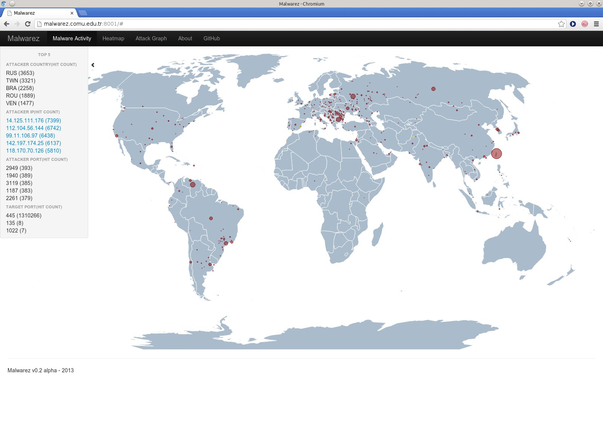

MalwareZ is a visualization project that is started as a [YakindanEgitim (YE)](http://yakindanegitim.org/) project. YE is a startup that me and some collegues mentor young people on specific projects, remotely. It is announced as a local fork of Google Summer of Code, except neither mentors nor mentees are paid.

[Gürcan Gerçek](http://ggercek.wordpress.com/) was the main developer for the MalwareZ project and my role was mentoring him.

MalwareZ project idea arose from the 2011 GSoC project idea. The aim was to generate 3D visualizations of malware visualizations with heatmap mesh grids. It has been a while since the project is not edited and become more usable so the idea is used instead.

The project is still under development and you may reach the codes from its Github repo: [https://github.com/YakindanEgitim/malwarez](https://github.com/YakindanEgitim/malwarez)

There is a demo site to see it working: [http://malwarez.comu.edu.tr:8001/](http://malwarez.comu.edu.tr:8001)

MalwareZ is aimed to be a web based project. It displays real-time information. The information is coming from [hpfeeds](https://github.com/rep/hpfeeds) by using dionaea.capture chanell which is shared from [Hpfriends](http://hpfriends.honeycloud.net). Currently only dionaea.capture channel data is being parsed and used for visualization.

The project is at the 0.2 alpha version. The first visualization is the real time world map displaying malware locations by using circles. The center of the circles are pointing to the location gathered from hpfeeds data, which is an IP address and converted to latitude longitude. The world map is generated using [Kartograph.js](http://kartograph.org/about/kartograph.js/). Real-time display is provided by using websockets. Small yellow points are displayed whenever a new data is reveived and displayed for a few seconds.

When a country is clicked, a 3D bar graph is opened and displays more detail information about the location of the malware sources through the country. The bar heights are proportional to the number of the malwarez detected.

The collected data is also saved to Mysql database. A sample result from the collected information can be seen at the left side by clicking on the small arrow. A hidden display will be seen and will display top ports and IP sources acting as a malware source.

Another visualization is the heatmap display. The color is darkened at the same world map either depending on the number of malwares, or IP / malware diversity. The unique number of IP or malware source distribution may give another idea of the malware sources. Again this part is also working as real time.

There is another part which is not implemented yet but still in progress, that is attack graph. The aim is to display the source and destination IP relations.

There are some other planned but unfinished issues at the project. It is planned to create data filtering option and revising the map displays. Some undefined coutries should be marked as unnamed also. Except from dionaea data, we should be collecting other honeypots data and working on them as well.
