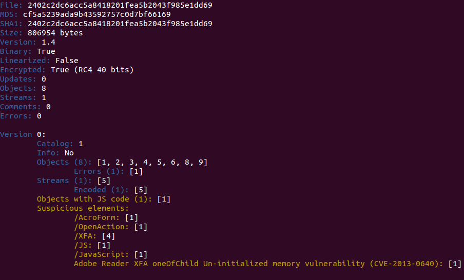

After some time without releasing any new version here is [peepdf v0.3](http://eternal-todo.com/files/pdf/peepdf/peepdf_0.3.zip). It is not that I was not working in the project, but since [the option to update the tool from the command line was released](http://code.google.com/p/peepdf/wiki/Execution#Updating_peepdf) creating new versions became a secondary task. Besides this, since January 2014 [Google removed the option to upload new downloads to the Google Code projects](http://google-opensource.blogspot.nl/2013/05/a-change-to-google-code-download-service.html), so I had to figure out how to do it. From now on, all new releases will be hosted at [eternal-todo.com](http://peepdf.eternal-todo.com/), in the [releases section](http://eternal-todo.com/tools/peepdf-pdf-analysis-tool#releases).

The differences with version 0.2 are noticeable: new commands and features have been added, some libraries have been updated, detection for more vulnerabilities have been added, a lot of bug fixes, etc. This is the list of the most important changes ([full changelog here](http://peepdf.googlecode.com/svn/trunk/CHANGELOG)):

- - Replaced Spidermonkey with PyV8 as the Javascript engine ([**see why here**](http://eternal-todo.com/blog/pdf-attack-journey-exploitkit-shellcode)).
        

- - New command _“[**vt\_check**](http://code.google.com/p/peepdf/wiki/Commands#vtcheck)”_ to show VirusTotal detection (API key included). The sample is not sent to VT just hashes.
        

- - Added detection for CVE-2010-0188, CVE-2010-2883, CVE-2013-0640, CVE-2013-2729 and CVE-2013-3346.
        

- - Updated [_**colorama**_](https://pypi.python.org/pypi/colorama) to version 3.1.
        

- - New option to avoid automatic execution of Javascript code (-m). Useful to avoid endless loops related to heap spraying.
        

- - New command _“[**js\_jjdecode**](http://code.google.com/p/peepdf/wiki/Commands#js_jjdecode)”_ to decode Javascript code using the [**_jjencode_ algorithm**](http://utf-8.jp/public/jjencode.html).
        

- - New command _“[**js\_vars**](http://code.google.com/p/peepdf/wiki/Commands#js_vars)”_ to show the variables defined in the Javascript context and their content.
        

- - More complete description of the exploits found.
        

Another change in this version is that it is not possible to use the command _“set output”_ to redirect the output from the interactive console anymore. Some time ago I added the [command-line-like redirection (">", ">>", "$>" y "$>>")](http://eternal-todo.com/blog/extract-streams-shellcode-peepdf), so the command “set output” was not longer useful and a bit deprecated.

Besides this, it is important to highlight that a bug related to the interactive console prompt was fixed. The history commands were being truncated and messed up in Unix systems, due to the use of the [GNU Readline library](http://cnswww.cns.cwru.edu/php/chet/readline/rltop.html) and a [bug related to not handling colorized prompts correctly](http://bugs.python.org/issue17337). Well, it was partially fixed, because, although it works well in Linux systems, machines running Mac OS X keep having the same issue. The problem is that this operating system uses [Editline](http://thrysoee.dk/editline/) instead of GNU Readline to manage the interactive console and it seems they don't have a fix for this. If someone knows a workaround to solve this, please contact me, you will make me happy ;)

I am already thinking in the new version, including detection for more exploits/vulnerabilities, JSON output (it seems that XML is not cool anymore, or some years ago ;p), improvements in the execution of Javascript code and fixes for the new bugs found.

If you don't have [_peepdf_](http://twitter.com/peepdf) in your system it is possible to [download the package here](http://eternal-todo.com/tools/peepdf-pdf-analysis-tool#releases) ([ZIP](http://eternal-todo.com/files/pdf/peepdf/peepdf_0.3.zip) or [TAR.GZ](http://eternal-todo.com/files/pdf/peepdf/peepdf_0.3.tar.gz)). As usual, I wait for your feedback and your bug reports to continue improving the tool. Thanks a lot!
