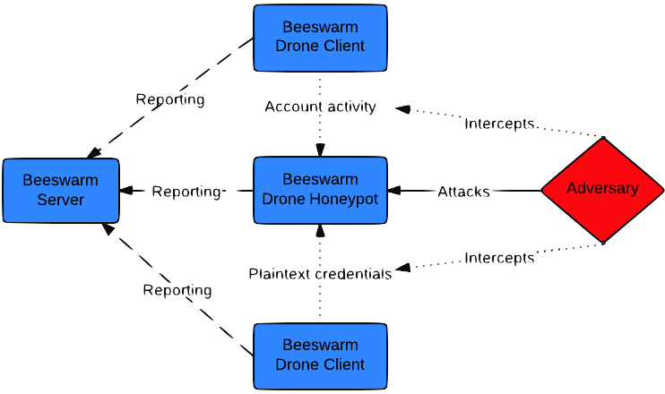

Finally we can announce with great pleasure the first public beta of the [Beeswarm](http://www.beeswarm-ids.org) project. [Beeswarm](http://www.beeswarm-ids.org) is an active IDS project that provides easy configuration, deployment and management of honeypots and clients. The project differentiates itself by two key items:

- - Active deceptions

- - Simplicity and ease of use

**Active deceptions** Normal honeypot deployments are passive - which means that if an attacker eavesdrop on the network he will never see any actual traffic to the honeypot, and therefore most likely ignore it making the honeypot virtually worthless. In contrast to others, [Beeswarm](http://www.beeswarm-ids.org) operates by deploying fake end-user systems, called beeswarm clients, which simulates real users communicating with the honeypots using what we call bait sessions. These bait sessions are so fine grained that for interactive protocols like ssh and telnet the traffic patterns will match the typing speed of humans. The whole purpose of this scheme is to make the bait session traffic look legit and interesting to the hacker and lure him out of the shadows.

\[caption id="attachment\_7013" align="alignnone" width="742"\] _Example of a Beeswarm deception infrastructure_\[/caption\]

**Simplicity and ease of use** Simplicity is archived by packaged PYPI installation, which makes installation of Beeswarm components as easy as: `$pip install beeswarm` Ease of use is achieved employing a self-explaining web user interface and an automatic configuration of beeswarm clients.

\[caption id="attachment\_7015" align="alignnone" width="709"\] _Screenshot showing a few system events_\[/caption\]

**Supported protocols!** At the current stage in development the following protocols are supported: ftp, http, https, pop3, pop3s, smtp, ssh, telnet, vnc.

**Try it out today and get involved!** [Beeswarm](http://www.beeswarm-ids.org) is an open source project under the umbrella of The Honeynet Project. The current project is in a beta state, expecting the first stable release within the next three months. Being in a beta state, means that there are still a few known issues to sort out - and quite a few potential improvements. But more importantly there also must be some unknown issues that needs to be fixed, therefore: Please try it out and raise bug reports or suggestions for improvements on the [issues page](https://github.com/honeynet/beeswarm/issues). If you are a developer and want to help out, make sure to [reach out to me](mailto:jkv@unixcluster.dk) - or start digging into some of the [known issues](https://github.com/honeynet/beeswarm/issues).
