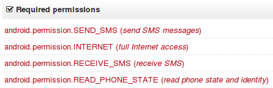

[Pietro wrote a nice post](/node/1080) about him finding Android malware while visiting the theatre. Thanks to Thug (thank you Angelo) and HoneyProxy, he was able to get some interesting details about their infrastructure. I was curious what kind of malware you find in a theatre, so I quickly looked at one of the samples that he mentioned: [f6ad9ced69913916038f5bb94433848d](https://www.virustotal.com/it/file/4c7c0bd7ed69614cb58908d6a28d2aa5eeaac2ad6d03cbcad1a9d01f28a14ab9/analysis/).

Virus Total already provides some nice information for Android.

 The `SEND_SMS` permissions already gives a solid hint that this application is probably sending to premium numbers. But why would the app also need `RECEIVE_SMS` permissions. That sparked my interest to take it apart completely. So I dug out [dex2jar](http://code.google.com/p/dex2jar/) and [jad](http://varaneckas.com/jad/) and decompiled it. Yes, I know, there are better tools out there, but I'm old (school). I even use Emacs for browsing the decompiled code ;) For those who like to have other tools mentioned, I'll put some at the end of the post (please send me suggestions if you have more worth mentioning).

`# unpack the apk and get the contents unzip 4c7c0bd7ed69614cb58908d6a28d2aa5eeaac2ad6d03cbcad1a9d01f28a14ab9`

\# dex to jar d2j-dex2jar.sh 4c7c0bd7ed69614cb58908d6a28d2aa5eeaac2ad6d03cbcad1a9d01f28a14ab9

`# unpack the jar jar xvf 4c7c0bd7ed69614cb58908d6a28d2aa5eeaac2ad6d03cbcad1a9d01f28a14ab9-dex2jar.jar`

The main application classes went into version/eleven. This might be a revisioning scheme and mean that this is their 11th version of the app (or just a lame name). Contained was also an assets directory that contained html, javascript, stylesheets, and porn pictures. Next step, decompile the code: `cd version/eleven jad *.class`

The MainActivity class basically revealed most of the logic in one function. The decompiler created a strange loop but you will get the idea. At least, I hope that they haven't implemented it that way.

 First the app loads a range of settings from `/res/raw/settings.json`. This file basically contains a list of phone numbers to which sms messages are sent including the text to send. ` "op100": { "codes": [ "219" ], "items": [ { "number": "88088", "text": "76638005653025442" } ] }, "op101": { "codes": [ "216" ], "items": [ { "number": "0690888400", "text": "76638003653025442" } ] }, ` From this, the smsList variable is populated as an internal data structure, which will be used later. When the list is fully populated, a WebView (basically Android browser) starts up and the `index.html`, which is shipped in the package, is loaded. One relevant detail for the overall picture is that the app registers some special javascript objects from the `WebApi` class that are available as `webapi` in the browsers javascript. That's pretty much it. Afterwards the app only displays the page.

So, let's have a closer look at this page, which is displayed to the user. The page circles through a bunch of porn pics while showing a message "Идет загрузка. Пожалуйста подождите" ("Loading. Please wait") ; I have selected the most harmless picture.

 After 10 seconds the rotation stops and a blue, highlighted Play button is presented.

 This part is actually interesting because nothing happens if the user doesn't do anything. If you run this app in a standard sandbox, you won't see anything but porn. Only when the user clicks this specific Play button, the actual malicious behavior is triggered. All other buttons are fake, without functionality. The part that is actually tricky for sandboxes is that it takes 10 seconds before the actual "trigger" becomes available. This can evade even sandboxes that simulate some kind of user behavior. It is important for automated analysis tools to continue simulating user clicks when the UI changes.

index.html: ------------------

jquery-s-0.1.min.js: ----------------------------- function goNext() { sendSms(); $('#page1').fadeOut(300); $('#page2').fadeIn(600);

}

api.js: ---------- function sendSms() { if(isBagVesrionAndroid) { prompt('webapi.sendSms', ''); } else { webapi.sendSms(); } }

You can see how in `index.html`, `goNext()` is called. `goNext` changes the displayed page to `Ваша ссылка: http://klub0-raduga.ru/adult.php Ваш пароль: 382956` giving "Your Link" and "Your Password". Right before that in `jquery-s-0.1.min.js`, `sendSms()` is called which calls the `WebApi.sendSms()` function that was registered by the MainActivity

 This function starts a new thread for some background activity. Guess for what? Before I answer that question, let's look at the if statement. The thread will only be started if the last run is more than 24h ago. So basically only run once every day - don't be greedy.

You have guessed correctly if you think that the thread starts to send sms messages to the numbers found in the settings file. In addition, the `phoneList` variable is populated with all numbers that sms were sent to. Furthermore, the current state is saved in the application's shared preferences.

 The last two missing pieces are "what is this `phoneList` about" and "what about the `READ_SMS` privilege". These pieces come together in the `SmsReciver` class (this typo is not mine :) ). Whenever the device receives an sms, the `BroadcastReceiver` (handler) in this class is called. This receiver checks if the incoming sms is from one of the phone numbers that the app has sent to previously. If so, it silently deletes it. This way the user will not get alarmed if one of the services replies with a confirmation message or something similar.

All in all, I was a bit disappointed that Pietro's theatre didn't serve something more sophisticated - only cheap porn and a little sandbox evasion by requiring specific user interaction. But what should I expect? Pietro has not even written what type of theatre he went to :)

UPDATE: [Andrea has created wider overview of the code and more information on the SMS numbers used. Make sure to read his post if you are interested in the details](https://www.honeynet.org/node/1104)

Other Android tools that would have been helpful for this research:

- [Android Decompiler](http://www.android-decompiler.com)
- [JD-GUI](http://jd.benow.ca/)
- [http://www.decompileandroid.com](http://www.decompileandroid.com)
- [APK Inspector](https://www.honeynet.org/project/APKinspector)
- DexDump from the Android SDK
