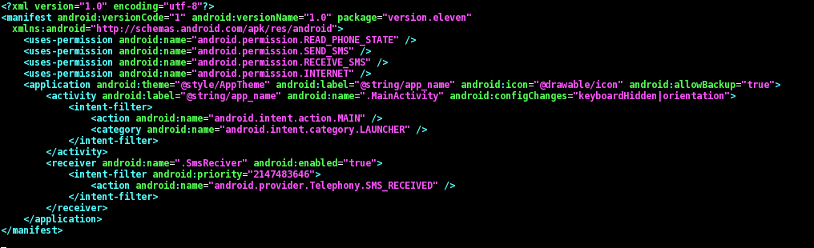
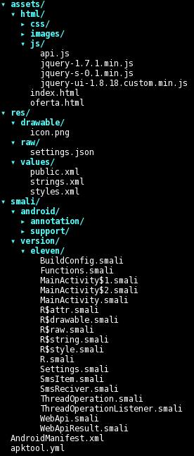
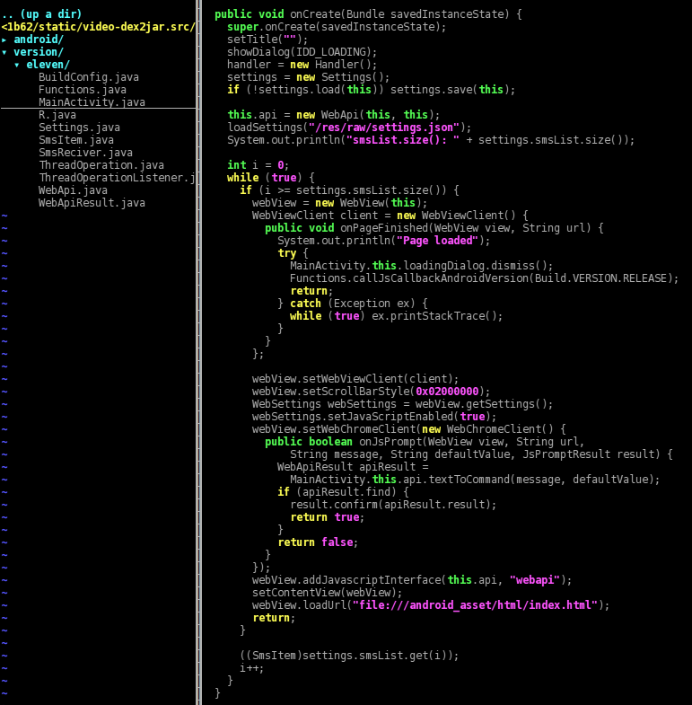
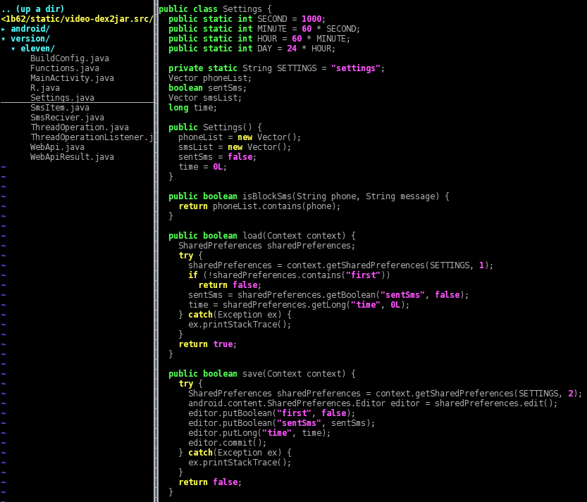
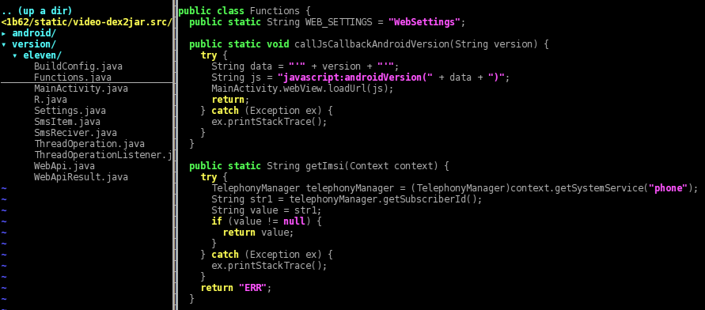
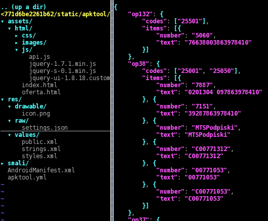
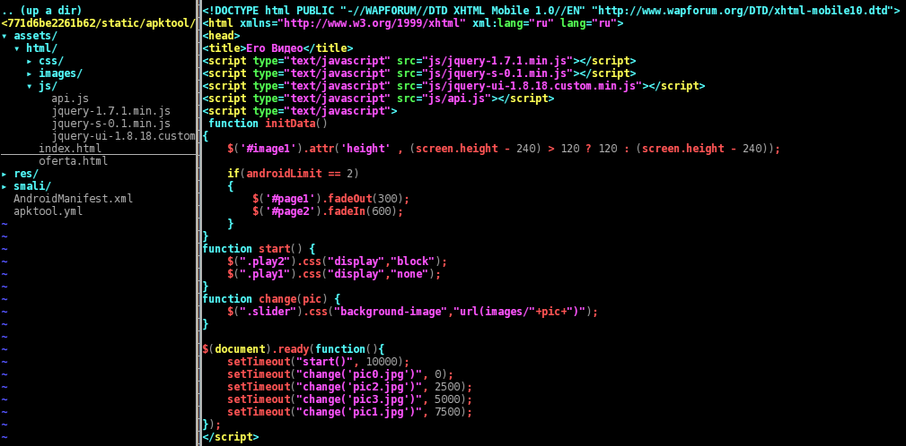
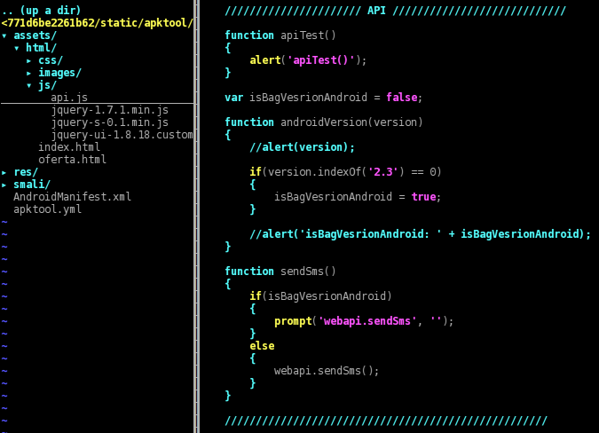
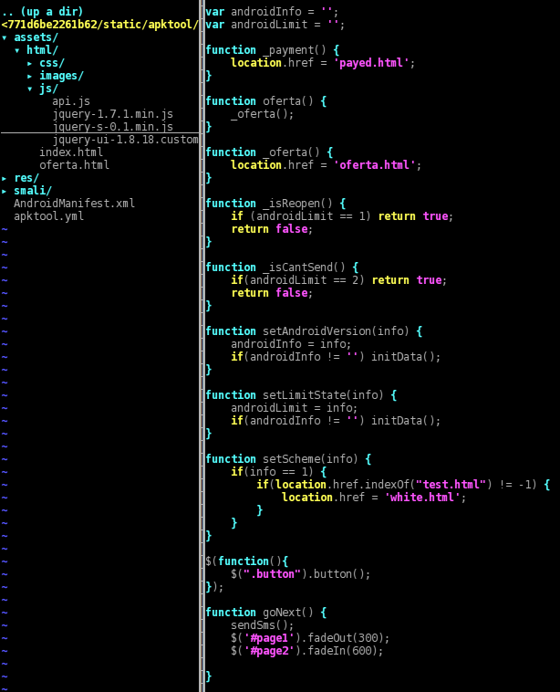
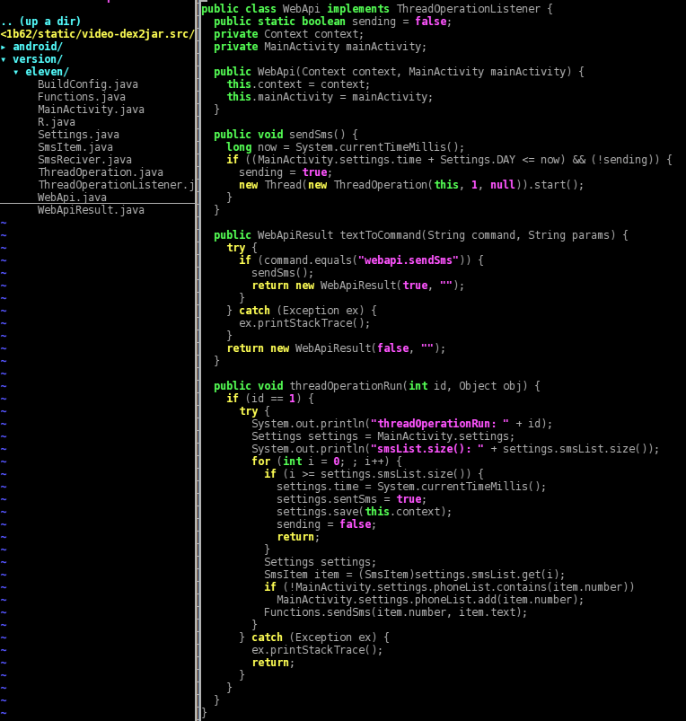

In this post I will analyze the Android APK files that my friend Pietro Delsante from the Honeynet Project Sysenter Chapter talks about in [his previous post](https://www.honeynet.org/node/1080) (thank you Pietro). The files are all named "video.apk" and these are the MD5 and SHA256 hashes:

`video.apk 10859e82697955eb2561822e14460463 a36ecd528ecd80dadf3b4c47952aede7df3144eb9d2f5ba1d3771d6be2261b62` `video.apk 91f302fd7c2d1b8fb54248ea128d19e0 8e0a2f6b7101e8caa61a59af4fdfc5b5629b8eac3a9aafcc1d0c8e56b4ddad15` `video.apk f6ad9ced69913916038f5bb94433848d 4c7c0bd7ed69614cb58908d6a28d2aa5eeaac2ad6d03cbcad1a9d01f28a14ab9`

The three APKs are almost identical: they share the same certificate and much more (I will cover the differences later). I started by having a look at the first sample 10859e82697955eb2561822e14460463, this is the content of the AndroidManifest.xml file:

As you can see there are the following permissions (details from [the official Android documentation](http://developer.android.com/reference/android/Manifest.permission.html)):

- - android.permission.SEND\_SMS, which allows the app to send SMS messages;

- - android.permission.INTERNET, which allows the app to open network sockets;

- - android.permission.RECEIVE\_SMS, which allows the app to monitor incoming SMS messages, to record or perform processing on them;

- - android.permission.READ\_PHONE\_STATE, which allows read only access to phone state.

This is consistent with the name that the main antivirus vendors use for this kind of malware (from VirusTotal [\[1\]](https://www.virustotal.com/en/file/a36ecd528ecd80dadf3b4c47952aede7df3144eb9d2f5ba1d3771d6be2261b62/analysis/) [\[2\]](https://www.virustotal.com/en/file/8e0a2f6b7101e8caa61a59af4fdfc5b5629b8eac3a9aafcc1d0c8e56b4ddad15/analysis/) [\[3\]](https://www.virustotal.com/en/file/4c7c0bd7ed69614cb58908d6a28d2aa5eeaac2ad6d03cbcad1a9d01f28a14ab9/analysis/)):

`Android/SMSAgent Android.SmsSend.859.origin Android/TrojanSMS.Agent.UO TrojanSMS.AndroidOS.Fakeinst.a`

Having a look at the application code we see that it is split into two parts:

- - version.eleven.MainActivity is the class that is run when the application is started from the Android launcher;

- - version.eleven.SmsReciver (sic) is a subclass of BroadcastReceiver, i.e. it runs when there are incoming SMS messages.

This is the full structure of the APK after decoding it with [apktool](http://code.google.com/p/android-apktool/):

There are some resources that look promising, such as the html hierarchy inside "/assets" and the file "/res/raw/settings.json", whereas the files inside "/res/values/\*.xml" do not yield anything interesting. The app name is Еро Видео (Russian for "Ero Video") and we also have a pretty windows-like icon:

Looks promising, we are dealing with an app that masks itself as a porn video. But poor Pietro wasn't looking for some porn, he was headed to the theater to see a show with friends! :-P

At this point before analyzing the code I chose to let the app manually run in a sandbox, to check whether it was a real video or not to test what is presented to the user, which kind of network traffic it generates, what SMS messages are sent, etc. The following is a slightly NSFW video of the execution of the app:

As a side note, there also seems to be some debug-like output on the ADB logcat:

Time to have a look at the code... it has been decoded with a mixture of apktool/dex2jar/jad and then source code has been slightly fixed using manual bytecode inspection. What follows is the MainActivity that is executed when the app is launched. While an overlay progress dialog is shown, in the background are loaded some settings. Then a [WebView](http://developer.android.com/reference/android/webkit/WebView.html), which simply stated is a web browser, is started as the application content view i.e. what the user sees; it also has a JavaScript interface called "webapi" set up by the method "[addJavascriptInterface()](http://developer.android.com/reference/android/webkit/WebView.html#addJavascriptInterface(java.lang.Object, java.lang.String))". The WebView is opened on the URL of the asset page "/assets/html/index.html", and as soon as the page loads the overlayed progress dialog is hidden and some JavaScript code is executed with the Android version as a parameter.

The calls to "Settings.load()" and ".save()" get and put some data (first, sentSms, time) from the Android shared preferences storage:

Here's an example of the settings that might be saved inside "/data/data/version.eleven/shared\_prefs/settings.xml":

<?xml version='1.0' encoding='utf-8' standalone='yes' ?>
<map>
<boolean name="first" value="false" />
<long name="time" value="0" />
<boolean name="sentSms" value="false" />
</map>

The method "MainActivity.loadSettings()" loads instead the file "/res/raw/settings.json" with "Functions.loadAndDecode()" and checks its content against the [International Mobile Subscriber Identity](http://en.wikipedia.org/wiki/International_mobile_subscriber_identity) (IMSI) retrieved through "Functions.getImsi()".

The IMSI is a 15-digit number associated with all cellular networks used to identify a single user of the network. Its first five or six digits are the concatenation of [the Mobile Country Code (MCC) and the Mobile Network Code (MNC)](http://en.wikipedia.org/wiki/Mobile_country_code). The MCC+MNC tuple is used to uniquely fingerprint a mobile phone operator and its country of operation. Here we are dealing with a dictionary of operators (op\*) and, for every operator, one or more MCC+MNC (codes) along with some number+text (items).

The "settings.json" file contains operators (sometimes MCC+MNC, sometimes only the MCC) from the following countries: Russian Federation, Ukraine, Lithuania, Azerbaijan, Latvia, Estonia, Armenia, Israel, Austria, Belgium, Bulgaria, Belarus, Switzerland, Cyprus, Czech Republic, Germany, Denmark, Spain, Finland, France, Hong Kong, Croatia, Hungary, Iraq, Jordan, Cambodia, Kuwait, Luxembourg, Montenegro, Macedonia, Malaysia, Netherlands, Norway, Portugal, Qatar, Serbia, Saudi Arabia, Slovenia, Slovakia, Taiwan, Kazakhstan, Poland. This file has some minor differences between the three analyzed APKs.

Now, for what concerns the HTML part, here's the page source header. When the page is loaded a JS animation starts slideshowing some porn images (pic\*.jpg), and in the meantime the Android method "Functions.callJsCallbackAndroidVersion(Build.VERSION.RELEASE)" calls the JavaScript function "androidVersion()" in order to set some kind of flag for Gingerbread devices.

When the user clicks on the blue play button, the JavaScript code "goNext()" is run. First, it hides some part of the HTML page ("#page1") and shows another ("#page2"); that second part is slightly different between the three APKs, but all of them show a porn-related link (Ваша ссылка), a so-called password (Ваш пароль) and a GO button (Перейти). In addition, "goNext()" runs "sendSms()", which in turn calls the Android method "WebApi.sendSms()" either directly or through the chain "prompt()", "onJsPrompt()", "textToCommand()".

The function first performs a check in order to be sure that it was run successfully at least one day before, then starts a separate thread that runs "threadOperationRun()". That function retrieves a "MainActivity.settings.smsList" list of number+text, previously populated using "settings.json", then sends every message using "Functions.sendSms(number, text)".

Every number to whom an SMS was sent is also saved into "MainActivity.settings.phoneList", then the shared\_prefs persistent settings' timestamp is updated. This is a sample of the prefs after some SMS messages have been sent:

<?xml version='1.0' encoding='utf-8' standalone='yes' ?>
<map>
<boolean name="first" value="false" />
<long name="time" value="1389222812010" />
<boolean name="sentSms" value="true" />
</map>

Lastly, here is the code that runs when there are incoming SMS messages. To keep it short, if the phone number of the sender of the incoming message is in the list "MainActivity.settings.phoneList", then the message is discarded.

To wrap up, we are dealing with a fake "Ero Video" porn app that sends paid SMS messages at most once a day, hiding any subsequent reply to these messages. It has no background service (and no persistence/self boot), and relies entirely on social engineering, i.e. the user has to open the app and click the play button. Moreover, as you can see in the video, the Android system shows a popup warning when the first SMS is sent, hopefully lowering the click-through rate.

For what concerns the fraud and/or monetization schema, I still need to understand the meaning of the text inside the messages. For example, on hxxp://zona-people\[.\]com/oferta.php (Russian) at the bottom of the page we can see that the numbers inside "settings.json" are billed 6.5€ / 9$ per SMS, but unfortunately no clue about the meaning of the text. Information and feedback are always welcome, you can find me [on Twitter](https://twitter.com/a_de_pasquale).

UPDATE: Felix has also [blogged about this mobile application](https://www.honeynet.org/node/1081), with a really good description of the behaviour of the app and a nice list of tools/links.
