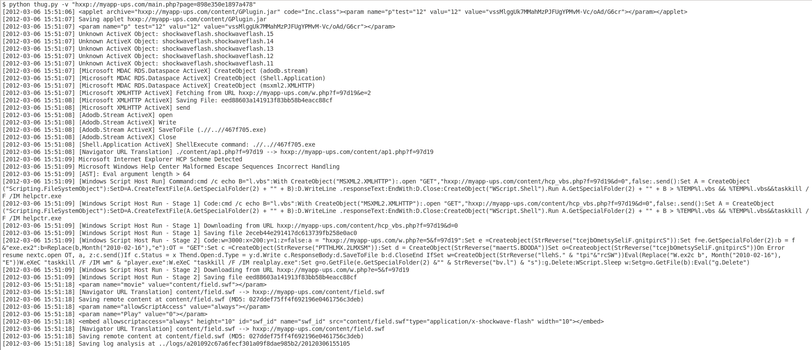



Ever wanted to run up a quick instance of [Thug](https://buffer.github.io/thug/) on a couple of malicious web sites or try it out but lacked the sys op knowledge or time to install it? Here is the opportunity. Thanks to [Docker](http://www.docker.com) you can run Thug up in a matter of minutes. [Jose Nazario](https://registry.hub.docker.com/u/jnazario/thug/) and [me](https://registry.hub.docker.com/u/riker2000/thug/) have created two docker images which are in the Docker Hub ready to run.

So this is how to do it:

**1\. Install Docker for your system (Works also on Windows and Macs, see docs) based on the docs [here](http://docs.docker.com/). Below is the procedure on Ubuntu 14.04.**

`$ sudo apt-get install docker.io`

**2\. Get your image (Jose's is Thug v0.4.31, mine is the latest code)**

`$ sudo docker.io pull jnazario/thug`

**3\. Start virtual filesystem (replace jnazario/thug with riker2000/thug for my build)**

`$ sudo docker.io run -i -t jnazario/thug /bin/bash`

**4\. Run Thug (replace /usr/local/src/thug/src/thug.py with /thug/src/thug.py on my build)**

`$ python /usr/local/src/thug/src/thug.py -n /tmp/example http://example.com`

**A sample analysis for the Blackhole EK:**

