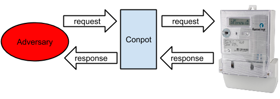

The [Conpot team](http://www.conpot.org) recently introduced what we call the proxy module. Basically we forward the traffic from one service in [Conpot](http://www.conpot.org) to a service running on a real piece of hardware. This is a very successful technique when figuring out a unknown hardware or protocol. Next step then is to decode the messages logged in the proxy module. Most of this step is done by studying books of specifications, leaked manuals and offensive tools. This then gives us insight into the protocol, the commands sent and responses generated.

Using this technique, another milestone has been reached for the [Conpot](http://www.conpot.org) project: the ability to pose as a [smart meter](http://en.wikipedia.org/wiki/Smart_meter). As we surround ourselves with interconnected items, popularly called [the internet of things](http://en.wikipedia.org/wiki/Internet_of_Things), it is critical that we also provide ourselves the ability to investigate malicious actions against these. Under normal circumstances, most of the intriguing details of [the internet of things](http://en.wikipedia.org/wiki/Internet_of_Things) is hidden away in proprietary implementations - for example: Most likely you have a smart meter installed in your house - but do you know WHO is actually connecting to your meter and which commands they are sending? Probably not - unless of course you outsmart your adversary and setup a [Conpot](http://www.conpot.org) instance.

The specific smart meter protocol we decided to implement was the Kamstrup protocol, potentially used in several hundred thousand smart meters deployed throughout the world. After starting [Conpot](http://www.conpot.org) with the kamstrup\_382 profile, [Conpot](http://www.conpot.org) answers to kamstrup commands just like a real smart meter and also provides realistic changes in power usage. Starting [Conpot](http://www.conpot.org) with the supplied kamstrup profile is as simple as:

`$ conpot -t kamstrup_382.xml`

As there exist no official free tools to probe Kamstrup meters, we suggest that you use our slightly modified version of [PyKamstrup](https://github.com/johnnykv/PyKamstrup), originally written by [Poul Henning-Kamp](http://people.freebsd.org/~phk/), to probe the honeypot.

`$ python kamstrup.py 192.168.0.154 Energy in 7183.3 kWh Energy out 0.0 kWh Energy in hi-res 7183.3212 kWh Energy out hi-res 0.0 kWh Voltage p1 228.0 V Voltage p2 229.0 V Voltage p3 224.0 V Current p1 5.11 A Current p2 4.22 A Current p3 1.44 A Power p1 1.0 kW Power p2 5.499 kW Power p3 0.895 kW`

The [Conpot](http://www.conpot.org) team will participate in this years [BruCon](http://2014.brucon.org/index.php/Main_Page) where we expect to release the next version of Conpot.

Upcoming improvements to Contpot in the following months may include:

- Configurable adjustment of power usage to match location, time of day, etc.
- Decode and respond to more kamstrup commands.
- Provide capability to make Conpot answers to queries from RF mesh network.
- Implement the Kamstrup telnet based management protocol.
