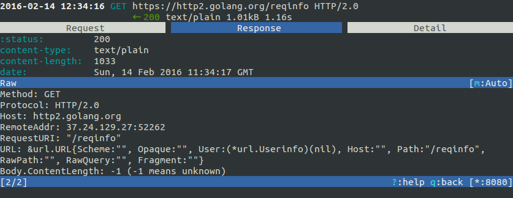

We are happy to announce the immediate availability of [mitmproxy 0.16](https://mitmproxy.org/)! As a major new feature, Thomas Kriechbaumer – who joined us as a Google Summer of Code (GSoC) Student last year – contributed a brand new HTTP/2 implementation built on top of [hyper-h2](https://github.com/python-hyper/hyper-h2). HTTP/2 requests now blend into the mitmproxy UI just like regular HTTP 1 requests, making mitmproxy the first interactive HTTPS proxy with HTTP/2 support! All HTTP/2 features from RFC7540 are supported - including PUSH\_PROMISE, RST\_STREAM, and as many concurrent streams as you want. We are super excited about the improvements Thomas is bringing us here and we encourage you to try them out. To make a transition as seamless as possible, HTTP/2 needs to be enabled manually for now by passing `--http2` to mitmproxy. We plan to remove this requirement with one of the next releases. For a full list of changes, take a look at the changelog posted below!

### Google Summer of Code 2016

2012 was a big year for me - being only just out of my freshman year, Honeynet accepted my application as a GSoC Student and I got introduced to the world of free and open-source software development and started contributing to mitmproxy. Long story short, I think this program is one of the major reasons why I am now writing this blog post as one of mitmproxy’s core contributors. Last year, I was in the fortunate position to mentor a student myself - we’re super happy that not only Thomas’ project was a great success, but we also gained a very strong new mitmproxy contributor who is contributing well beyond his GSoC. I am very happy to announce that we are applying under the umbrella of Honeynet as a GSoC Organization this year again. The last six years’ projects have generated long-lasting successes at Honeynet, so we can’t wait to get in touch with students this year again!

### Release Notes

Since the last release, the project has had 226 commits by 23 contributors, resulting in 64 closed issues and 49 closed PRs, all of this in just over 74 days.

- - Completely revised HTTP2 implementation based on [hyper-h2](https://github.com/python-hyper/hyper-h2) (Thomas Kriechbaumer)

- - Export flows as cURL command, Python code or raw HTTP (Shadab Zafar)

- - Fixed compatibility with the Android Emulator (Will Coster)

- - Script Reloader: Inline scripts are reloaded automatically if modified (Matthew Shao)

- - Inline script hooks for TCP mode (Michael J. Bazzinotti)

- - Add default ciphers to support iOS9 App Transport Security (Jorge Villacorta)

- - Basic Authentication for mitmweb (Guillem Anguera)

- - Exempt connections from interception based on TLS Server Name Indication (David Weinstein)

- - Provide Python Wheels for faster installation

- - Numerous bugfixes and minor improvements
