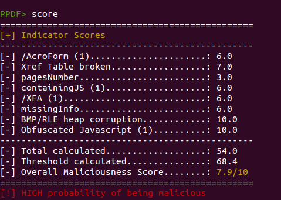

[peepdf](http://eternal-todo.com/tools/peepdf-pdf-analysis-tool) is a Python tool to explore PDF files in order to find out if the file can be harmful or not. The aim of this tool is to provide all the necessary components that a security researcher could need in a PDF analysis without using 3 or 4 tools to make all the tasks. With peepdf it's possible to see all the objects in the document showing the suspicious elements, supports the most used filters and encodings, it can parse different versions of a file, object streams and encrypted files. With the installation of [PyV8](http://code.google.com/p/pyv8/) and [Pylibemu](https://github.com/buffer/pylibemu) it provides Javascript and shellcode analysis wrappers too. Apart of this it is able to create new PDF files, modify existing ones and obfuscate them.

In addition to providing the tools for analyzing PDF documents, we also wanted to provide some indication about how likely it is that a given PDF file is malicious. Adding such a scoring system in peepdf was one of the projects of Honeynet Google Summer of Code (GSoC) 2015 program, and the student [Rohit Dua did a great job](https://github.com/rohit-dua).

The scoring system has the goal of giving valuable advice about the maliciousness of the PDF file that’s being analyzed. The first step to accomplish this task is identifying the elements which permit to distinguish if a PDF file is malicious or not, like Javascript code, lonely objects, huge gaps between objects, detected vulnerabilities, etc. The next step is calculating a score out of these elements and test it with a large collection of malicious and not malicious PDF files in order to tweak it.

A Beta version was presented during [Black Hat Europe Arsenal 2015](https://www.blackhat.com/docs/eu-15/materials/eu-15-Esparza-peepdf.pdf) last November, where [Jose Miguel Esparza](https://twitter.com/EternalTodo) introduced the new functionalities: actually the scoring is based on different indicators like

- - Number of pages
        

- - Number of stream filters
        

- - Broken/Missing cross reference table
        

- - Obfuscated elements: names, strings, Javascript code.
        

- - Malformed elements: garbage bytes, missing tags…
        

- - Encryption with default password
        

- - Suspicious elements: Javascript, event triggers, actions, known vulns…
        

- - Big streams and strings
        

- - Objects not referenced from the Catalog
        

Here’s a screenshot of the scoring system in action:

Besides that, a new command was created to show the individual score assigned to the different indicators and give more details about how the global score was calculated. This command is called “score” and this is an example of its output:

Sounds interesting? Go and try it out yourself:

[https://github.com/jesparza/peepdf/tree/gsoc](https://github.com/jesparza/peepdf/tree/gsoc)

We also love to hear your feedback. Just shoot us an email via peepdf \[AT\] eternal-todo \[DOT\] com or via Github.
