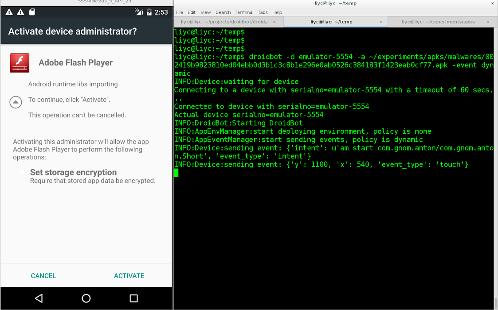
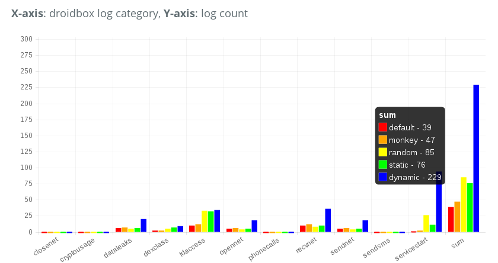



Hi there, my name is Li Yuanchun and I'm glad to introduce DroidBot, a tool to improve the coverage of dynamic analysis.  
As it is the case for malware targeting the desktop, static and dynamic analysis are also used for detection of Android malware. However, existing static analysis tools such as [FlowDroid](https://blogs.uni-paderborn.de/sse/tools/flowdroid/) or [DroidSafe](http://mit-pac.github.io/droidsafe-src/) lack accuracy because of specific characteristics of the Android framework like ICC (Inter-Component Communication), dynamic loading, alias, etc.  While dynamic analysis is more reliable because it executes the target app in a real Android environment and monitors the behaviors during runtime, its effectiveness relays on the amount of code it is able to execute, this is, its \*coverage\*. Because some malicious behaviors only appear at certain states, the more states covered, the more malicious behaviors detected. The goal of DroidBot is to help achieving a higher coverage in automated dynamic analysis. In particular, DroidBox works like a robot interacting with the target app and tries to trigger as many malicious behaviors as possible.  
The Android official tool for this kind of analysis used to be  [Monkey](http://developer.android.com/tools/help/monkey.html), which behaves similarly by generating pseudo-random streams of user events like clicks,touches, or gestures, as well as a number of system-level events. However, Monkey interacts with an Android app pretty much like its name indicates and lacks any context or semantics of the views (icons, buttons, etc.) in each app.

  

Instead, DroidBot understand the app by statically analysing its code and dynamically analysing its UI hierarchy. This knowledge is extremely helpful to generate relevant interactions with the app. For example by getting a list of sensitive user events during static analysis, avoiding redundant reentries of the UI that have been explored through dynamic analysis, avoiding sending random gestures like Monkey do and instead sending specific gestures according to the position and type of UI elements.  
To simulate the real interaction, DroidBot does mainly two things:  
   
1. Sets up the device environment before starting the app, in order to make the device look like a more realistic phone.  
2. Send events such as gestures, Intents and key presses when the app is running, just like a human would do when using the app.  
   
Some apps perform sensitive operations according to the device state. For example, checking whether the device has contacts or checking whether the GPS is enabled. Normally in test environments such as DroidBox, the contacts and call logs are empty, and the GPS is not enabled, thus many sensitive behaviors cannot be discovered. DroidBot sets up the device environment by adding fake data (fake contacts, call logs, SMSs, etc.) and simulating a GPS signal.  
After starting the target app, DroidBot interacts with it to trigger all possible behaviors.  Android apps are event-driven, and the apps code is executed when handling events. As mentioned above, DroidBot uses three types of events:  
   
1. **Gestures**. The most common way for a human to interact with a device is using gestures, such as touching, long touching and sliding. Android provides a way of sending gestures via ADB, which requires introducing the coordinates on the screen. DroidBot makes use of another Android UI debugging tool -- Hierarchy Viewer (or UI Automator) to get the bounds of each UI components (Button, TextView, etc.) and it is able to send accurate touch events to select a specific UI component. Note that Monkey sends random touch events and it doesn't know which component it is "touching".  
2. **Key presses**. Keys such as \`HOME\`, \`MENU\`, \`A\`, \`B\`, \`C\` are another set of important user inputs. The keys have different meanings on different UI screens based on the key event handlers implemented in different apps. There are also interfaces for sending key event using ADB.  
3. **Intents**. Unlike gestures and keys which are direct ways of interacting with apps, Intents are indirect. Normally Intents are sent from the Android framework or other apps, and the target app handles the Intents and perform the corresponding actions. For example, when the device is booted up, a Intent named \`ACTION\_BOOT\_COMPLETED\` is sent out, and if the target app registered a broadcast receiver listening the Intent, it would be waken up to handle the Intent. DroidBot gets the list of registered receivers of the target app using [Androguard](http://code.google.com/p/androguard/), and sends the Intents when the app is running.

<iframe src="https://www.youtube.com/embed/jtvXZzeTbVE" frameborder="0" align="middle" width="600" height="495"></iframe>

The goal of DroidBot is to execute as much code as possible by sending events. A common metric to measure the amount of executed code is \*coverage\*, which can be described in terms of lines, paths, methods etc. Existing tools that measure the coverage require access to the source code or instrumenting the app, but we don't have the source code, and we would like to avoid instrumentation due to its instability (many apps will crash after instrumentation). Therefore, we use the number of sensitive operations as a metric instead.  
   
For the dynamic analysis, our tool relies on [DroidBox](https://github.com/pjlantz/droidbox) , a well-known sandbox for Android apps which integrates the taint tracking system [TaintDroid](http://www.appanalysis.org/)  and log the sensitive operations at runtime. The more logs generated means the more sensitive operations are triggered.  
In particular and to trigger more sensitive operations, DroidBot tries to reach more views by sending the corresponding events. It then records the views it has reached and the UI components it has touched. The principle of DroidBot is "try new things first", i.e. try to explore unseen views first and touch un-touched UI components first. In this way DroidBot can reach more views faster.  
   
As for every first version of a new tool, certain limitations exist when using DroidBot on real apps. For example, DroidBot gets stuck at pop-up dialogues and input windows, a situation that we tried to solve case by case.  There are also some states that DroidBot cannot handle, such as the views needing specific input (login screen for instance), and WebView not being able to dump the hierarchy via ADB.  
All considered, DroidBot works well on most Android apps and currently it is able to trigger much more sensitive behaviors than Monkey as our experiments show according to the pictures below:

  

Here we can see the comparison of the amount of sensitive behaviors triggered by Monkey and DroidBot. "default" means starting the app and doing nothing, "monkey" means using ADB Monkey tool to interact with the app, and "random", "static", and "dynamic" are policies of DroidBot. From the figure we can see that the dynamic policy of DroidBot produced 229 sensitive logs while Monkey only produced 47.

 This second picture shows the comparison of the speed of Monkey and DroidBot to trigger sensitive behaviors. We can see a significant growth of log count triggered by the dynamic policy of DroidBot after 100s, which is because it entered the malicious state of the app which Monkey could not enter.

For more details on our evaluation you can check our [DroidBot blog](http://lynnlyc.github.io/droidbot/) to see the evaluation reports and if you want to give DroidBot a try, you can easily get it on the [DroidBot githubpage](https://github.com/lynnlyc/droidbot) for detailed setup instructions. If you know Docker there is also an one-liner command to run it without further setup:  
   
docker run -it --rm -v ~/mobileSamples:/samples:ro -v ~/mobileSamples/out:/samples/out honeynet/droidbot /samples/mySample.apk  
   
Pull requests are also welcome!  
   
Finally I would like to thank my GSoC mentors Hugo Gascon, Hanno Lemoine, and other cool guys from the Honeynet Project, I learned a lot from them. Also I would like to thank the open source projects [AndroidViewClient](https://github.com/dtmilano/AndroidViewClient)  and [Androguard](http://code.google.com/p/androguard/) that DroidBot is based on.
