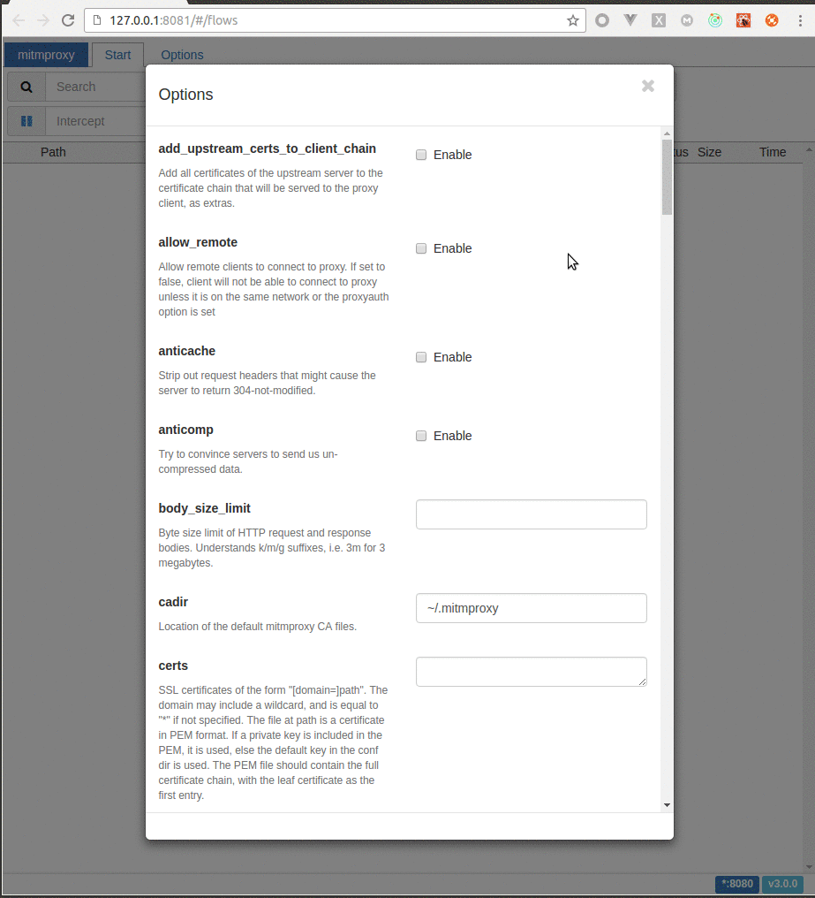

Hi, I’m Matthew Shao from China. This year, I got the honor to be selected as a Google Summer of Code student for the mitmproxy project. With the help of my kindly mentors Maximilian Hils and Clemens Brunner, I managed to improve the source code of mitmweb, which is a web interface for mitmproxy, and added some exciting new features for it. Here I’m going to present you the work I’ve done during this fulfilling summer.

## First Month: Writing tests for Mitmweb

Test Coverage for mitmproxy before and after the first month. You can see the `web/` directory at the bottom right.

My work can be generally divided into 3 parts, of which the first one is adding tests for mitmweb. Thanks to our enthusiastic member Thomas Kriechbaumer, mitmproxy’s Python codebase has a an impressive test coverage rate. But left from last year’s GSoC, the JavaScript tests for mitmweb were broken and only covered a small part of the code. I started to write tests for mitmweb once I was accepted into GSoC and opened quite a few pull requests to add tests ([#2117](https://github.com/mitmproxy/mitmproxy/pull/2117), [#2131](https://github.com/mitmproxy/mitmproxy/pull/2131), [#2137](https://github.com/mitmproxy/mitmproxy/pull/2137), [#2322](https://github.com/mitmproxy/mitmproxy/pull/2322), [#2327](https://github.com/mitmproxy/mitmproxy/pull/2327), [#2337](https://github.com/mitmproxy/mitmproxy/pull/2337), [#2342](https://github.com/mitmproxy/mitmproxy/pull/2342), [#2347](https://github.com/mitmproxy/mitmproxy/pull/2347), [#2348](https://github.com/mitmproxy/mitmproxy/pull/2348), [#2359](https://github.com/mitmproxy/mitmproxy/pull/2359), [#2365](https://github.com/mitmproxy/mitmproxy/pull/2365), [#2376](https://github.com/mitmproxy/mitmproxy/pull/2376), and [#2413](https://github.com/mitmproxy/mitmproxy/pull/2413)). As a result, this work raised the test coverage for the Web UI from 0% to 83%, and therefore the total line coverage of mitmproxy increased from 82% to 87%. We are taking advantage of the `Jest` test suite here, whose flexible mocking function and snapshot feature help a lot. But as you can see, we are not at 100% yet, and there are still some tricky code paths which require more patience to cover.

## Second Month: Options Editor

Mitmproxy’s new options editor implemented by Aldo Cortesi gives us more flexibility on modifying the all kinds of settings, including the extra options brought by the customized scripts and addons. During the second coding period in GSoC, I made this new feature adapt to the Web Interface.

As the first step, with the help of Maximilian, I ported the options editor to the RESTful API. This part is coded in Python ([#2395](https://github.com/mitmproxy/mitmproxy/pull/2395)).

Next, I designed an simple UI for the options editor, and implemented it with `React.js` step by step. You can see how the editor evolved over a series of PRs ([#2416](https://github.com/mitmproxy/mitmproxy/pull/2416), [#2423](https://github.com/mitmproxy/mitmproxy/pull/2423), [#2430](https://github.com/mitmproxy/mitmproxy/pull/2430), and [#2460](https://github.com/mitmproxy/mitmproxy/pull/2460)) here:

Our current implementation does live-editing, the front-end always listens on any changes and tries to update the options to the back-end almost immediately. This works great for the majority of options, although some options (i.e. the `cadir` and other file-related ones) need more digging to support live-editing in mitmweb. We created an issue to trace the usability of all the options in mitmweb and also opened a collaborative spreadsheet for that ([#2451](https://github.com/mitmproxy/mitmproxy/issues/2451)).

### Third Month: Static Viewer

This feature, I personally consider it as the most challenging as well as the most exciting one during my GSoC trip. Mitmweb allows users to save all captured flows into a single `flows` file, and there are many cases we need to share captured flows to others. For now, everyone needs to install mitmproxy to view captured flows. The new static viewer changes that: The `flows` file can be converted to a set of static HTML/CSS/JS files, which provide an instant interface to view captured flows in any web browser. We are currently finishing a cloud service where users can upload a mitmproxy flow file and then get a publicly shareable URL for their captured session. **You can view a demo here: [http://share.mitmproxy.org/honeynet-demo/](http://share.mitmproxy.org/honeynet-demo/#/flows/b07c553b-1ffd-4414-924f-ca4412804a6d/response)!**

The sharing process goes like this:

1. 1. Alice uses mitmproxy (maybe mitmweb or mitmdump) to capture a bunch of flows.

1. 1. Alice uploads her flows to [share.mitmproxy.org](http://share.mitmproxy.org), either from within mitmproxy or from the website.

1. 1. Our server converts the uploaded flows to static files and returns the sharing URL.

1. 1. Alice shares the URL with Bob.

1. 1. Bob accesses the URL and gets the mitmweb interface with all the flows captured by Alice.

First, we had a discussion about which components in the web interface should be eliminated in static mode. I set a global variable to tell whether we are in static mode or not, and hide the redundant components in static mode according to the variable ([#2504](https://github.com/mitmproxy/mitmproxy/pull/2504)). This was a bit tricky as we needed to upgrade to the latest React beta version. Second, I implemented a converter addon to copy all the static files (in `.html`, `.css`, `.js`) to the destination and generated the json files which contain all the captured information ([#2510](https://github.com/mitmproxy/mitmproxy/pull/2510)). Third, @mhils and I started to work on the [share.mitmproxy.org](http://share.mitmproxy.org) code, which can be found at [https://github.com/mitmproxy/share.mitmproxy.org](https://github.com/mitmproxy/share.mitmproxy.org).

## Lesson Learned and Conclusion

1. 1. I got familiar with the work flow of Web App development with `React.js` and `Redux.js`, especially about how to write reliable tests for the Web UI.

1. 1. Python 3 type checking feature is of great help. Frankly, I only wrote Python 2 before this summer, but had to switch to Python 3 and got used to the type checking annotation for some back-end tasks. That’s kind of awkward to write it on the first try, but I fall in love with it later because it can prevent a log of bug.

1. 1. Communication is of top importance during the open source software development. We are working together as an international team, the time difference and language problem might reduce your interest of expressing your thoughts, but those can be overcome with passion.

I enjoy coding cool stuff with my dear mentors very much. Thanks for the countless helpful suggestions and great patience from them. Thanks to Google to provide me with this invaluable chance to work with a famous open source community with awesome members from all over the world. I really appreciate this experience and I believe it will have profound impact on my career.
