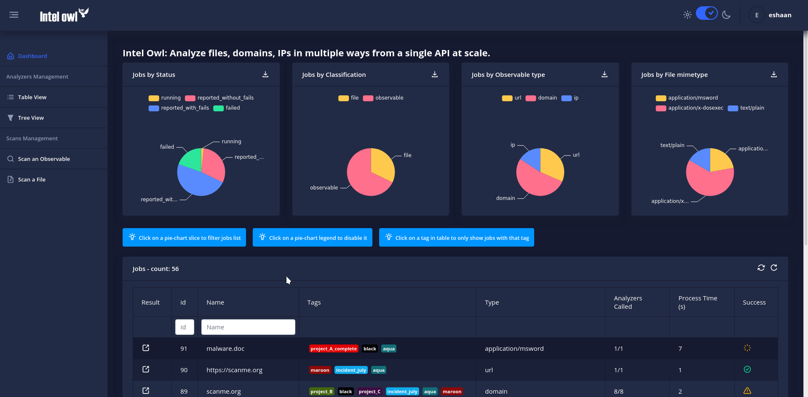
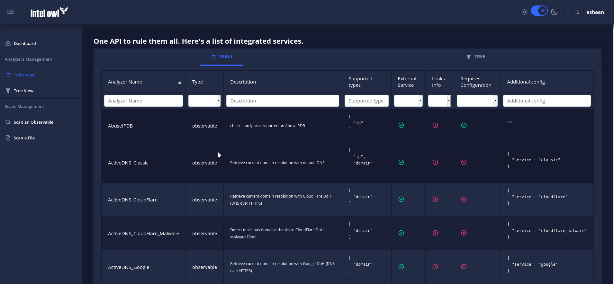

[Intel Owl](https://github.com/intelowlproject/IntelOwl) is an Open Source Intelligence, or OSINT solution to get threat intelligence data about a specific file, an IP or a domain from a single API at scale. It integrates a number of analyzers available online and is for everyone who needs a single point to query for info about a specific file or observable.

Born at the start of 2020 ([announcement](https://www.certego.net/en/news/new-year-new-tool-intel-owl/)), this fresh and new tool was accepted as part of the Google Summer of Code under [The Honeynet Project](https://www.honeynet.org/gsoc/gsoc-2020/google-summer-of-code-2020-project-ideas/#intel-owl-improvements). Great improvements have been developed since the start of this project.

With the release of [version 1.0.0](https://github.com/intelowlproject/IntelOwl/releases/tag/1.0.0), we are excited to announce a completely new and revamped web interface and some new features in our API to help you better manage your threat intelligence data.

Sneak peek of some features from the new web interface:

  
1\. Want to **get threat intelligence data quick** without having to wait for the entire analysis to end ? We got you covered! With the new interface, requesting a malware/observable scan is a breeze with just a few clicks and as a bonus, you can go through the result as it keeps getting updated from our API in background.

Request new scan and view Job result instantly ([See It In Action](https://i.imgur.com/LzriEDq.gif))

As you can see here, one can now add specific and custom tags to a new analysis. This helps you group different scans together and differentiate between them.

2\. A **dashboard to display different visualizations** of analysis data, with the following features:

- Tabular view of all analysis jobs which can be filtered, sorted or searched through.
- Pie charts for visualizing analysis data on the basis of _status_, _observable\_classification_ and _file\_mimetype_.
- Clicking on any slice on the Pie Chart will filter the jobs list based on the selected classification.
- You can also choose to view analysis having a particular tag.

Dashboard ([See It In Action](https://i.imgur.com/wCIwh9m.gif))

3\. Intel Owl’s query power comes from the **many (80+ and growing) different analyzers (external or internal) that are seamlessly integrated into the core API.** Ofcourse, with this comes the issue of managing them - so we have made it easy for you.  
You can view the list of all analyzers along with their use-case and supported types in a tabular view which can be filtered, sorted or searched through. Along with this, there's also a dendrogram tree view inspired by [https://osintframework.com/](https://osintframework.com/).  
Our motive is that the layman can easily understand and use the API in a way that prevents him/her from gathering noise and speed up threat intelligence operations in their organization.

Analyzers Configuration ([See It In Action](https://i.imgur.com/US8N2M0.gif))

4\. Different themes for different times of the day ? We understand. **Switch between dark and light themes** in a single click without the need of refreshing the page.

Theme Switcher ([See It In Action](https://i.imgur.com/nicC9gd.gif))

And we were saving the best part for the last - this new web interface comes with no extra configuration on your side, it’s lightweight and built-in to the core application.

Not impressed ? More of a backend/ Show me the code person ? 

1. Intel Owl now supports new analyzers such as,

- [Team Cymru Hash analyzer](https://team-cymru.com/community-services/mhr/)
- [Tranco Domain Rank](https://tranco-list.eu/)
- [Cloudflare DNS over HTTPS Malware check](https://developers.cloudflare.com/1.1.1.1/1.1.1.1-for-families/setup-instructions/dns-over-https/)
- [Yara Scan with McAfee public rules](https://github.com/advanced-threat-research/Yara-Rules)

2. You can now choose the retention days for old jobs from the config environment variables.
3. We care about your security therefore now using **JSON Web Tokens (JWT) for authentication** with periodical refresh and blacklisting. They can be easily managed from the inbuilt admin interface. And of course, the PyIntelOwl Client and the web interface take care of automatically refreshing the tokens for you.

We suggest you to try the application! It’s easy and fast, just [follow the step-by-step instructions](https://intelowl.readthedocs.io/en/latest/Installation.html) and, in a few minutes, you can get it running on your machine.

We are continuously working on under-the-hood improvements and optimizations and always looking for more contributors and feedback.

Don’t like something ? Need help ? Create an issue on the [GitHub](https://github.com/intelowlproject/IntelOwl/) page and we will look into it.  
Looking to contribute to Open Source ? Here’s the list of [beginner-friendly](https://github.com/intelowlproject/IntelOwl/issues?q=is%3Aopen+is%3Aissue+label%3Abeginner-friendly) issues and the [documentation](https://intelowl.readthedocs.io/en/latest/Contribute.html) on how to contribute.

Remember to star the project on [GitHub](https://github.com/intelowlproject/IntelOwl) and to follow the new official [Twitter](https://twitter.com/intel_owl) Account!

Co-authored: [Eshaan Bansal](https://twitter.com/mask0fmydisguis) & [Matteo Lodi](https://twitter.com/matte_lodi).
