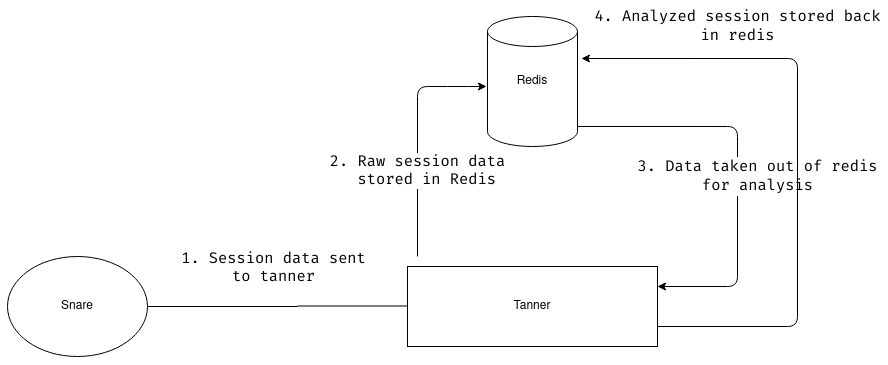
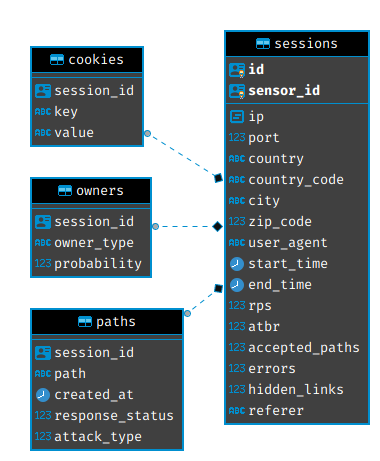

This year I got selected for Google Summer of Code 2020 under The Honeynet Project and worked on the [SNARE](https://github.com/mushorg/snare)/[TANNER](https://github.com/mushorg/tanner). GSoC 2020 was very special for me because I finally got selected for the organization, for which I've been trying to get selected for the past 2 years.

## Background

I got to know about Google Summer of Code in 2018 when I learned that my elder brother has done it 3 years in a row. He wanted me to try to get selected for any org that I like. So I started looking for projects on GSoC archives and came across the Honeynet Project org. I was interested in it because I really liked all the projects under it, projects like Snare Tanner, Thug, etc. I think these projects attracted my attention because they have a feel of being related to the \`Information Security\` field.

In GSoC 2018, I submitted 2 proposals, one for SNARE & TANNER under Honeynet Project and another one for a tool called [Addon-Checker](https://github.com/xbmc/addon-check) under XBMC Foundation. I wasn't selected for SNARE & TANNER that year but got selected for another project. You can read the blog post about it [here](https://blog.mzfr.me/Gsoc-with-kodi)

In GSoC 2019, I again applied for a project called [Cowrie](https://github.com/cowrie/cowrie/) under the Honeynet Project and wasn't selected.

In 2020, I decided to start early and make some more contributions to SNARE & TANNER. Also, I spent quite some time understanding the exact work required and making a good proposal for it. The mentor of the project was very helpful from the very beginning. She reviewed my proposal twice or thrice before I made a final proposal submission on the GSoC portal.

## Project Overview

[SNARE](http://github.com/mushorg/snare) is a web application honeypot sensor attracting all sort of maliciousness from the Internet.  
  
[TANNER](http://github.com/mushorg/tanner) is a remote data analysis and classification service to evaluate HTTP requests and composing the response then served by SNARE.  
TANNER uses multiple application vulnerability type emulation techniques when providing responses for SNARE. In addition, TANNER provides Dorks for SNARE powering its luring capabilities.

## Proposed Work

The work that I proposed in my GSoC proposal was:

1\. Adding support for persistent storage for sessions, in TANNER.

2\. Improving cloning and storing functionality of SNARE.

3\. Small works like adding a new injection template, using the async FTP library, etc.

## Coding Period

I started to work before the official \`coding begins\` period. Even though I didn't write any code, I started to discuss everything with my mentor like what we should do first, how we should start etc. Our initial idea was to start with the most important task, which was to add support for PostgreSQL, so the storage capability of TANNER can become a bit more stable. In the early discussion, we decided to add PostgreSQL as an optional DB meaning users will have the option to choose between PostgreSQL and Redis DB. But later, we came to the conclusion that it would be nice if we can use the combination of both the databases to improve the overall storage functionality.

Work Detail

Currently, in TANNER, the only way to store all the session data (analyzed and unanalyzed) is to keep it within the Redis.

What are unanalyzed and analyzed data?

- Unanalyzed data: It’s raw data that is sent by SNARE and it contains information like time of the session, user-agent, etc
- Analyzed data: Processed data that contains information like Possible Owners, type of attack, etc. 

Back in 2016, when new features were added to TANNER, Redis was selected as the best choice because of its speed. Redis stores data in the memory instead of keeping it in the disk, similar to how a cache of any system works.

As the project grew, we started to gather more and more data. Storing everything in Redis resulted in high memory consumption and unexpected crashes on low spec systems.

Below is the diagram which explains how the SNARE & TANNER is working with the only Redis:

  

**Disadvantages of this setup**

As mentioned above, higher consumption of memory on a low spec system would result in an unexpected crash of the TANNER server. Also, higher memory consumption would cause other memory issues like slowing down other applications present on the system.

**The Solution**

First, we decided that we can add support for PostgreSQL, and then we'll give users the option to run tanner either with Redis or with PostgreSQL. After some discussion, we decided that we'll use a combination of Redis and PostgreSQL.

The way we decided to use them can be seen in the following diagram:  

As it's clear from the above diagram, after analysis we store the data in PostgreSQL and then delete the raw data from Redis.

The advantages of using the combination of PostgreSQL and Redis are

- When TANNER receives a session from SNARE it will be able to store that session data in Redis with much higher speed

- Once the session is analyzed, it can be stored in persistent disk storage like PostgreSQL

**Change in Data format**

One of the major advantages of having PostgreSQL as the storage is that it gives us the power to perform queries before presenting it to the user.

TANNER API is used to access the data stored in the DB. Let's take an example to understand how the API has changed now. Suppose we have an endpoint `/snare-stats/<snare-uuid>` which returns stats like a number of attacks, total sessions, etc of a given SNARE instance. To get this data from TANNER API we do the following steps:

_Old setup:_  
1\. Fetch all available data from the Redis  
2\. Go through all sessions and search for requested key

_New setup (Redis+PostgreSQL):_  
1\. Perform SQL query with the given key

If you’d like to see the queries we are executing then please check out the code [here](https://github.com/mushorg/tanner/blob/develop/tanner/api/api.py#L49)

Replacing Redis with a PostgreSQL allowed to reduce latency in API. We made a performance check using `wrk`. While testing, we try to retrieve all the sessions with a specific attack type using the following API request `sessions?filters=attack_types:lfi` The average requests per second increased from 1.63 to 98.83. So the solution with PostgreSQL is more than 60 times faster.

**Detail about the format**

We decided to store all the data in 4 tables named sessions, cookies, owners, paths. Below you can see the schema of all the tables:  

If you'd like to see the initial discussion about this format then check out this small [gist](https://gist.github.com/mzfr/e7cb772a6c452a12c75230430260022b) that I made.

Initially, our plan was that I'd spend around 2 months working on this task, and then in the last month I'd work on all the other tasks that I proposed but little did we know that adding support for another DB wouldn't be as easy as we thought.

Problems Faced

- **Finding and fixing the session's bug:** I think this was the most frustrating bug that I came across during the whole GSoC time period. So we have 4 tables in our PostgreSQL DB and out of this there is one main table called `sessions` and then there are others like cookies, owners, and paths. The sessions data store a reference to these tables. When we looked at the data in the sessions table, it showed the correct number of paths, while the data was missing in the paths table. Example:

a1894717-bf39-4f67-8493-66debde31e0b | 776edef4-ec5f-4fe0-8485-02cf9ff1f64d |51.158.118.90|43972| France | FR | Paris | 75001 |Mozilla/5.0 (Windows NT 10.0;Win64;x64) AppleWebKit/537.36 (KHTML, like Gecko) Chrome/74.0.3729.169 Safari/537.36 2020-06-23 20:09:01 | 2020-06-23 20:16:23 | 9.010287049751257 | 0.11098427662381329 | 3983 | 0 | 0 |

In this, the number `3983` is the `accepted_path` value which basically means how many paths a bot/attacker tried in one session. But if we checked the count in the `paths` table it showed `6`

select count(\*) from paths where session\_id='a1894717-bf39-4f67-8493-66debde31e0b';
count
-----
6

The issue was in missing `attack_type` field due to wrong URL encoding. This problem was not recognized earlier since according to our storage design Redis allowed to have empty values for attack type.

- **Support multiple filters in API**: The API as well as the Web application needed to support the multiple filters at the same time. So say if you want all the sessions from two different IP addresses the API call would look like:

`<SNARE-ID>/sessions?filters=ip:127.0.0.1 ip:192.1.1.1`

Now, this looks easy and a lot of \`python\` devs might look at this query and be like \`oh you can split it using space, and then it's a piece of cake\`, but it wasn't that easy. I had to make sure that only valid filters were passed, and the biggest issue was in generating an SQL query based on all the filters so that API can fetch the exact data from the DB.

- **Testing**: I think this is one of the most important things that I have learned this GSoC. Testing your code is very important and I kind of already knew this but I wasn't doing this practically. But a lot of times I felt that I could have caught certain bugs right when they appeared if I had written the test cases for the newly written code right after finishing the code. The problem that I faced during the testing phase was exactly "while writing them" but it was while running them. Once Pytest would finish running the tests it would show warnings about "unclosed connection". Fixing this was a bit difficult because most of the libraries used in this project are async and I was quite confused with the working. The most difficult part was that sometimes when I locally ran the tests there were no warnings but in the Travis logs, we could see like 5-10 warnings so it was hard testing it locally.
- **Shift to SQLAlchemy**: This wasn't the problem but I am writing about this because this definitely took some of our time. So at the start, my mentor and I thought that using raw SQL queries wouldn't be such an issue. But once I made some initial changes we both felt that the code was getting a \`bit dirty\` and hard to understand. So we decided it would be better if we use SQLAlchemy since this ORM would provide a lot of functionality which would keep our code clean and simple.

**Completed Work**

So out of the suggested task, I was able to finish the task of adding support for persistent storage and the other small task like adding new template injections or updating the FTP support to use the async library. Even though I had completed the PostgreSQL task in around 2.5 months and could have tried to do another big task but then my mentor suggested that instead of trying to have a lot of new features, it would be better to improve the existing features that we have. That is why we decided not to go ahead with "changing the snare storage and cloning functionality" and to do other small tasks. All the code can be found [here](https://github.com/mushorg/tanner/tree/develop).

**Lesson Learned**

1\. It's very important to test your code. You can use whatever automated tools possible to try and test them. Also once you feel that you are done adding a new feature, write the tests for the code right away.

2\. During the Proposal making phase I had written things like "Take test coverage to 100%" and "finish PostgreSQL integration in 2 weeks" but in reality, the DB integration took around ~2.5 months and the test coverage is at around 78% now 😅. So after the GSoC I have realized that it's better to have few tasks in your timeline with clear deliverables, goals, etc rather than trying to add loads of tasks without thinking them through.

3\. Sometimes everything is right in front of you, you just need to take a good look. This happened with me multiple times, the bug was right in front of me, but I still had to ask my mentor about it.

4\. Before this I had never worked on any DB related work. I mean, I did study DBMS in my 3rd year of college, but I have never got a chance to work on a real-world project, so I learned a lot about PostgreSQL, Redis, SQLAlchemy, etc.

## Final thoughts

In the end, I just want to thank the Honeynet Project org and my mentor for seeing the potential in me and selecting me for this year GSoC. Also other special thanks to the mentor for being so helpful and patient with me.
