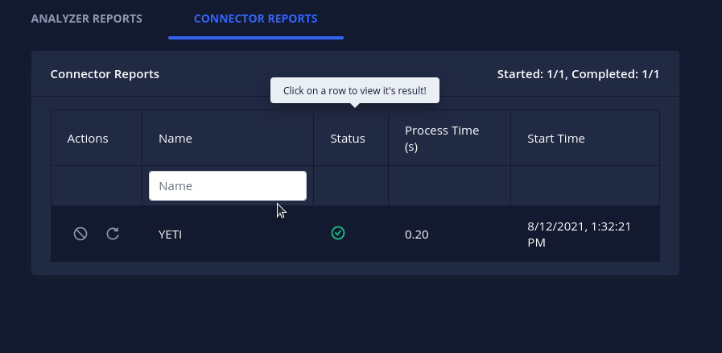
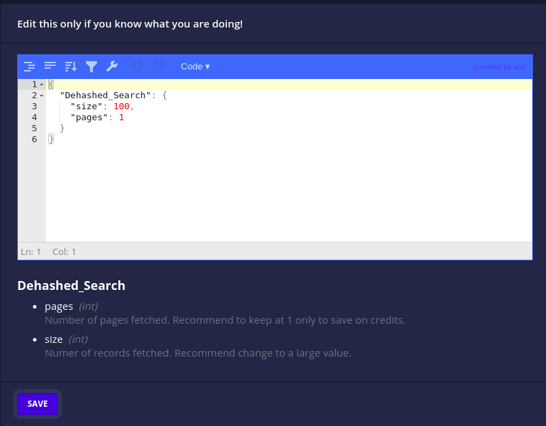
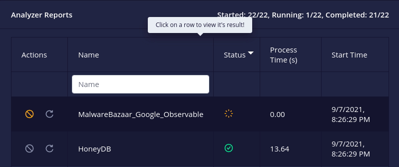
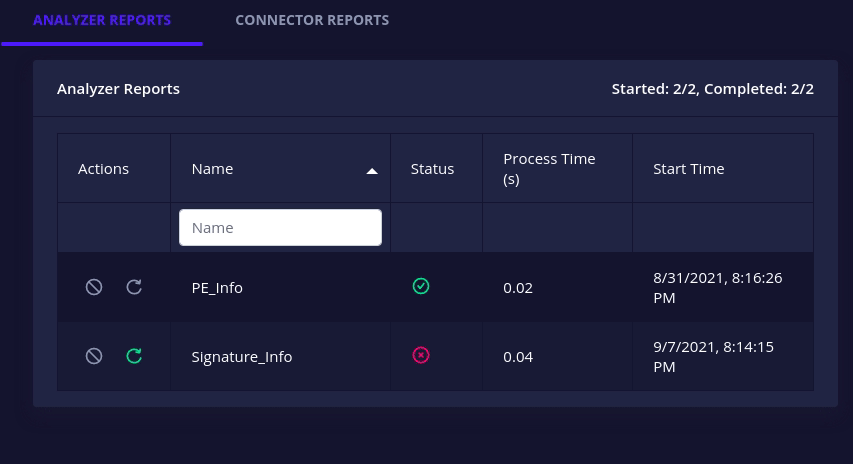
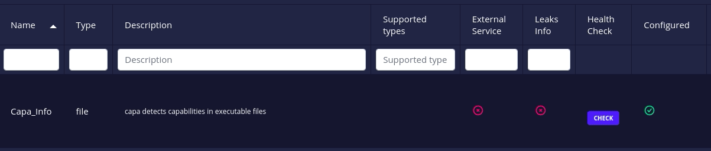

_[Intel Owl GitHub repository](https://github.com/intelowlproject/IntelOwl/)_

Intel Owl is an Open Source Intelligence, or OSINT solution to get threat intelligence data about a specific file or observable from a single API at scale. Intel Owl helps enrich threat intelligence data, especially speeding up retrieval of info because it is composed of 100+ analyzers (tools, external APIs, etc.). Organizations can host their own instance of Intel Owl to help mitigate threats more effectively.

### Intel Owl 🤝 Google Summer of Code

Born at the start of 2020 ([announcement](https://www.certego.net/en/news/new-year-new-tool-intel-owl/)), Intel Owl has participated in the [Google Summer of Code](https://summerofcode.withgoogle.com/) program under The Honeynet Project in both the years 2020 and 2021. Each year a great many features have been developed by the participating students (humblebrag). The following are the summaries of these projects written by the students:

- [GSoC 2020 Work Product - Intel Owl](https://www.honeynet.org/2020/08/26/gsoc-2020-work-product%e2%80%8a-%e2%80%8aintel-owl/) by Eshaan Bansal ([@eshaan7](https://github.com/eshaan7))
- GSoC 2021 Project Summaries - [Intel Owl improvements](https://www.honeynet.org/2021/08/20/gsoc-2021-project-summary-intelowl-improvements/) by Sarthak Khattar ([@m0mosenpai](https://github.com/m0mosenpai)) and [Connectors and Integrations](https://www.honeynet.org/2021/08/20/gsoc-2021-project-summary-intelowl-connectors-manager-and-integrations/) by Shubham Pandey ([@sp35](https://github.com/sp35))

It's our hope that Intel Owl will continue to participate in the Google Summer of Code program, bringing more developers and contributions to the ideas and solutions space in Intel Owl's ecosystem.

### v3.0.0

With the v3.0.0 release, Intel Owl brings many new exciting features and fixes that we have been working on for the last 3 months (involving both GSoC projects).

Following are a brief summaries of the new features and how you can use them to speed up your threat intelligence operations:

#### Connectors

> Designed to support integration with other SIEM/SOAR projects specifically aimed at Threat Sharing Platforms.

**Connectors are a new class of plugins** in Intel Owl. Connectors run after the completion of a successful analysis which makes them suitable for automated threat-sharing, data aggregation and processing.

See in [demo app](https://intelowlclient.firebaseapp.com/pages/scan/result/2)

The v3.0.0 release brings 3 initial connectors that you can use today:

- `MISP`: automatically creates an event on your MISP instance
- `OpenCTI`: automatically creates an observable and a linked report on your OpenCTI instance
- `YETI`: Your Everyday Threat Intelligence. Find or create an observable on YETI

We have made writing new connectors very easy (See [How to add a new connector ?](https://intelowl.readthedocs.io/en/develop/Contribute.html#how-to-add-a-new-connector)) so we highly encourage the community to contribute to their development. You can also [create requests for new connectors](https://github.com/intelowlproject/IntelOwl/issues/new?labels=new_connector,needs%20approval) on GitHub.

Learn more on how to enable and customize these connectors in the [documentation](https://intelowl.readthedocs.io/en/master/Usage.html#connectors-customization).

#### Traffic Light Protocol (TLP) support

Intel Owl now supports the [Traffic Light Protocol](https://en.wikipedia.org/wiki/Traffic_Light_Protocol) (TLP) to **facilitate sharing of job/analysis results in a standardized manner**.

Different TLP indicators

The way Intel Owl facilitates threat information sharing using TLP is that each connector has a maximum TLP value ([customizable from the configuration file](https://intelowl.readthedocs.io/en/master/Usage.html#connectors-customization)) associated with it that gives you the control of what information is shared to the external platforms.

Learn more about the definitions of different TLP indicators in the [documentation](https://intelowl.readthedocs.io/en/master/Usage.html#tlp-support).

#### Verification of Analyzers and Connectors Configuration files

Intel Owl now verifies whether the configuration JSON files for the plugins (analyzers and connectors) are valid or not checking if the required attributes are correctly set. The application will fail to start if any of the JSON file is invalid.

It also checks for each plugin whether its required secrets are available or not marking them `configured` or `unconfigured` automatically. The analyzers or connectors which are disabled or unconfigured will be greyed-out from the selection drop-down on the GUI form and will not be executed even if directly requested via the API. The reason (an helpful error message) as to why a plugin was marked unconfigured can be seen on the drop-down and the configuration tables both, as shown below:

Unconfigured analyzers cannot be selected

On top of this, the configuration files now hold the description and datatype of the `secrets` and `params` attributes.

analyzer table showing the parameter's datatype and description

In this way, the configuration files themselves serve as a self-documentation for the plugins and their parameters. This is especially useful when customizing them either from the JSON file or the GUI.

"customize analyzer parameters" dialog box

#### Analyzers and Connectors Management

Intel Owl v3.0.0 brings granular control over analyzers and connectors.

- A `running`/`pending` analyzer or connector can now be **cancelled** i.e. stop execution and mark it as `killed`.

- A `failed`/`killed` analyzer or connector can now be **retried** i.e. re-run with its original configuration.

- All docker-based analyzers and connectors have a **health check** action to check whether their associated instances are up or not.

Click on the health check button to request current status

Learn more on how to make use of these features using pyintelowl or the API directly in the [documentation](https://intelowl.readthedocs.io/en/latest/Usage.html#managing-analyzers-and-connectors).

#### New analyzers and upgrades to existing

We have added integration with the following services:

- [Spyse API](https://spyse.com/api): Search IP/domains/CVEs
- [OpenCTI analyzer](https://www.opencti.io/en/): Scan an observable on a custom OpenCTI instance
- [Intezer analyzers](https://analyze.intezer.com/): Scan files or query hashes
- [mwdb](https://mwdb.readthedocs.io/en/latest/): Retrieve malware file analysis by hash from repository maintained by CERT Polska MWDB.
- [YETI](https://yeti-platform.github.io/) (YETI = Your Everyday Threat Intelligence): Scan an observable on a custom YETI instance.
- [hashlookup-server](https://github.com/adulau/hashlookup-server): Check if a MD5 or SHA1 is available in the database of known file hosted by CIRCL
- [ClamAV Antivirus Engine](https://docs.clamav.net/): Scan files for viruses/malwares/trojan

Learn more in the [v3.0.0 change log](https://github.com/intelowlproject/IntelOwl/blob/master/.github/CHANGELOG.md#v300).

### Update now

You can follow the update guide [here](https://intelowl.readthedocs.io/en/latest/Installation.html#update-to-the-most-recent-version) and pay attention to the breaking changes as explained in the [v3.0.0 change log](https://github.com/intelowlproject/IntelOwl/blob/master/.github/CHANGELOG.md#v300).

> If you are new to Intel Owl, we highly suggest you to try the application! It’s easy and fast, just [follow the step-by-step instructions](https://intelowl.readthedocs.io/en/latest/Installation.html) and, in a few minutes, you can get it running on your machine.

### End note

We are continuously working on under-the-hood improvements and optimizations and always looking for more contributors and feedback.

Don’t like something ? Need help ? Create an issue on the [GitHub](https://github.com/intelowlproject/IntelOwl/) page and we will look into it.  
Looking to contribute to Open Source ? Here’s the list of [beginner-friendly](https://github.com/intelowlproject/IntelOwl/issues?q=is%3Aopen+is%3Aissue+label%3Abeginner-friendly) issues and the [documentation](https://intelowl.readthedocs.io/en/latest/Contribute.html) on how to contribute.

Remember to star the project on [GitHub](https://github.com/intelowlproject/IntelOwl) and to follow the official [Twitter (@intel\_owl)](https://twitter.com/intel_owl) account for updates!
