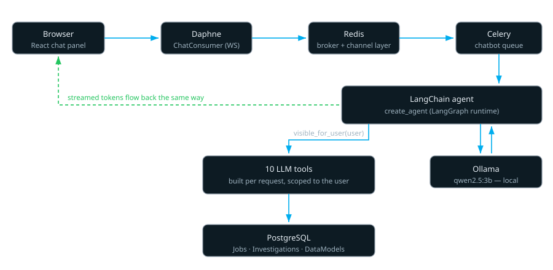
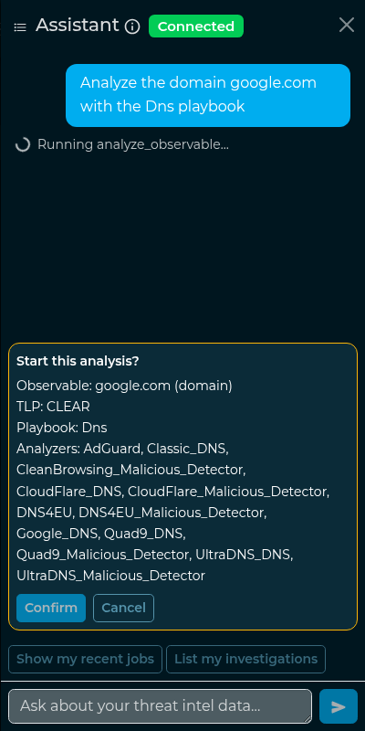

**Contributor:** Francesco Berardi  
**Mentors:** Matteo Lodi

An analyst opens IntelOwl, types *"is job #40 malicious?"*, and gets back:

> Job #40 is classified as **malicious** with a reliability score of 7 out of 10. The verdict was
> supported by 2 analyzers and contradicted by 1 analyzer, while the remaining 3 analyzers did not
> provide an opinion (silent).

No API key. No token bill. **No byte of that observable ever left the machine.**

That is what I built for Google Summer of Code 2026 with The Honeynet Project: a conversational
interface embedded in IntelOwl, running entirely on a locally-hosted LLM. This post explains how it
works, what I measured, and what did not work.

<!--more-->

## Why a chatbot inside a threat intelligence platform

IntelOwl already knows the answer to most questions an analyst asks. It runs 200+ analyzers, groups
their output into jobs, groups jobs into investigations, and normalizes every analyzer's findings into
a `DataModel`. The information is all there. What it costs is navigation: filter the job list, open
the right job, expand the raw results, read six analyzer reports, decide. A chat interface collapses
that into a sentence.

But one constraint rules out the obvious implementation. **You cannot send a SOC's observables to a
third-party LLM API.** The domains, hashes and IPs an analyst investigates describe what an
organization is being attacked with, and often who it is.

So the model runs **locally**, in an Ollama container beside the other IntelOwl services, and the
feature is opt-in. The default is `qwen2.5:3b`, small enough for a CPU-only box, which is the honest
deployment target for a self-hosted tool. Most of what follows is a consequence of that choice. A 3B
model is a very different engineering problem from a frontier model.

Before GSoC I had been contributing to IntelOwl for a few months, which is how I learned the codebase
well enough to propose this project. Those earlier patches were an
[N+1 ORM fix](https://github.com/intelowlproject/IntelOwl/pull/3341),
[onboarding-guide fixes](https://github.com/intelowlproject/IntelOwl/pull/3355) including a React
crash on invalid date routing, and the
[password strength validation](https://github.com/intelowlproject/IntelOwl/pull/3356) that
`ChangePasswordView` was missing.

## What an analyst can do today

The chatbot ships in **IntelOwl v6.7.0**. It lives in a drawer available from any page and streams its
answers token by token over a WebSocket. It is also aware of where you are: ask "summarize this" while
looking at a job and it knows which job you mean.


*The chat panel answering "show my recent jobs", with context-aware quick actions below.*

Behind the conversation are **ten tools** the agent can call. Each is a real query against the
platform, not a retrieval index over a documentation dump:

| Tool | What it answers |
|---|---|
| `search_jobs` | "What jobs do I have?", filtered by observable, MD5 or status |
| `get_job_details` | Everything about one job by ID |
| `summarize_job` | A prose summary **plus IntelOwl's own verdict** on the observable |
| `get_data_model` | The normalized, analyzer-agnostic view of a job's findings |
| `list_investigations` | Investigations you own or that your organization shared |
| `get_investigation_tree` | The job tree inside an investigation |
| `summarize_investigation` | Status, job counts per status, TLP, tags |
| `list_analyzers` | Which analyzers are enabled, and which are actually runnable for you |
| `recommend_playbook` | Which playbooks can analyze a given observable |
| `analyze_observable` | **Previews** a new analysis (see the guardrail section below) |

## Architecture



Three decisions in that diagram were not obvious.

**Inference never happens in the request thread.** A turn on a CPU box takes tens of seconds. In a
Django view that would pin a worker and time out under any real load. So a message goes to a
**dedicated Celery queue** and the answer streams back through the Channels layer. The WebSocket
consumer mirrors IntelOwl's existing `JobConsumer` instead of inventing a pattern, so authentication,
group naming and reconnection behave like the rest of the platform.

**The agent uses native tool calling, not a ReAct string parser.** The first implementation parsed
`Thought:/Action:` text, which a 3B model gets wrong often enough to be unusable. Switching to the
model's structured tool-calling interface
([#3762](https://github.com/intelowlproject/IntelOwl/pull/3762)) removed a whole class of failures.
The engine was later migrated from the deprecated `AgentExecutor` to LangChain 1.x's `create_agent`
on the LangGraph runtime ([#3842](https://github.com/intelowlproject/IntelOwl/pull/3842)). That was a
drop-in swap: the wire protocol, the memory backend and the guardrail were untouched.

**Tools are a factory closing over the user, not a global registry.** This is the load-bearing
security decision of the whole project, and the next section is about why.

## Multi-tenancy: the LLM is never trusted with scope

IntelOwl is multi-tenant: users belong to organizations, jobs carry TLP levels, and what you can see
is not what your colleague can see. An agent that queries the database on a user's behalf is an
excellent way to leak all of that.

The rule I settled on: **the requesting user is never an argument the model can supply.** Tools are
built per request by a factory that closes over the authenticated user, and every queryset goes
through IntelOwl's own `visible_for_user` manager, the same scoping the REST API and the UI use.
The model chooses *which tool* and *what to search for*. It cannot choose *whose data*.

```python
def make_search_jobs_tool(user):
    # Built per-request and closed over `user`: scoped with visible_for_user (owner +
    # same-org AMBER/RED + globally-visible CLEAR/GREEN), matching the REST JobViewSet / UI.
    # The LLM can never widen it.
    @tool("search_jobs")
    def search_jobs(query: Optional[str] = None, status: Optional[str] = None, limit: int = 10) -> str:
        qs = Job.objects.select_related("analyzable").visible_for_user(user)
        ...
```

Everything the model *does* control is treated as untrusted input. `limit` is clamped, `status` is
validated against IntelOwl's `Status` enum before it can reach the ORM, and a playbook name is
re-checked for visibility before anything happens with it.

I did not want to take my own word for it, so I ran a **full security audit** of the subsystem: all
ten tools, the WebSocket and REST entry points, the rate limiter, error paths, prompt injection
through the page-context field, and markdown rendering on the frontend. It found zero data-isolation
leaks and nothing critical or high, but seven findings. Four were low-severity fixes that shipped
immediately. One I accepted as-is, with the reasoning written into the code. Two mattered more.

The first was an **inconsistency worth arguing about**. The job tools used `filter(user=user)`
(owner-only) while the investigation tools used `visible_for_user` (owner + organization). Stricter,
but *inconsistent with the UI*: the chatbot would deny you a job the web interface happily shows. My
mentor's call was UI parity, and that is what shipped. The second finding changed the design, and it
is the one worth a section of its own.

## Deep dive I — the model can propose, only a human can launch

`analyze_observable` is the only tool with a side effect: it starts a real analysis, which sends the
observable to external analyzer services. That is precisely the egress the local-model architecture
exists to avoid.

The original implementation had a `confirm` flag. The code was correct, in that only `confirm=True`
reached the launch path. But the flag was set **by the model**, so the safety property depended on a
3B model reading a prompt correctly. The fix removes the decision from the model entirely:

1. The tool becomes **preview-only**. It validates, resolves the playbook, and returns a plan plus an
   opaque `pending_id`. It has no code path that launches anything.
2. The plan is stored in a short-lived Redis record, scoped to the user, with a TTL.
3. The agent emits an `action_required` WebSocket frame; the frontend renders a Confirm/Cancel card.
4. Only `POST /api/chatbot/analysis/confirm` with that `pending_id` launches. It re-validates playbook
   visibility too, because permissions could have changed between the preview and the click.



*The model can describe the analysis. Only the Confirm button starts it.*

The consume step is deliberately atomic, so a double-click cannot launch twice:

```python
def consume_pending_analysis(user_id: int, pending_id: str) -> dict | None:
    record = cache.get(key)
    if not record or record.get("user_id") != user_id:
        return None
    # delete() reports whether the key still existed: under a concurrent double-submit only the
    # caller whose delete actually removed it proceeds, keeping the launch strictly one-shot.
    if not cache.delete(key):
        return None
    return record["payload"]
```

The point generalizes: **a safety property that depends on the prompt is not a safety property.**
There is now no sequence of tokens the model can emit that starts an analysis.

## Deep dive II — "it works on my machine" is not a reliability claim

The most valuable thing I learned this summer is that you cannot debug a small language model by
trying things until one works. Prompt changes are global: fixing one phrasing silently breaks another,
and a 3B model's tool choice is sensitive to state you would never think to control for.

Here is the case that taught me that. *"What jobs do I have?"* consistently called the wrong tool
(`list_investigations` instead of `search_jobs`) and answered "there are no investigations", while
*"list my jobs"* worked fine. Same model, same temperature.

So before changing anything I built a **reliability harness**: nine scenarios, each run eight times
warm (model resident, KV-prefix cache hot) and twice cold (model force-unloaded first), against a real
Ollama and a real database with nothing mocked. Warm and cold matter because at `temperature=0` the
only difference between them is the KV cache, and that alone is enough to flip a borderline
tool-selection argmax.

Three things made the measurement trustworthy:

- **Same-session A/B.** Run A (unmodified prompt) and Run B (modified) ran back-to-back in one
  session, so the prompt was the only variable. This turned out to matter. In Run A one phrasing
  flipped to failing that had passed 8/8 in the *recorded* baseline, and a cross-session comparison
  would have credited that flip to my change.
- **A sanity gate.** Run A had to *reproduce* the failure first. If the baseline is green, a green
  Run B proves nothing.
- **Collateral-damage controls.** Two unrelated scenarios were measured in every run, so a global
  prompt edit could not silently break something else.

The prompt fix passed the tool-selection gate cleanly: 0/10 to 10/10 on the broken phrasing, zero
regressions, all controls held. Then I measured what the gate had never asked about. Did the user
actually get their jobs back?

| Phrasing | Right tool called | **Jobs actually returned** |
|---|---|---|
| "what jobs do I have?" | 0/10 → **10/10** | 0/10 → **0/10** |
| "show my recent jobs" | 0/8 warm → 8/8 | 2/10 → 10/10 |
| "show me my jobs" | 0/2 cold → 2/2 | 8/10 → 10/10 |

The fixed phrasing now called the correct tool and *still returned nothing*. A diagnostic on the raw
tool-call arguments explained it: for that one interrogative phrasing the model emits
`search_jobs(query=None, status=None, limit=10)`. The signature was `query: str = ""`, so an explicit
`None` failed schema validation and the agent gave up. The working phrasings simply *omitted* the
arguments.

So the residual bug was never about tool selection at all. It was a **tool schema too narrow for what
the model naturally emits**. Widening `query` and `status` to `Optional[str] = None` closed it, and
`list_investigations` had the identical latent gap.

**Job delivery across all five phrasings: 30/50 → 50/50.** Had I stopped at the tool-selection gate,
I would have declared victory on a feature that was still handing the user an empty list.

## Deep dive III — an objective verdict, not an LLM opinion

In July my mentor reported a bug that became the final third of the project. *"Summarize job"* and
*"Evaluate job"* returned essentially the same text. The reason was structural: **no tool read the
findings at all.** Every job tool reported metadata such as status, TLP and which analyzers ran.
Asking whether a job was malicious got you a fluent paragraph inferred from analyzer *names*.

The tempting fix is to feed the analyzer reports to the model and ask for a verdict. I deliberately
did not. A 3B model inventing a maliciousness score, in a security tool, next to a UI badge that says
something else, is worse than no feature. So the design rule became: **the verdict is IntelOwl's own
reconciled evaluation, and the chatbot only reads it.** It says exactly the word the job-page badge
shows, because it comes from the same `EvaluationEngineModule`.

That required work in two places. IntelOwl's core reconciles per-analyzer `DataModel` evaluations into
one verdict, but a set of key-free analyzers (DNS malicious-detectors, Phishtank, PhishingArmy,
Phishstats, Tranco) were not populating theirs. There was nothing to reconcile for exactly the free
analyzers a self-hosted user runs. Fixing that was a **core** change
([#3893](https://github.com/intelowlproject/IntelOwl/pull/3893)) that benefits the platform whether or
not the chatbot is enabled. Only then could the chatbot read it
([#3898](https://github.com/intelowlproject/IntelOwl/pull/3898)).

The reader partitions every analyzer that ran into **supporting**, **contradicting** and **silent**,
so "we don't know" is attributable to named analyzers and not an opaque shrug. A silent analyzer ran
and expressed no opinion: a blocklist miss, a timeout, a missing API key. Hiding those is how a tool
becomes confidently wrong.

Every other test in the pull request mocks the LLM, so none of them prove that a 3B model *narrates*
that payload correctly. I gated the merge on a live smoke test against real Ollama, with five
acceptance criteria and a fixed seeded job. It caught two defects:

1. **The model paraphrased the numbers away.** It copied the prose `summary` verbatim but reworded the
   structured verdict, frequently dropping the reliability score. What pointed at the fix was noticing
   that the best answers were always the ones that happened to quote the headline literally. So the
   copy-ready headline is now written into the prose as well.
2. **Then a second defect took over.** With the headline reading "2 of 6 analyzers support it", five
   of eight answers concluded *"there are no silent analyzers"*. The model had inferred that the other
   four disagreed, which is the exact opposite of the honest-absence reporting the feature exists for.
   The headline became self-contained, stating all three counts including a zero:

```
malicious (reliability 7/10) — 6 analyzers ran: 2 supporting, 1 contradicting, 3 silent
```

Both fixes are pinned by tests, with the reasoning in the code so nobody "simplifies" the headline
back into the bug. The answer quoted at the top of this post is a real, unedited one from that final
run.

## The numbers

Every figure below was measured on a CPU-only laptop (Intel Core Ultra 7 155U, no GPU) with
`qwen2.5:3b` on Ollama 0.30.7, driving the production code path with nothing mocked.

**Latency**, warm (model resident, n=5 per scenario, median):

| Question | Tool rounds | Time to first token | Total |
|---|---|---|---|
| "What can you help me with?" | 0 | 0.29 s | 6.4 s |
| "Analyze google.com with the Dns playbook" | 1 | 12.3 s | 27.2 s |
| "Summarize job 3" | 1 | 9.4 s | 27.9 s |

Tokens stream at a steady ~8.8/s, so the user watches progress and not a spinner. Time to first token
for a tool-backed answer is dominated by the tool round: the model reading the prompt, picking a tool,
the tool running, the model re-reading the observation. Output length has very little to do with it.

That last point killed a change I had planned. A 127-second turn in an early smoke test looked like
runaway generation, and capping `num_predict` was the obvious fix. The benchmark showed that turn was
a **cold** run taking the *correct* two-round path, and that the longest warm answers were ~160
legitimate tokens. A cap large enough never to truncate a real answer would never trigger. One small
enough to bite would truncate a real multi-job listing. **Zero warm benefit, real correctness risk, so
no cap and no pull request.**

What the same benchmark did surface was a real cost. Ollama unloads the model after five minutes of
idle, so the first query after a coffee break pays a reload: a few seconds if the weights are still in
the OS page cache, up to ~70 s if the load is genuinely disk-cold. I measured both and at first
mistook the difference for a contradiction. Keeping the model resident by default
([#3856](https://github.com/intelowlproject/IntelOwl/pull/3856)) removes the penalty in either case,
at the cost of 2.4 GB staying resident. That is why it is a setting and not a constant.

## What did not work

**The prompt lever is exhausted.** I made four serious attempts to fix narration by editing the system
prompt. Each one traded one failure for another. The second regressed two phrasings that already
passed and was reverted; the fourth produced the bug it was meant to prevent. The prompt sits at ~550
words, and at that size a 3B model's attention is a zero-sum budget. Every durable fix I shipped moved
the problem into **code or data**: a schema widening, a copy-ready string, a populated `DataModel`.
None of them was a better instruction.

**A residual failure I could not reproduce.** After the routing fix, two phrasings were documented as
occasionally flipping tools across cold-start states. I planned a prompt refinement, gated on the
harness reproducing the flip first. It did not reproduce: **40 independent cold model reloads, zero
flips.** With no reproducible failure the fix could not be validated, since a green result would have
been green with or without it. I shipped nothing and wrote up the negative result.

**A criterion that genuinely does not hold.** On the terse phrasing *"is job #N malicious?"*, the
model names the supporting analyzers in only **3 runs out of 10**. I measured that at n=10 because
n=3 had suggested "never", and "never" would have been wrong in the pull request. The verdict itself
is correct 10/10, and no answer ever substitutes a placeholder name. It is a real limitation, and it
is written into the pull request description rather than rounded away.

**A cosmetic bug I chose not to fix.** In roughly four of nine answers the model calls the analyzer
list "the playbooks used for this job". The names are right, the noun is wrong. The cause is known:
the prompt advertises a `recommend_playbook` tool, so the word sits in context and gets misapplied.
But the prompt has no headroom, and a prior edit proved that touching it regresses narration that
currently passes.

**An open question.** The rule forbidding placeholder names (`[Analyzer 1]`) turned out to be
probabilistic and not a guarantee: one violation in ~40 measured answers, under a stricter prompt
variant that was discarded. I filed it as a report with two possible directions, a post-generation
guard or accept-and-document, and did not implement either. Which trade-off IntelOwl wants is a
maintainer's decision, not mine.
[Issue #3909](https://github.com/intelowlproject/IntelOwl/issues/3909) is still open.

## How to extend this work

The subsystem is shaped so the next contributor adds a tool without touching anything else. Everything
lives under `api_app/chatbot_manager/`:

- `agent/tools/` — **one file per tool**, each exporting a `make_<name>_tool(user)` factory. Adding a
  tool means writing that file and registering it in `build_tools()`; nothing else changes.
- `serializers/` — one DRF serializer per tool, all returning the same
  `{"errors": [...], "<payload>": ...}` envelope so the model sees one consistent shape.
- `agent/system_prompt.txt` — the prompt as a file, with per-tool selection guidance. Watch the word
  budget; see above for why.
- `tests/api_app/chatbot_manager/tools/` — one test module per tool, each with isolation tests
  asserting another user's data stays invisible. **Treat those as the contract.**

There are two mandatory rules for a new tool. Build it as a factory closing over `user` and scope it
with `visible_for_user`. And if it has a side effect, route it through the pending-action guardrail
instead of a flag the model sets.

Two things were deliberately left unbuilt. LangChain's LangGraph checkpointer could replace the
Django-backed conversation memory, and its native interrupt mechanism could replace the pending-action
store. Both would rewrite working, reviewed, security-relevant code for tidiness alone, so both need a
concrete driver first.

The user, deployment and prompt-tuning guides are at
[intelowlproject.github.io/docs/IntelOwl/chatbot](https://intelowlproject.github.io/docs/IntelOwl/chatbot/)
and [chatbot_tuning](https://intelowlproject.github.io/docs/IntelOwl/chatbot_tuning/), the latter
covering the model choice, the context budget, and how to swap in a larger model. The reliability and
latency harnesses are reproducible scripts with their raw output recorded alongside them.

## Everything that shipped

**38 pull requests** merged into `intelowlproject/IntelOwl` during the coding period, plus 4 on the
documentation repository. All work was developed in the organization repository, reviewed by
[@mlodic](https://github.com/mlodic), and released in **IntelOwl v6.7.0**.

| Workstream | Pull requests |
|---|---|
| Foundations — Django app, Ollama container, retention, session API | [#3715](https://github.com/intelowlproject/IntelOwl/pull/3715), [#3719](https://github.com/intelowlproject/IntelOwl/pull/3719), [#3726](https://github.com/intelowlproject/IntelOwl/pull/3726), [#3727](https://github.com/intelowlproject/IntelOwl/pull/3727) |
| The agent and its ten tools | [#3722](https://github.com/intelowlproject/IntelOwl/pull/3722), [#3729](https://github.com/intelowlproject/IntelOwl/pull/3729), [#3731](https://github.com/intelowlproject/IntelOwl/pull/3731), [#3740](https://github.com/intelowlproject/IntelOwl/pull/3740), [#3742](https://github.com/intelowlproject/IntelOwl/pull/3742), [#3744](https://github.com/intelowlproject/IntelOwl/pull/3744), [#3762](https://github.com/intelowlproject/IntelOwl/pull/3762), [#3775](https://github.com/intelowlproject/IntelOwl/pull/3775) |
| Streaming, chat UI, sessions, health, page context, quick actions | [#3757](https://github.com/intelowlproject/IntelOwl/pull/3757), [#3765](https://github.com/intelowlproject/IntelOwl/pull/3765), [#3768](https://github.com/intelowlproject/IntelOwl/pull/3768), [#3769](https://github.com/intelowlproject/IntelOwl/pull/3769), [#3771](https://github.com/intelowlproject/IntelOwl/pull/3771), [#3773](https://github.com/intelowlproject/IntelOwl/pull/3773) |
| Security — audit follow-ups, rate limiting, UI parity, the guardrail | [#3777](https://github.com/intelowlproject/IntelOwl/pull/3777), [#3780](https://github.com/intelowlproject/IntelOwl/pull/3780), [#3783](https://github.com/intelowlproject/IntelOwl/pull/3783), [#3787](https://github.com/intelowlproject/IntelOwl/pull/3787), [#3792](https://github.com/intelowlproject/IntelOwl/pull/3792) |
| Testing, CI and robustness | [#3794](https://github.com/intelowlproject/IntelOwl/pull/3794), [#3797](https://github.com/intelowlproject/IntelOwl/pull/3797), [#3809](https://github.com/intelowlproject/IntelOwl/pull/3809), [#3830](https://github.com/intelowlproject/IntelOwl/pull/3830), [#3836](https://github.com/intelowlproject/IntelOwl/pull/3836), [#3837](https://github.com/intelowlproject/IntelOwl/pull/3837), [#3897](https://github.com/intelowlproject/IntelOwl/pull/3897) |
| Integration release into `develop` | [#3831](https://github.com/intelowlproject/IntelOwl/pull/3831) |
| Post-release: engine migration, reliability, performance | [#3842](https://github.com/intelowlproject/IntelOwl/pull/3842), [#3844](https://github.com/intelowlproject/IntelOwl/pull/3844), [#3856](https://github.com/intelowlproject/IntelOwl/pull/3856) |
| Result interpretation: defaults, core verdict, chatbot verdict | [#3881](https://github.com/intelowlproject/IntelOwl/pull/3881), [#3893](https://github.com/intelowlproject/IntelOwl/pull/3893), [#3898](https://github.com/intelowlproject/IntelOwl/pull/3898) |
| Documentation | [docs#65](https://github.com/intelowlproject/docs/pull/65), [docs#68](https://github.com/intelowlproject/docs/pull/68), [docs#69](https://github.com/intelowlproject/docs/pull/69), [docs#70](https://github.com/intelowlproject/docs/pull/70) *(open)* |

*One more for completeness: [#3785](https://github.com/intelowlproject/IntelOwl/pull/3785) was the
guardrail backend, merged prematurely before review completed. I reverted it and reopened the work as
#3787. I am recording it here because leaving it out felt like cheating.*

That is roughly 2,750 lines of Python across ten tools, eight React components plus a WebSocket hook
and API client, and **200 backend tests plus eleven frontend suites**. Those include query-count
guards that fail if a tool regresses into an N+1, and isolation tests on every tool.

**Current status:** merged and released in v6.7.0. Two items remain open: documentation pull request
#70, waiting on a version marker, and issue #3909, waiting on a maintainer decision.

## Acknowledgements

Thank you to my mentor **Matteo Lodi**, whose reviews consistently made this better. That includes the
bug report that became the entire last third of the project, and the call to prioritize consistency
with the UI over a scope that was stricter but surprising. Thank you to **The Honeynet Project** and
to Google Summer of Code.

What I take away is smaller than the feature itself: **a small model is a component with a measurable
failure rate, not a black box you negotiate with.** Every problem I actually solved this summer, I
solved by building a way to measure it first. The measurements that told me to ship nothing were worth
as much as the ones that told me to ship.

I intend to keep contributing to IntelOwl.
