Our [GSoC](https://summerofcode.withgoogle.com/) student **[Krishna Awasthi](https://github.com/opbot-xd)** spent three months working under the supervision of **[Tim Leonhard](https://github.com/regulartim)** on [**GreedyBear**](https://github.com/GreedyBear-Project/GreedyBear) and a new companion project, [**tpot-payload-server**](https://github.com/GreedyBear-Project/tpot-payload-server), building a complete pipeline to capture, quarantine, and share the malware payload files that T-Pot honeypots collect from live attackers.

Read on for an overview of the project, the technical decisions behind it, and what shipped.

**Student:** Krishna Awasthi ([opbot-xd](https://github.com/opbot-xd))

**Mentors:** Tim Leonhard

**Organization:** The Honeynet Project

**Project:** [GreedyBear](https://github.com/GreedyBear-Project/GreedyBear) · [tpot-payload-server](https://github.com/GreedyBear-Project/tpot-payload-server)

<!--more-->

## The Problem

GreedyBear already harvests threat intelligence from T-Pot's Elasticsearch stack: attack IPs, ports, credentials, and signatures. However, one critical layer of evidence was entirely absent: the **actual malware payload files** that honeypots like Dionaea, Cowrie, Honeytrap, and ADBHoney capture from live attackers.

These binaries, scripts, and exploit payloads live unindexed on T-Pot's local filesystem under its data directory with no API, no index, and no way for downstream tools to access them. The goal of this GSoC project [**GreedyBear: Access payload files**](https://summerofcode.withgoogle.com/programs/2026/projects/gm6UndtK) was to build a **complete, production-grade pipeline** that bridges T-Pot payload captures with GreedyBear's threat intelligence platform and the broader security research community.

## Architecture

The solution spans two codebases connected by a secured API channel, implemented in three phases:

1. **T-Pot side:** A stateless FastAPI microservice that scans honeypot payload directories on demand and serves file metadata and downloads over an API-key-authenticated endpoint.
2. **GreedyBear side:** A Django Q2 scheduled task that fetches new payloads, deduplicates by SHA256, and quarantines them safely with `.vir` extensions.
3. **Distribution:** An RBAC-protected DRF API for researchers, plus automated submission of new samples to MalwareBazaar.

## GSoC Tasks and Deliverables

### 1. T-Pot Payload Server (New Repository)

The first phase of the project was building [tpot-payload-server](https://github.com/GreedyBear-Project/tpot-payload-server), a new standalone microservice designed to run as a Docker sidecar alongside T-Pot.

The server mounts honeypot capture directories (Dionaea binaries, Cowrie downloads, Honeytrap downloads, ADBHoney downloads) as **read-only** volumes and exposes two core endpoints:

- `GET /api/v1/payloads/recent?start_ts=...&end_ts=...` - Scans directories for files modified within a time window and returns metadata (MD5, SHA1, SHA256 hashes, MIME type, size, source honeypot) computed on-the-fly.
- `GET /api/v1/payloads/download/{locator}` - Streams the raw binary payload for ingestion.

A key design decision was making the service **completely stateless**. There is no background daemon watching directories. The server only consumes CPU during the brief window when GreedyBear actively makes a request, and sits idle the rest of the time. All file analysis (hashing, MIME detection via `python-magic`) happens through streaming reads; no sample is ever executed.

Security was a central concern throughout. The container runs with a read-only filesystem, `no-new-privileges`, and as a non-root user. The download endpoint includes multi-layer path traversal guards: exact directory allowlisting against configured honeypot paths, regex-validated filenames, and `is_relative_to` checks against symlink escapes.

An automated `install.sh` script handles deployment: it detects the T-Pot installation, generates a secure API key, configures an NGINX HTTPS reverse proxy using T-Pot's existing TLS certificates, and brings up the container stack.

Key pull requests on **tpot-payload-server**:
- [Initial repository setup - #12](https://github.com/GreedyBear-Project/tpot-payload-server/pull/12)
- [Payload metadata extraction engine - #15](https://github.com/GreedyBear-Project/tpot-payload-server/pull/15)
- [FastAPI endpoints and containerization - #19](https://github.com/GreedyBear-Project/tpot-payload-server/pull/19)
- [Environment configuration and port conflict fix - #47](https://github.com/GreedyBear-Project/tpot-payload-server/pull/47)
- [Comprehensive README and documentation - #49](https://github.com/GreedyBear-Project/tpot-payload-server/pull/49)
- [Automated deployment with NGINX proxy and TLS - #52](https://github.com/GreedyBear-Project/tpot-payload-server/pull/52)
- [Release workflow - #53](https://github.com/GreedyBear-Project/tpot-payload-server/pull/53)

### 2. HoneypotPayload Model and Quarantine Storage

On the GreedyBear side, I introduced the `HoneypotPayload` Django model to persist payload metadata: SHA256, MD5, SHA1 hashes, MIME type, file size, and source information. The model includes `ManyToManyField` relationships to `Honeypot`, `IOC` (attacker IPs), and `CowrieSession` for threat intelligence correlation. A `unique` constraint on SHA256 (case-insensitive) ensures deduplication at the database level.

Downloaded samples are stored through a custom `QuarantineStorage` backend that restricts all file saves to the `media/quarantine/` directory and enforces a `.vir` extension on every filename, preventing accidental execution on any operating system.

- [HoneypotPayload model with quarantine storage - #1422](https://github.com/GreedyBear-Project/GreedyBear/pull/1422)

### 3. Payload Extraction Task

The core ingestion pipeline is a Django Q2 scheduled task (`PayloadExtractionJob`) that runs alongside GreedyBear's existing extraction jobs after every extraction interval.

Each run:

1. Queries the `tpot-payload-server` for payloads modified in the last extraction window.
2. Performs **bulk deduplication**: collects all incoming SHA256 hashes, queries PostgreSQL for existing records, and filters the diff before downloading anything.
3. Checks quarantine disk usage against `MAX_QUARANTINE_SIZE_GB` before each download. Once the cap is reached, new samples are tracked in the database by metadata only and remain retrievable on-demand from T-Pot.
4. Downloads new payload files via the authenticated download endpoint, appends `.vir`, and saves through `QuarantineStorage`.

The task uses a shared `HttpClient` wrapper with configurable timeouts, retry strategies (with backoff on 429/5xx), and automatic `raise_for_status()` - keeping HTTP concerns out of the business logic.

- [Payload extraction task - #1435](https://github.com/GreedyBear-Project/GreedyBear/pull/1435)

### 4. DRF API with RBAC-Gated Download

A `HoneypotPayloadViewSet` at `/api/v1/payloads/` exposes payload metadata (hashes, MIME type, source honeypots, size) to any authenticated user via standard `list`/`retrieve` actions. The `sha256` field serves as the lookup key rather than internal database IDs.

The actual file download, however, is gated behind a custom `IsThreatResearcherOrAdmin` permission class: only users with staff privileges or membership in the `threat_researcher` Django group can retrieve raw malware samples. This prevents accidental exposure to bots or untrusted accounts while keeping metadata freely browsable for triage.

The viewset includes full OpenAPI documentation via `drf-spectacular`, with documented response schemas for each endpoint including error cases.

- [Payload viewset with RBAC-gated download - #1464](https://github.com/GreedyBear-Project/GreedyBear/pull/1464)

### 5. Automated MalwareBazaar Submission

The final piece closes the loop with the threat intelligence community. A dedicated `MalwareBazaarCron` task periodically sweeps for samples with `is_uploaded_mb=False` and submits them to [MalwareBazaar](https://bazaar.abuse.ch/) via Abuse.ch's community API.

Submissions include provenance tags (`greedybear`, `honeypot`, plus the source honeypot name), making it easy for analysts to filter by origin. The task distinguishes between **payload-specific** API responses (`inserted`, `file_already_known`, `hash_blacklisted`, `illegal_file_type`) and **global** errors (`user_blacklisted`). Payload-specific responses permanently flip `is_uploaded_mb=True` to prevent infinite retries, while global errors immediately abort the batch. Transient failures (network errors, HTTP 5xx) leave the flag untouched for automatic retry on the next run.

The feature is opt-in via `MALWAREBAZAAR_API_KEY`; deployments that prefer to keep payloads private simply omit the key.

- [MalwareBazaar submission task - #1485](https://github.com/GreedyBear-Project/GreedyBear/pull/1485)

## Design Decisions Worth Noting

**Why a separate microservice instead of direct filesystem access?** GreedyBear and T-Pot typically run on different machines. There is no direct filesystem access across servers. The FastAPI service bridges this gap with a clean HTTP boundary. It also means any T-Pot deployment, even without GreedyBear, could use this same API to export payloads to their own internal tools.

**Why stateless scanning instead of a background watcher?** Early designs considered `watchdog`-based file monitoring. The stateless approach eliminates persistent background overhead, state management complexity, and race conditions. The server consumes zero CPU until a request arrives and is trivially restartable.

**Why upload to MalwareBazaar?** GreedyBear already *consumes* threat intelligence from the Abuse.ch ecosystem. Uploading honeypot-captured malware closes the loop: these are samples *actively being deployed in the wild right now*, making them especially valuable for AV vendors, YARA rule authors, and threat researchers building detections.

## Problems Encountered

The most significant design challenge was the path traversal security surface on the download endpoint. The initial implementation used SHA256 hashes as lookup keys, but this required maintaining a mapping of hashes to file paths. Switching to **relative path locators** (e.g., `dionaea/binaries/sample.bin`) made the system deterministic and stateless, but introduced path injection risks. The final solution uses a three-layer defense: exact directory matching against configured honeypot paths, regex validation of filename characters, and `is_relative_to` verification against symlink traversal. This went through several rounds of review addressing CodeQL alerts before reaching the current hardened state.

Another challenge was ensuring the quarantine disk quota mechanism worked correctly across different deployment environments, particularly in CI where the quarantine directory paths differ from production.

## Next Steps

There is more that can be built on this foundation:

- **IOC correlation:** Automatically linking downloaded payloads to the attacker IPs and Cowrie sessions that delivered them, by cross-referencing hashes against T-Pot's structured event logs.
- **Frontend integration:** Adding a payload browser to GreedyBear's web interface so analysts can search, filter, and download samples without using the API directly.
- **Multi-instance aggregation:** Organizations running multiple T-Pot sensors can centralize all payloads under one GreedyBear instance.

## Everything That Shipped

| Repository | Pull requests |
|---|---|
| **tpot-payload-server** - Repository setup, metadata engine, API, containerization, deployment automation | [#12](https://github.com/GreedyBear-Project/tpot-payload-server/pull/12), [#15](https://github.com/GreedyBear-Project/tpot-payload-server/pull/15), [#19](https://github.com/GreedyBear-Project/tpot-payload-server/pull/19), [#47](https://github.com/GreedyBear-Project/tpot-payload-server/pull/47), [#49](https://github.com/GreedyBear-Project/tpot-payload-server/pull/49), [#52](https://github.com/GreedyBear-Project/tpot-payload-server/pull/52), [#53](https://github.com/GreedyBear-Project/tpot-payload-server/pull/53) |
| **GreedyBear** - Payload model, extraction pipeline, RBAC API, MalwareBazaar integration | [#1422](https://github.com/GreedyBear-Project/GreedyBear/pull/1422), [#1435](https://github.com/GreedyBear-Project/GreedyBear/pull/1435), [#1464](https://github.com/GreedyBear-Project/GreedyBear/pull/1464), [#1485](https://github.com/GreedyBear-Project/GreedyBear/pull/1485) |

## Acknowledgements

Thank you to my mentor **Tim Leonhard**, who guided the architecture from the initial design discussions through every code review. His feedback consistently pushed the implementation toward simpler, more secure solutions, particularly on the path traversal hardening and the stateless scanning design. Thank you to **The Honeynet Project** and to Google Summer of Code for the opportunity.

This project has been one of the most rewarding technical experiences I have had. Building across two codebases, designing a security-sensitive API that handles live malware, and shipping something that contributes back to the global threat intelligence ecosystem taught me more about production engineering than I expected going in.

I intend to keep contributing to GreedyBear and the tpot-payload-server.
